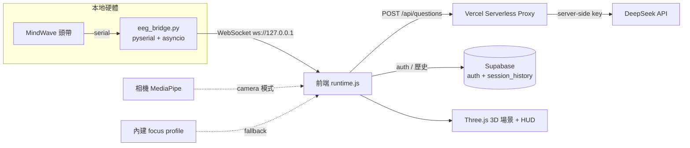
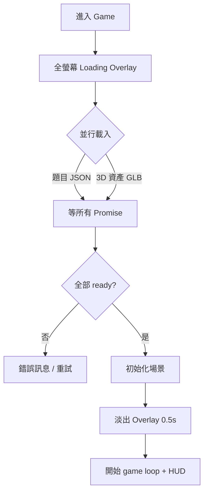

# NeuroFocus 展覽總手冊（EXHIBITION HANDBOOK）

> **一份文件睇晒**：產品是什麼、技術架構、玩法邏輯、現場執行、台上台詞、評判 Q&A、Windows 部署、競爭力與科學論述。
> 呢份係「**展覽 + 答辯**」用嘅參考大全，展覽當日直接開嚟用。
> 👉 至於「之後要寫咩 code / 待辦」——睇另一份 **[`docs/IEYI_PLAN_V2.md`](./IEYI_PLAN_V2.md)**。
>
> 本手冊由以下舊文件整合而成（已全部併入，並**更新到 2026-07 sprint 後嘅最新狀態**）：
> `PROJECT_ANALYSIS.md`、`README.md`、`EXHIBITION_EXECUTION_BRIEF`、`GAMEPLAY_UPGRADE_CONFIRMATION`、`UI_FLOWCHART`、`WINDOWS_2A_DEPLOYMENT_SOP`、`TRAE_HANDOFF_PROMPT_WINDOWS`、`debug-windows-home-fps`。
>
> 最後整合日期：**2026-07-11**

---

## 目錄

1. [產品是什麼](#part-1)
2. [網站所有模式：目的與原理](#part-2)
3. [技術架構（最新）](#part-3)
4. [遊戲運行邏輯 + UI 機制](#part-4)
5. [現場展示執行](#part-5)
6. [台上台詞（三位講者）](#part-6)
7. [評判 Q&A](#part-7)
8. [Windows 部署 SOP + 裝置分工 + FPS 已知問題](#part-8)
9. [競爭力分析（對比賽）](#part-9)
10. [現場檢查清單](#part-10)
11. [IEYI 攤位規格 + 展板計劃（跟 2026 官方 PDF）](#part-11)

---

## Part 1 — 產品是什麼

**一句定位**：NeuroFocus 係一個**神經回饋專注訓練平台原型**。

**唔係**：單純遊戲、單純 EEG 讀數器、醫療器材。
**係**：把「專注狀態」變成**可視化、可訓練、可量化**嘅互動系統。

| | 內容 |
|---|---|
| **主問題** | 短片、通知、社交媒體令年輕人長期處於「睇落清醒、其實注意力好碎」嘅狀態。 |
| **主解法** | 用 EEG / 外界偵測**即時觀察**專注狀態，再用**遊戲回饋 + 呼吸介入**幫用戶重新回到穩定專注。 |
| **主價值** | 唔再係叫用戶「你專心啲」，而係令佢**即時見到自己狀態、學識點拉返自己入狀態**。 |
| **產品定位** | 教育 / 訓練 / 展示用嘅 neurofeedback prototype；專注訓練平台概念驗證；可延伸成商業產品嘅互動原型。 |

**核心閉環**（比單純顯示腦波數字更似產品）：
`偵測 → 視覺化 → 遊戲回饋 → 呼吸介入 → 量化報告`

---

## Part 2 — 網站所有模式：目的與原理

系統有**兩層模式**：先揀「練咩」，再揀「用咩訊號」。

### 第一層：任務模式（練咩）
> 兩個模式**都喺同一個海洋場景、玩法一致**，分別只在於挑戰模式會加入題目壓力。（2026-07 已把訓練模式一度試過嘅「書房場景」移除，統一用海洋。）

- **訓練模式**：專注航行，**不出題**，主打穩定維持專注。沿一條**無限彎曲航道**航行：專注先揸得住個舵（分心船會漂離航道）、穩住專注 25 秒摘一粒**心流星**、每 500m 經過一個**航標**、天氣即時反映腦狀態（分心起霧、復原放晴）。最適合台上展示（流程最清、最穩、旁觀者一眼睇明）。
- **挑戰模式**：加入 **Stroop 題 + 邏輯題**，主打「一邊做任務、一邊維持專注」，貼近真實生活。最適合台下俾評判親身感受「做 task 時大腦容易亂」。

### 第二層：訊號來源模式（用咩訊號）
- **Real EEG**：MindWave 頭帶讀 EEG → 本地 `eeg_bridge.py` → WebSocket → 前端。**wow factor 最高、最吸引評判**；風險最高（藍牙 / COM port / 權限）。
- **Simulation**：即使無頭帶 / 頭帶失靈都可完整展示。**唔係假裝 EEG，而係展示神經回饋系統嘅完整運作邏輯。** 內部再分兩條：
  - `camera-ready`：相機開到，用 **MediaPipe 臉部追蹤**（望開、眨眼、臉部居中程度）估算 0–100 專注分。屬「外界偵測專注力」。
  - `simulation-fallback`：連相機都唔得，用內建 focus profile 產生自然起伏嘅專注曲線，驅動船速同呼吸介入。屬「保底模式」，確保任何裝置都 demo 到。

### 介入層：Box Breathing
- **定位**：唔係獨立模式，而係**橫跨整個系統嘅統一介入層**。
- **觸發**：無論用緊 Real EEG / camera / fallback，只要系統判定用戶**長時間偏離穩定專注**（低於自適應門檻持續一段時間），就觸發。
- **流程**：遊戲暫停、計時停止、專注顯示歸零 → 引導呼吸（吸 4 秒 / 憋 4 秒 / 呼 4 秒，兩輪）→ 完成後短暫 focus boost，令用戶明顯感受「成功回復專注」。
- **意義**：由「只量度專注」推進到「主動改善專注」。

### 難度（挑戰模式用）
- **Easy**：降低門檻，讓新手感受系統如何回應專注變化。
- **Medium**：較真實嘅認知負荷。
- **Hard**：高認知負荷 + Stroop 衝突題，講「現實世界唔係靜坐，而係高壓下仍要保持清晰」。

---

## Part 3 — 技術架構（最新，已反映 2026-07 sprint）

### 資料流

### 技術清單
- **前端基礎**：HTML5 單頁 + **Vanilla JS ES Modules**（非 React/Vue，輕量、易 Vercel 靜態部署）+ **Import Maps**（直接指 `three`、`@mediapipe/tasks-vision`、`@supabase/supabase-js`）+ **Hash Router**。
- **UI / 視覺**：Tailwind CDN（首頁高密度排版）+ Custom CSS（Liquid Glass / Clay 質感、dark mode、game HUD）+ Google Fonts / Material Symbols。字體統一：Orbitron 只喺遊戲 HUD，其餘用 EB Garamond + Inter。
- **3D 互動**：Three.js（場景、光影、材質、粒子、船隻）+ GLTF/HDR 資產（`EGGShip2.glb`、HDR sky、water normal map）+ Web Audio（BGM / 音效）。
- **專注輸入**：MindWave Mobile 2 單通道 EEG（`attention` / `meditation` / `signal_quality`）+ WebSocket + MediaPipe FaceLandmarker + getUserMedia。
- **本地橋接**：Python `asyncio` + `pyserial` + `websockets` + `serial.tools.list_ports` + `threading`。
- **後端（sprint 後新增）**：
  - **Supabase**：真實帳戶 auth（錯密碼真係入唔到；離線時先 fallback 本地 session）+ `session_history` 表（跨 session 歷史）。config 見 `docs/supabase_schema.sql`、`services/supabaseClient.js`。
  - **Vercel Serverless `/api/questions`**：DeepSeek key 收埋喺 `process.env.DEEPSEEK_API_KEY`，**永遠唔會出現喺瀏覽器**。有 GET 健康檢查（開網址睇 `hasKey`）。
- **持久化**：localStorage（語言 / 主題 / user / 歷史 mirror）。
- **部署**：Vercel 靜態前端 + 本地 Python bridge（EEG 唔上雲）+ Windows batch 啟動腳本。

### 主要檔案負責乜（更新版）
| 檔案 | 負責 |
|---|---|
| `index.html` | 載入入口、import map、全域 DOM 容器（countdown / breathing / loader） |
| `app/main.js` | Bootstrap：讀 localStorage 語言/主題/session，啟動 router |
| `app/router.js` | 單頁 hash router，管 home/auth/setup/game/results 嘅 lazy import + mount |
| `app/state.js` | 全域狀態（`testMode`、`trainingDurationSec`、`inputMode`、`difficulty`、`focusSource`…） |
| `app/i18n.js` | 中英文文案（`hk` / `en` 兩個 block，key 要對齊） |
| `api/questions.js` | **Vercel proxy**：server-side 叫 DeepSeek、隱藏 key、健康檢查、fallback reason |
| `services/authService.js` | **真 Supabase 登入/註冊**（離線 fallback） |
| `services/supabaseClient.js` | Supabase client（動態 import，離線唔會 crash） |
| `services/storageService.js` | localStorage + **跨 session 歷史讀寫** |
| `services/runtimeLoader.js` | 版本號 query string + 動態 import runtime（降快取干擾） |
| `services/focusInputService.js` | 相機專注偵測（MediaPipe FaceLandmarker） |
| `pages/game/runtime.js` | **全專案核心引擎**（6000+ 行）：Three.js 場景、航行物理（航向+慣性）、心流充能摘星、天氣共感、黃金時刻、題目、focus 更新、呼吸介入、simulation profile、bridge reconnect、results、audio、performance profile、**自適應門檻**、**FPS meter** |
| `pages/game/voyage.js` | **航程系統**：無限不規則彎曲航道（發光虛線）、航標浮塔 checkpoint（浮沉+燈頭脈動+海鷗）、航海圖數據 |
| `eeg_bridge.py` | 本地硬體橋：掃 COM port、揀 MindWave、解析 attention/meditation/signal、WebSocket 廣播 |
| `styles/**` | UI 外觀、Liquid Glass、dark mode、各頁樣式 |
| `*.bat` / `requirements-eeg-bridge.txt` | Windows 一鍵啟動（見 Part 8） |

---

## Part 4 — 遊戲運行邏輯 + UI 機制

### 基本流程
`輸入名稱 → Setup（揀任務模式 → 揀訊號來源 →（挑戰揀難度 / 訓練揀時長）→（Simulation 問相機授權））→ Game → Results`

### 核心邏輯（2026-07 gameplay 重新設計後）
- **專注度驅動船速 + 舵**：`focusLevel` 係核心輸入——越高船越快；同時專注 = 舵嘅控制力：專注時船貼住彎曲航道行，分心時船會隨機漂離航道，重新專注先拉得返（真實航向物理：慣性加速、入彎側傾）。
- **心流充能摘星（訓練模式嘅「贏」）**：企穩喺個人穩定線以上，能量環≈25 秒充滿一圈 = 1 粒星（分心只暫停充能，唔倒扣）；摘星有短暫滑行加速 + 金色橫額。
- **航標 checkpoint**：每 500m 一個紅白航標浮塔座喺航道上，經過有鐘聲 + 橫額；右下航海圖卡實時顯示航道彎位、船嘅偏航同下一個航標距離；跨 session 有「航海日誌」累積總航程。
- **天氣共感**：分心持續 → 起霧、水濁、天暗（旁觀者唔使識睇 HUD 都知狀態）；復原 → 放晴。呼吸介入時霧鎖畫面，**跟住呼氣一格格撥開**，完成陽光爆返。
- **黃金時刻（Real EEG 專屬）**：專注 + 放鬆雙軸同時達標 4 秒 → 成個場景轉入暖金黃昏——雙軸神經回饋嘅高光位，Simulation 冇（冇 meditation 訊號，唔造假）。
- **題目系統**（挑戰模式）：先試 AI 生成 → 失敗 / 太慢 / 格式錯就自動轉**本地 fallback 題庫**。題目偏生活化 + 生物/化學/邏輯推理。有嚴格本地 validation（唯一正解、拒絕重複選項 / 「以上皆是」/ 缺解釋），無效 AI 題自動換成本地驗證過嘅題。
- **雙軸心流（Real EEG 專屬）**：EEG 模式下，心流條件係「**專注 AND 放鬆**」（attention 高 + meditation 達標）；Simulation / camera 模式無 meditation 訊號，用單軸規則。
- **Box Breathing 觸發**：`focusLevel` 低於**自適應門檻**（用歷史調整，唔再死 45/55）並持續一段時間 → 頂部提示 → 觸發呼吸 UI → 完成後短暫 focus boost。
- **自適應門檻**：系統跟住玩家歷史表現收緊 recovery / trigger 門檻——係真「訓練」而唔淨係「量度」。

### Results 量化（2026-07-10 D1 重新設計：航海報告版面）
> 設計語言用 v0 設計稿，Claude 以 vanilla JS + inline SVG 落地（唔加框架），Training / Challenge 兩版共用一套 teal + 金色系，深淺色 + 雙語齊全。由上到下：
- **Hero 判語**：一句大字 + 模式/難度/訊號來源 chips + 專注率或正確率——做到「3 秒睇明今次點」。
- **4 格指標**：專注穩定度（高亮）、平均恢復、呼吸救返；第 4 格挑戰係「距離 + 航標」、訓練係「訓練時長」。
- **成就（訓練）**：心流星、航標、**黃金時刻（真 EEG 專屬，模擬顯示鎖住唔造假）**、航海日誌累積；**答題回顧（挑戰）**：答對數 + 可展開答錯卡（你的答案／正解／解釋）。
- **專注曲線 SVG**（area fill + 穩定線）+ **session 內前後對比 badge**（頭半 vs 尾半）。
- **跨 session trend**（recovery / 穩定度趨勢 + 「分心恢復 vs 你最近平均」誠實 headline）——直接回應評判「點證明有進步」。
- **下一個目標卡**：一個具體目標 + 一句現實意義（例如「恢復快 = 溫書分咗心都追得返」）——見到進步之餘知道下一步。
- **耐刷新**：中途 refresh Results 頁唔會歸零（快照存 localStorage，還原最新一局；重複刷新唔會重複入歷史）。

### UI 機制（值得同評判講嘅工程細節）
**1. Loading 狀態機**（避免黑屏 / 感知崩潰）

用 `Promise.all` 確保題目 + 船模型**兩者都 ready** 先開場，避免 3D「pop-in」。

**1b. 入場零穿崩 + 現代 Loading（2026-07-10）**：入 game 一刻 loader 會**同步不透明覆蓋**（頁面初始已帶隱藏態），唔會再見到一兩幀原始 HUD/背景；Loading 頁重新設計（小艇浮喺波浪線 + 品牌字 + 進度 shimmer，純 transform/背景動畫，弱機都平）。

**1b2. 遊戲內設定面板（2026-07-11 完成版）**：右上 ⚙ 掣開設定——畫質（自動 / 高L0 / 中L1 / 低L2 / 最低L3）、鏡頭距離（近/標準/遠）、**背景音樂/音效音量滑桿**、**全螢幕切換**；全部設定會記住。**開住設定面板時遊戲會經正規 pause 管線暫停**（計時/距離/呼吸計時全部凍結），閂返即繼續。自動畫質模式下 FPS 跌會自動降級、回穩升返；DEMO_MODE 嘅 FPS meter 顯示現行等級（評判想睇技術深度可以指住佢講）。

**1c. 遊戲提示一律喺螢幕底（2026-07-10）**：摘星/航標/開場提示/加速/呼吸前置提示全部改為由**底部中央**升起（分四層堆疊唔會互疊），唔遮玩家視線中央；呼吸引導 overlay 維持原樣。

**2. 固定寬度數字 HUD**：`updateDigitDisplay` 把每個數字放入固定闊度 `.digit-box`（`tabular-nums`），令 speed 由「1.1」跳到「10.0」時 **HUD 唔會抖動**。

**3. Windows 效能保護**：偵測到 Windows 就掛 `html[data-platform="windows"]` flag，關掉首頁重 blur / glow / 浮動動畫（見 Part 8）。另有隱藏 **FPS meter**（`DEMO_MODE` 後面）可即時睇幀數。

---

## Part 5 — 現場展示執行

### 雙軌制（最重要嘅策略）
| 軌 | 裝置 | 角色 |
|---|---|---|
| **A. EEG 深度軌** | Windows Laptop + EEG 頭帶 | 完整功能 + 技術深度，畀評判睇「真腦波輸入」 |
| **B. 穩定體驗軌** | iPad + 參觀者手機 | 流暢、多人參與，Simulation 保底 |

**核心原則**：唔好將全部成敗押喺 EEG 即時取數。策略 = 「**網站可玩、Simulation 穩定、EEG 作加分**」。

### 三層成功標準
- **最低成功**：參觀者用 iPad / 手機入到網站、玩到 Simulation。
- **標準成功**：Laptop 演示真 EEG 流程，或至少完整展示 EEG 連接介面。
- **額外加分**：至少一部 EEG 成功連線，展示專注度驅動船速。

### 風險分級
- **低**：公開網站、Simulation、題目互動、呼吸介入、結果頁。
- **中**：AI 出題速度、會場網絡、平板/手機效能波動。
- **高**：EEG 當日藍牙/serial、Windows 權限/驅動、bridge 收唔到穩定數據。

### 四人分工
1. **主講 + 評審應對**：講背景、產品目的、技術架構；答「點解用 EEG/camera/simulation」「專注度點量化」「呼吸點幫訓練」。
2. **EEG + Laptop**：管頭帶連接、bridge 啟動、佩戴；成功就示範真 EEG。
3. **iPad + 一般參觀者**：引導入 Simulation，示範遊戲 / 呼吸 / 結果頁。
4. **人流分流 + 手機入口**：引導掃 QR、解釋手機版、處理網絡/排隊/故障。

### 帶咩物品
- **核心**：Windows Laptop ×1、EEG ×2 套、iPad ×1（連充電線/頭）、Laptop 充電器、EEG 電池/充電配件、延長線 ×1–2、拖板 ×1。
- **網絡備援**：手機熱點 ≥1、已部署網址、QR code（首頁 + demo 入口）、本機 IP 局域網入口說明。
- **操作/清潔**：酒精濕紙巾、紙巾、小鏡/髮夾（戴 EEG）、膠紙/魔術貼（固線）。
- **講解物料**：項目名牌、一頁式介紹、功能流程圖、原理簡介、評審問答速記卡。
- **額外**：多一部手機錄影、USB 備份簡報/影片、本地錄好嘅 demo 影片、四頁截圖備援（Setup / 遊戲 / 呼吸 / 結果）。

### Demo 路線
**路線 A — 一般參觀者（1–2 分鐘）**：掃碼/iPad 開網站 → 輸入名 → 揀 Simulation → 入遊戲 → 示範專注↔速度 → 有機會示範呼吸介入 → 睇結果頁。

**路線 B — 評判（3–5 分鐘）**：介紹目標（幫助專注訓練）→ 說明輸入模式（EEG / Simulation / 未來 camera）→ 示範核心流程 → 示範呼吸介入 + 結果頁 → 若 EEG OK 再示範真裝置。

**路線 C — EEG 失敗備援**：先承認現場連線受限 → 說明已設計真 EEG 模式 + 本機 bridge → 改用 Simulation 示範完整閉環 → 強調「輸入接口已存在，現場示範改用穩定模式」。

### 救場台詞
> 「會場藍牙干擾比較大，Real EEG 正在重連。不過我哋個系統有 Simulation 路線，可以即刻展示完整訓練邏輯。」

**鐵律**：喺參觀者面前**唔好花多過 1–2 分鐘**搞硬件；不穩就即刻切 Simulation。

---

## Part 6 — 台上台詞（三位講者）

### 分工
- **講者一**：時代痛點、專注力點解碎片化、傳統方法點解唔夠。
- **講者二**：網站不同模式做咩、船如何代表專注、Simulation 兩條路線原理。
- **講者三（你）**：EEG 概念、技術架構、Box Breathing 為何有效、長期改善機制。

### 講者一（背景 / 問題 / 理念）— 停留 `Home`
> 「各位評判大家好，我哋嘅作品叫做 NeuroFocus。喺而家充斥短片、通知、社交媒體嘅年代，年輕人好容易長期處於一種『睇落清醒，但注意力好碎』嘅狀態。我哋認為專注力唔應該只靠意志力硬撐——如果用戶根本唔知道自己而家係專心、分心定太緊張，佢就無從調整。所以我哋想做嘅唔係普通遊戲，而係一個將專注狀態變成**可視化、可訓練、可量化**嘅平台。」

### 講者二（網站模式 / Simulation 原理 / 產品設計）— 入 `Setup` 再入 `Simulation`
> 「我哋個網站有兩層模式。第一層係**任務模式**：`訓練模式` 唔出題，純練穩定維持專注；`挑戰模式` 加入 Stroop 同邏輯題，模擬真實世界『一邊做任務、一邊維持專心』。第二層係**訊號來源**：`Real EEG` 真實腦波輸入，`Simulation` 用嚟展示同備援。Simulation 仲有兩條路線——相機開到就用鏡頭觀察望開/眨眼/臉部集中程度估專注分；相機唔得就用 fallback 模擬曲線，確保任何裝置都 demo 到。無論用邊種偵測，只要你長時間跌出穩定狀態，都會觸發 Box Breathing。喺遊戲入面，當你狀態好，船就更順更快;分心就失去節奏——呢種即時回饋，比叫人『專心啲』直接得多。」

### 講者三（EEG / Box Breathing / 長期改善）— 入 `Game` 或 `Results`
> 「我負責講技術同原理。其中一條核心輸入係 **EEG 腦電波**：透過頭帶讀腦部活動，經本地 Python bridge 傳到網頁，轉成即時專注指標，直接驅動隻船。我哋唔只監測『你有冇分心』——當系統發現你長時間跌出穩定狀態，會即時觸發 **Box Breathing**。點解用呼吸？因為規律呼吸有助降低過高喚醒，幫你由太亂太緊，慢慢返去『專注但放鬆』。我哋最重視長期改善：即時回饋幫你建立自我覺察，重複練習幫你學識分心時點拉返自己——我哋唔止想量度專注，而係想教用戶**調節**專注。」

### 時間不足時
- **可略**：AI 個人化難度、未來 cloud progress、其他未實裝 sensor。
- **一定要講**：專注力點解值得解決；先任務模式再訊號來源;Real EEG vs Simulation 分工；訓練 vs 挑戰分別;Box Breathing 係橫跨所有偵測嘅介入層;產品長期訓練價值。

### 台下攤位 SOP（6 步）
1. **Hook**：「頭先台上講嗰套腦波訓練系統，我哋而家可以畀你親身試。」
2. **先講模式**：「先揀任務模式，再揀訊號來源。」
3. **先示範訓練模式**（`Real EEG → 訓練`）：「呢個唔出題，純粹訓練穩定專注。」
4. **再示範挑戰模式**：「基本功穩定後就加任務壓力，貼近現實。」
5. **最後 Results**：「每次訓練都量化今次表現——穩定度、恢復速度、呼吸次數，仲有同你之前 session 嘅對比。」
6. **未來發展點到即止**：「之後會加長期 progress tracking、個人化難度、更多外界偵測。」

---

## Part 7 — 評判 Q&A

- **Q：點解要咁多模式？**
  A：因為解決嘅唔只係展示問題，而係訓練問題。先揀 `訓練/挑戰` 決定練咩，再揀 `Real EEG/Simulation` 決定訊號來源——前者解決練咩，後者解決點量度。

- **Q：Simulation 係咪即係假？**
  A：唔係。Simulation 係展示同備援路線，保證任何裝置都能完整示範系統邏輯;真實 EEG 係另一條獨立輸入路線。

- **Q：Simulation 兩條路線有咩分別？**
  A：相機可用就用相機外界偵測;相機不可用就用 fallback profile 保證流程完整。

- **Q：點解 Box Breathing 有用？**
  A：用戶過度緊張/太散時，規律呼吸可短時間重置節奏，更易回到穩定專注。而且佢唔綁死某一輸入模式，係接喺所有偵測機制後面嘅統一介入層。

- **Q：你哋點證明真係有效？**（最常問，要答得好）
  A：現階段已做到**即時神經回饋 + 呼吸介入 + 單次 session 量化 + 跨 session 前後對比同恢復趨勢**——即係唔止畀你睇一次，仲畀你睇多次之間有冇進步。至於嚴謹長期成效，下一步會做**前後測、對照組、持續追蹤**。現階段定位係**訓練平台原型**，唔係已完成臨床驗證嘅醫療產品。

- **Q：呢個係咪醫療產品？**
  A：目前唔係。定位係教育/訓練/神經回饋原型，幫用戶建立自我覺察同專注調節能力。

- **Q：你哋用單通道消費級 EEG，準唔準？**
  A：我哋用 MindWave 輸出嘅 attention/meditation 作**訓練輸入同展示**，唔會講成研究級多通道腦狀態診斷。呢個係設計上誠實嘅取捨——重點係閉環訓練體驗，唔係臨床量測。

- **Q：Alpha/Beta 同 Flow 係咪必然等於?**
  A：唔係。我哋用「以 Alpha/Beta 作為專注與放鬆平衡嘅**設計框架**」去理解，唔係當成臨床定律。

---

## Part 8 — Windows 部署 SOP + 裝置分工 + FPS 已知問題

### 目標
Windows laptop 做現場 demo 機：本地 Python EEG bridge + 本地站 `http://localhost:8000/#home`，真 EEG 為主、Simulation 備援。

### 要 copy 去 Windows 嘅檔
`index.html`、`app/`、`pages/`、`services/`、`styles/`、`components/`、`assets/`、`bgm/`、`server.js`、`eeg_bridge.py`、`requirements-eeg-bridge.txt`、`install_eeg_bridge_windows.bat`、`start_eeg_bridge_windows.bat`、`start_local_site_windows.bat`、`start_2a_demo_windows.bat`。

### 一次性準備
1. 裝 Python 3　2. 裝 Node.js　3. Windows 藍牙配對 `MindWave Mobile 2`　4. 雙擊 `install_eeg_bridge_windows.bat`。

> **Mac 定位（2026-07-11 修訂）：做網站/備援機得，做 EEG 主機唔得。** Code 層面 bridge 支援 macOS 序列埠（/dev/cu.* 掃描＋權限提示），但 **MindWave Mobile 2（藍牙 Classic SPP 老協議）喺近年 macOS 上實測經常配對到但攞唔到數據**——Steven 過往經驗一致，NeuroSky 對 macOS 嘅支援亦早已停更。結論：**真 EEG demo 一律用 Windows 機**；MacBook 用 `start_demo_mac.command` 做本地網站/備援/hotfix 機。

### 開場步驟
1. 插電　2. Windows 電源模式設 `Best performance`　3. 開瀏覽器硬件加速　4. 關 Teams / OneDrive 同步 / Discord / 多餘分頁　5. 開頭帶　6. 雙擊 `start_2a_demo_windows.bat`　7. 等兩個視窗（EEG Bridge + Local Site）　8. 瀏覽器開 `http://localhost:8000/#home`　9. Setup 測 `EEG Device`，唔得就即切 `Simulation`。

### 快速驗證
- **本地站**：`http://localhost:8000/#home` 首頁順、Setup/Auth 唔卡。
- **EEG bridge**：視窗唔會即刻閃退;顯示 COM port + connected 就入 EEG 模式;連唔到就即用 Simulation。

### 裝置分工
- **Windows Laptop**：主技術 demo 機 + 本地站 + Python bridge + 真 EEG 嘗試;EEG 失敗仍作本地備援機。
- **iPad 1**：主公開互動機，開公開站跑 Simulation，畀順滑體驗。
- **iPad 2**：後備公開機（評判睇 / 多一位參觀者 / iPad 1 需要 refresh 時）。
- **MacBook**：緊急維修 / 備援控制機 + 專案檔案備份 + hotfix 文字/CSS/部署 + 播截圖/影片。

### ⚠️ Windows FPS 已知問題（已修，但要知）
- **症狀**（2026-06-23 記錄）：Windows 首頁得 ~20–31 FPS，iPad 遊戲頁 ~45 FPS。
- **根因**：Windows 整合 GPU 對**層疊 glassmorphism blur、大陰影卡片、image filter、loop 浮動/雷達動畫**特別食力（`devicePixelRatio` 只 0.9375，唔係 DPR 問題;亦確認首頁冇提早 import 遊戲 runtime）。
- **已套用修法**：加 `html[data-platform="windows"]` flag，Windows 首頁**關掉** blur filter、hover 放大、重 image filter、連續浮動/雷達動畫;遊戲有 performance profile（降 DPR / 陰影 / 後製 / 粒子）。
- **下一步**（見 plan P1）：動態畫質 scaling——FPS 一跌自動降質、回穩再升。FPS meter 已有（`DEMO_MODE` 後面）。

### 緊急清單
新 AAA 電池、清潔額頭 sensor 接觸、重開 `start_2a_demo_windows.bat`、bridge 失敗即用 Simulation。

---

## Part 9 — 競爭力分析（創科比賽 / STEAM 展覽・發明品類別）

### 優勢（Pros，demo + 答辯主打）
1. **問題定義清楚**：直指數碼分心年代嘅專注力下降，社會需求明確，評判易明。
2. **完整閉環，唔止監測**：`偵測→視覺化→遊戲回饋→呼吸介入→報告`，比顯示腦波數字更似產品。
3. **展示策略成熟**：Real EEG 吸睛 + Simulation 保底，硬件出事整體 demo 仍成立。
4. **技術跨域高**：前端、3D、EEG、Python bridge、相機視覺、遊戲設計、UI/UX、**後端（Supabase + serverless proxy）** 都有整合。
5. **互動感強**：評判即刻感受「我專心→船快 / 我分心→船慢/介入」，非常適合展覽。
6. **可量測證據鏈（sprint 後加強）**：session 內前後對比 + 跨 session 恢復趨勢，直接答「點證明有效」。
7. **產品成熟度**：有真登入 + 後端 + key 安全 + 自適應門檻——唔係得個 demo shell。
8. **延展性**：易伸展到教育、家庭、訓練中心、企業專注訓練。

### 劣勢與風險（Cons，要收窄）
1. **真 EEG 路徑脆弱**：硬件/藍牙/serial/bridge/權限/瀏覽器任一環都可能出錯。→ 靠 rehearsal + Simulation 備援;未來引入更多 sensor（camera / eye-tracking / HRV）。
2. **長期療效實證仍未建立**：雖然已有跨 session 歷史，但未有正式前後測 / 對照組 / longitudinal study。→ 對外把「長期改善」定位為 **roadmap**，唔好講成已完成。
3. **單通道 EEG 語義限制**：消費級 attention/meditation，非研究級多通道。→ 講成訓練輸入 + 展示，唔好講成完整腦狀態診斷。
4. **Simulation 易被誤會造假**：→ 對外必須明確講係展示 + 備援路徑。
5. **科學敘事要精準**：Alpha/Beta 唔好講到太絕對。→ 用「設計框架」語氣。
6. **醫療定位風險**：唔好講成治療 ADHD（否則證據等級突然變高）。→ 講訓練工具 / 原型 / 教育科技。
7. **介入手段仍偏單一**：主要係 Box Breathing。→ 定位為可擴展嘅介入層，未來加更多短介入。

### 市場可行性
- **教育**：家長/學校關注學生專注、情緒調節、自主學習，比紙筆訓練更吸引。
- **家庭**：未來若不靠貴 EEG，單靠 camera + 軟件訂閱已有潛力。
- **訓練中心 / 治療輔助**：作專注訓練輔助（非取代治療）。
- **商業模式**：短期（學校展示、STEAM 教材、體驗工作坊）→ 中期（軟件訂閱、課程包、雲端進度）→ 長期（多 sensor 版、個人化 AI 難度、報表系統）。

### 科學基礎 + 誠實講法
**可合理主張**：
- 即時回饋比抽象提醒更易建立自我覺察。
- 循序漸進（訓練→挑戰）比一次過高壓更適合訓練。
- 節律呼吸有助短時間降低過高喚醒（與 parasympathetic / vagal modulation 有關）。
- 檢測 + 介入比純檢測更接近真正訓練。
- 重複練習 + 即時獎勵（船速）有助形成穩定自我調節策略。
- 認知負荷訓練（挑戰模式）貼近真實情境。

**不可過度主張**：
- 唔可以話已證明可治療 ADHD（無臨床試驗 / 對照組）。
- 唔可以話 Alpha+Beta 穩定就必然 = Flow。
- 唔可以話已證明長期療效（未有 longitudinal dataset）。

**嚴謹講法**：本產品建基於 neurofeedback、即時回饋、呼吸調節、循序漸進注意力訓練;目標係幫用戶建立自我覺察與自我調節;理論上有助長期改善，但仍需更長期用戶研究驗證。

**外部證據方向**：
- Neurofeedback 對 ADHD 群體層面效果係**混合**嘅（2024 系統性回顧/meta-analysis 指標準 protocol 下可能有小幅改善）→ 正確講法：「有科學基礎、有潛力，但仍需高質量驗證」。
- 慢速呼吸 / paced breathing 對 vagal modulation 支持相對更一致 → Box Breathing 係較站得穩嘅一環。

### 點樣真正證明「有效果」（未來 roadmap）
1. 前測/後測（Stroop 正確率、反應時間、連續專注時間）。
2. 長期追蹤（每週 3 次 × 4–8 週，睇 focus stability / recovery time）。
3. 對照組（普通遊戲組 vs neurofeedback + breathing 組）。
4. 主觀量表（分心頻率、緊張程度、任務完成能力）。
5. 行為證據（是否更快從分心恢復）。

### 答辯文獻關鍵字
- ADHD / 專注訓練：`ADHD attention training review`、`sustained attention intervention children`
- Neurofeedback：`EEG neurofeedback ADHD systematic review`、`attention neurofeedback learning`
- 呼吸：`box breathing focus recovery`、`breathing exercise attention regulation`
- 遊戲化：`gamification attention training`、`serious games cognitive training review`
- 相機隱私（未來 P1）：`camera consent privacy browser interaction`、`local processing privacy HCI`
- 實驗設計：`attention training pre post study design`、`reaction time focus metric`

---

## Part 10 — 現場檢查清單

### 上台前
- [ ] iPad 已開網址，停 `Home`
- [ ] Windows 電腦喺攤位，`eeg_bridge.py` 運行中
- [ ] EEG 頭帶喺電腦旁，方便即時佩戴
- [ ] 三位講者知自己講邊部分
- [ ] 備援共識：Real EEG 不穩即改 Simulation

### 最後檢查（必做）
- [ ] 公開網址可打開
- [ ] QR code 準備好
- [ ] iPad 可正常入網站 + 跑 Simulation
- [ ] Windows 可開本地版
- [ ] 所有裝置充滿電
- [ ] ≥1 條延長線 + 拖板
- [ ] demo 截圖 / 錄屏備援存在
- [ ] **devtools Network 確認：冇任何 DeepSeek key 外露**（只見自己 domain 嘅 `/api/questions`）

### 最後檢查（強烈建議）
- [ ] 今晚完整演練一次：參觀者流程 / 評判流程 / EEG 失敗備案
- [ ] 四人確認各自角色
- [ ] 準備 30 秒、1 分鐘、3 分鐘三種講稿

---

> **結語**：現階段最合理嘅策略唔係追求所有功能完美上場，而係把「穩定可展示」（網站 + Simulation + 呼吸介入 + 結果頁）同「高技術亮點」（真 EEG）分開處理。只要分工清晰 + 備好網絡/QR/截圖/EEG 備案，就有機會喺評判面前呈現「**技術深度 + 體驗完成度 + 未來擴展性**」三者兼備嘅印象。

---

## Part 11 — IEYI 攤位規格 + 展板計劃（來源：2026 官方 Booth Setup PDF，2026-07-11 摘錄）

### 官方規格（要點）
| 項 | 官方規定 |
|---|---|
| **Setup 時間** | **2026-07-28（二）11:00–12:00**；開幕禮後至中午亦可補 setup |
| **評審時段** | **07-28 下晝 → 07-29 中午**；期間攤位**至少一人留守**，評判順序逐檔巡 |
| 枱 | 1 張，**1.2m 長 × 0.6m 闊**（電子器材都要放呢度，唔會加枱） |
| 椅 | 最多 3 張（按作者人數） |
| 展板 | **1.8m 闊 × 1.8m 高**黑絨布面（海報區約 1.8×1.2m，以現場為準）；提供 10 個安全扣針 |
| **海報（必須）** | **至少一張，A0（841×1189mm）或以下**；用夾/磁石/雙面膠固定，**禁止漿糊**（會傷絨布） |
| **⚡ 電源** | **攤位冇任何電源供應**；只有「Model Repair Area」有 220V 插座＋工作枱可以充電（唔提供維修工具） |
| 裝飾 | 可帶輕量裝飾（氣球/絲帶/隊旗）；禁易燃、尖銳物 |
| 小禮物 | 可以派俾觀眾互動；唔計分、不得用於「疏通」評判（違者取消資格） |
| 收檔 | 完場自行帶走所有嘢，留低嘅當棄置 |

### ⚡ 冇電源 = 我哋最大現實約束（電量策略）
成個評審期（28 下晝＋29 上晝）所有裝置**食電池**：
1. **前一晚全部叉滿**：MacBook Pro、Windows Laptop、iPad、2 × MindWave（MindWave Mobile 2 食 **AAA 電**——帶一盒新 AAA，即場換）。
2. **帶大容量 PD 100W 行動電源 ×2**（叉到 laptop 嗰種）＋各裝置線材；細 power bank 留俾手機/熱點。
3. **輪流去維修區充電**：低峰時段（評判未到本檔前後）派一人拎一部機去叉；**帶自己拖板/延長線去維修區用**（攤位用唔着）。
4. **慳電設定**：遊戲內畫質設定較「低/最低」＋熄埋唔用嘅背光；Windows 選 Balanced（唔好 Best Performance 淨飲電）；demo 空檔較螢幕光度低啲、iPad 用低光。
5. **順序取捨**：如果電量告急——保 Windows（EEG demo）> iPad（公眾互動）> MacBook（純備援可以先熄）。

### 📋 A0 展板（海報）內容計劃（官方建議：作品摘要＋亮點相＋核心功能）
> 建議直向 A0，分五區，由遠到近都讀到：

1. **頂部（遠讀區）**：項目名 NeuroFocus + 一句定位（「用腦電波揸帆船嘅專注力訓練平台」）＋ 團隊/學校名 ＋ **大 QR code（公開網址）**。
2. **問題與解法**（左上）：注意力碎片化痛點 → 「偵測→視覺化→遊戲回饋→呼吸介入→量化報告」閉環圖。
3. **核心功能亮點**（中，圖為主）：遊戲截圖（天氣共感前後對比）、黃金時刻暖金畫面、Results 航海報告截圖、心流星/航標圖示——每張一句 caption。
4. **技術架構**（右/下）：MindWave→Python bridge→WebSocket→Three.js→Vercel/Supabase 簡化架構圖 ＋「三層輸入：EEG / 相機 / 模擬」示意。
5. **證據與誠實邊界**（底部）：跨場趨勢圖截圖（「點證明有進步」）＋ 一行誠實聲明（訓練原型、非醫療器材）＋ 未來路線三點。
- **製作規格**：A0 直向、300dpi、大字（標題 ≥100pt、內文 ≥28pt）、深底金/藍青主色（跟 Results 色系）；**帶磁石/長尾夾/雙面膠**（官方只俾 10 個扣針）。
- **加分位**：枱面放埋「一頁式 A4 傳單」俾評判帶走＋Results 頁 A4 打印版（評判追問證據時直接遞）。

### 🎒 攜帶裝置清單（Steven 確認 + 按官方 checklist 補充）
**核心（Steven 已定）**：MacBook Pro、Windows Laptop、iPad（私人）、2 × EEG（MindWave Mobile 2）、全部對應充電器。
**必補**：PD 100W 行動電源 ×2、新 AAA 電池一盒（MindWave 用）、手機熱點（會場網絡備援）、A0 海報＋A4 傳單/截圖、磁石＋長尾夾＋雙面膠、拖板（維修區充電用）、酒精濕紙巾（頭帶衛生）、小鏡/髮夾（戴頭帶）、斷線急救卡（T2 產出）、USB 手指（簡報/錄屏備援）。
**裝置分工**：Windows＝EEG 主 demo 機（本地站＋bridge）；iPad＝公眾 Simulation 機；MacBook＝備援/hotfix/播錄屏（`start_demo_mac.command` 一鍵起本地站）。

### 時間軸（對齊官方日程）
- **07-27（一）晚**：所有裝置叉滿、AAA 換新、海報捲筒裝好、完整 rehearsal 一次。
- **07-28（二）11:00**：到場 setup（海報上板→裝置擺位→本地站起機→EEG 試連一次→照相留底）。
- **07-28 下晝 → 07-29 中午**：評審期，輪更留守＋輪流充電；EEG 唔穩即切 Simulation（30 秒台詞）。
- **07-29 完場**：全檔清走。
