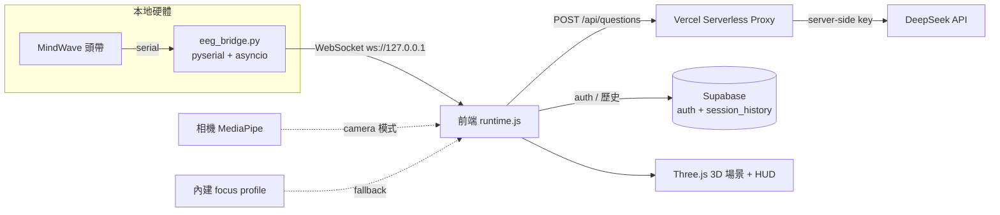
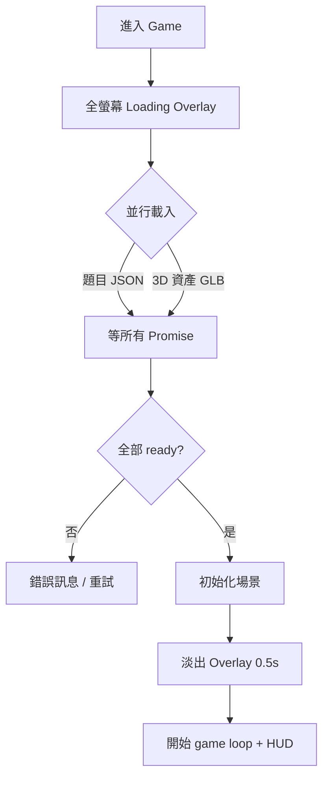

# NeuroFocus 展覽總手冊（EXHIBITION HANDBOOK）

> **一份文件睇晒**：產品是什麼、技術架構、玩法邏輯、現場執行、台上台詞、評判 Q&A、Windows 部署、競爭力與科學論述。
> 呢份係「**展覽 + 答辯**」用嘅參考大全，展覽當日直接開嚟用。
> 👉 至於「之後要寫咩 code / 待辦」——睇另一份 **[`docs/IEYI_PLAN_V2.md`](./IEYI_PLAN_V2.md)**。
> 👉 **正式答辯（3–4 分鐘、PPT 主導、老師 07-17 新方向）**——直接睇本手冊 **Part 6**（策略＋demo 時間分析＋PPT/Canva prompt＋講稿＋A0 海報）；Q&A 喺 **Part 7**；Pros & Cons 喺 **Part 9**。
>
> 本手冊由以下舊文件整合而成（已全部併入，並**更新到 2026-07 sprint 後嘅最新狀態**）：
> `PROJECT_ANALYSIS.md`、`README.md`、`EXHIBITION_EXECUTION_BRIEF`、`GAMEPLAY_UPGRADE_CONFIRMATION`、`UI_FLOWCHART`、`WINDOWS_2A_DEPLOYMENT_SOP`、`TRAE_HANDOFF_PROMPT_WINDOWS`、`debug-windows-home-fps`。
>
> 最後整合日期：**2026-07-16**

---

## 目錄

1. [產品是什麼](#part-1)
2. [網站所有模式：目的與原理](#part-2)
3. [技術架構（最新）](#part-3)
4. [遊戲運行邏輯 + UI 機制](#part-4)
5. [現場執行（答辯線 vs 攤位線）](#part-5)
6. [正式答辯包（PPT 9 頁＋數據＋預錄影片＋講稿＋海報）](#part-6)
7. [評判 Q&A](#part-7)
8. [Windows 部署 SOP + 裝置分工 + FPS 已知問題](#part-8)
9. [競爭力分析（對比賽）](#part-9)
10. [現場檢查清單](#part-10)
11. [IEYI 攤位規格 + 展板計劃（跟 2026 官方 PDF）](#part-11)

---
<a name="part-1"></a>
## Part 1 — 產品是什麼

**一句定位**：NeuroFocus 係一個**神經回饋專注訓練平台原型**。

**唔係**：單純遊戲、單純 EEG 讀數器、醫療器材。
**係**：把「專注狀態」變成**可視化、可訓練、可量化**嘅互動系統。

| | 內容 |
|---|---|
| **主問題** | 短片、通知、社交媒體令年輕人長期處於「睇落清醒、其實注意力好碎」嘅狀態。 |
| **主解法** | 用 EEG / 外界偵測**即時觀察**專注狀態，再用**遊戲回饋 + 呼吸介入**幫用戶重新回到穩定專注。 |
| **主價值** | 唔再係叫用戶「你專心啲」，而係令佢**即時見到自己狀態、學識點拉返自己入狀態**。 |
| **產品定位** | 教育 / 訓練 / 展示用嘅 neurofeedback prototype；專注訓練平台概念驗證；可延伸成商業產品嘅互動原型。 |

**核心閉環**（比單純顯示腦波數字更似產品）：
`偵測 → 視覺化 → 遊戲回饋 → 呼吸介入 → 量化報告`

---
<a name="part-2"></a>
## Part 2 — 網站所有模式：目的與原理

系統有**兩層模式**：先揀「練咩」，再揀「用咩訊號」。

### 第一層：任務模式（練咩）
> 訓練/挑戰兩個模式**都喺同一個海洋場景、玩法一致**，分別只在於挑戰模式會加入題目壓力。（2026-07 已把訓練模式一度試過嘅「書房場景」移除，統一用海洋。）第三個「學習模式」建置中（見下）。

- **訓練模式**：專注航行，**不出題**，主打穩定維持專注。沿一條**無限彎曲航道**航行：專注先揸得住個舵（分心船會漂離航道）、穩住專注 25 秒摘一粒**心流星**、每 500m 經過一個**航標**、天氣即時反映腦狀態（分心起霧、復原放晴）。最適合台上展示（流程最清、最穩、旁觀者一眼睇明）。
- **挑戰模式**：加入 **Stroop 題 + 邏輯題**，主打「一邊做任務、一邊維持專注」，貼近真實生活。最適合台下俾評判親身感受「做 task 時大腦容易亂」。
- **學習模式 Study Mode（✅ 2026-07-16 全部完成，正式站已解鎖）**：第三個選項，對應負責老師嘅**紙本 vs 平台對照實驗**——揀學科（生物已上線，「基礎/進階」兩級深度；化學/物理/歷史 🔒 Coming Soon，比賽前唔會解鎖）→ **閱讀階段**（教材放喺**螢幕右邊圓角磨砂閱讀器**〔闊約 60vw、跟深淺色變白/黑、唔重疊左邊 HUD〕，內文**筆記式排版**〔標題/列表/名詞解釋/重點框〕、計時器內嵌、左邊 focus HUD 照留；**每頁最少讀 15 秒先可揭頁、最多 3 分鐘自動揭頁**；背景同一片天空海景但**收起船／航道／浮標**；天氣共感/呼吸介入/三路訊號輸入照用）→ **答題階段**（**船隻＋題目 HUD 返場**，航行回饋同挑戰模式一樣，題目用該材料嘅**固定審核卷**）→ **Study Results**（📖 溫習＋✍️ 答題兩階段數據斬開＋**CSV 匯出**，學生用編號 S01/S02/S03 唔收真名）。**教材**：老師提供嘅生物「細胞膜與物質運輸」單元已數碼化（基礎/進階、雙語筆記、各 10 條審核 MC），存 `pages/game/studyMaterials.js`，老師可審核/整份換走。詳見 plan §5 D3。**比賽 demo 唔倚賴佢**：訓練/挑戰模式一行 code 都冇郁。**實驗操作**：Setup 右上角齒輪 ⚙ 有「重設所有數據」（清進度/歷史/結果、保留登入＋語言/主題）同「刪除帳戶」，方便每位 pilot 學生（S01→S02→S03）之間清底重嚟；Study Results 匯出 PDF 頁首而家會印埋登入 email 做識別。

### 第二層：訊號來源模式（用咩訊號）
- **Real EEG**：MindWave 頭帶讀 EEG → 本地 `eeg_bridge.py` → WebSocket → 前端。**wow factor 最高、最吸引評判**；風險最高（藍牙 / COM port / 權限）。
- **Simulation**：即使無頭帶 / 頭帶失靈都可完整展示。**唔係假裝 EEG，而係展示神經回饋系統嘅完整運作邏輯。** 內部再分兩條：
  - `camera-ready`：相機開到，用 **MediaPipe 臉部追蹤**（望開、眨眼、臉部居中程度）估算 0–100 專注分。屬「外界偵測專注力」。
  - `simulation-fallback`：連相機都唔得，用內建 focus profile 產生自然起伏嘅專注曲線，驅動船速同呼吸介入。屬「保底模式」，確保任何裝置都 demo 到。

### 介入層：Box Breathing
- **定位**：唔係獨立模式，而係**橫跨整個系統嘅統一介入層**。
- **觸發**：無論用緊 Real EEG / camera / fallback，只要系統判定用戶**長時間偏離穩定專注**（低於自適應門檻持續一段時間），就觸發。
- **流程**：遊戲暫停、計時停止、專注顯示歸零 → 引導呼吸（吸 4 秒 / 憋 4 秒 / 呼 4 秒）→ 完成後短暫 focus boost，令用戶明顯感受「成功回復專注」。
- **意義**：由「只量度專注」推進到「主動改善專注」。

### 難度（挑戰模式用）
- **Easy**：降低門檻，讓新手感受系統如何回應專注變化。
- **Medium**：較真實嘅認知負荷。
- **Hard**：高認知負荷 + Stroop 衝突題，講「現實世界唔係靜坐，而係高壓下仍要保持清晰」。

---
<a name="part-3"></a>
## Part 3 — 技術架構（最新，已反映 2026-07 sprint）

### 資料流


### 技術清單
- **前端基礎**：HTML5 單頁 + **Vanilla JS ES Modules**（非 React/Vue，輕量、易 Vercel 靜態部署）+ **Import Maps**（直接指 `three`、`@mediapipe/tasks-vision`、`@supabase/supabase-js`）+ **Hash Router**。
- **UI / 視覺**：Tailwind CDN（首頁高密度排版）+ Custom CSS（Liquid Glass / Clay 質感、dark mode、game HUD）+ Google Fonts / Material Symbols。字體統一：Orbitron 只喺遊戲 HUD，其餘用 EB Garamond + Inter。
- **3D 互動**：Three.js（場景、光影、材質、粒子、船隻）+ GLTF/HDR 資產（`EGGShip2.glb`、HDR sky、water normal map）+ Web Audio（BGM / 音效）。
- **專注輸入**：MindWave Mobile 2 單通道 EEG（`attention` / `meditation` / `signal_quality`）+ WebSocket + MediaPipe FaceLandmarker + getUserMedia。
- **本地橋接**：Python `asyncio` + `pyserial` + `websockets` + `serial.tools.list_ports` + `threading`。
- **後端（sprint 後新增）**：
  - **Supabase**：真實帳戶 auth（錯密碼真係入唔到；離線時先 fallback 本地 session）+ `session_history` 表（跨 session 歷史）。config 見 `docs/supabase_schema.sql`、`services/supabaseClient.js`。
  - **Vercel Serverless `/api/questions`**：DeepSeek key 收埋喺 `process.env.DEEPSEEK_API_KEY`，**永遠唔會出現喺瀏覽器**。有 GET 健康檢查（開網址睇 `hasKey`）。
- **持久化**：localStorage（語言 / 主題 / user / 歷史 mirror）。
- **部署**：Vercel 靜態前端 + 本地 Python bridge（EEG 唔上雲）+ Windows batch 啟動腳本。

### 主要檔案負責乜（更新版）
| 檔案 | 負責 |
|---|---|
| `index.html` | 載入入口、import map、全域 DOM 容器（countdown / breathing / loader） |
| `app/main.js` | Bootstrap：讀 localStorage 語言/主題/session，啟動 router |
| `app/router.js` | 單頁 hash router，管 home/auth/setup/game/results 嘅 lazy import + mount |
| `app/state.js` | 全域狀態（`testMode`、`trainingDurationSec`、`inputMode`、`difficulty`、`focusSource`…） |
| `app/i18n.js` | 中英文文案（`hk` / `en` 兩個 block，key 要對齊） |
| `api/questions.js` | **Vercel proxy**：server-side 叫 DeepSeek、隱藏 key、健康檢查、fallback reason |
| `services/authService.js` | **真 Supabase 登入/註冊**（離線 fallback） |
| `services/supabaseClient.js` | Supabase client（動態 import，離線唔會 crash） |
| `services/storageService.js` | localStorage + **跨 session 歷史讀寫** |
| `services/runtimeLoader.js` | 版本號 query string + 動態 import runtime（降快取干擾） |
| `services/focusInputService.js` | 相機專注偵測（MediaPipe FaceLandmarker） |
| `pages/game/runtime.js` | **全專案核心引擎**（接近 7000 行）：Three.js 場景、航行物理（航向+慣性）、心流充能摘星、天氣共感、黃金時刻、題目、focus 更新、呼吸介入、simulation profile、bridge reconnect、results、audio、performance profile、**自適應門檻**、**FPS meter**、**學習模式閱讀引擎（D3）** |
| `pages/game/voyage.js` | **航程系統**：無限不規則彎曲航道（發光虛線）、航標浮塔 checkpoint（浮沉+燈頭脈動+海鷗）、航海圖數據；`setVoyageVisible()` 畀學習模式收起船隻航道 |
| `pages/game/studyMaterials.js` | **學習模式教材（D3）**：per 學科 per 深度嘅分頁課文＋審核 MC——老師嘅生物「細胞膜與物質運輸」（基礎/進階，雙語）已入庫，老師可直接審核/整份換走 |
| `eeg_bridge.py` | 本地硬體橋：掃 COM port、揀 MindWave、解析 attention/meditation/signal、WebSocket 廣播 |
| `styles/**` | UI 外觀、Liquid Glass、dark mode、各頁樣式 |
| `*.bat` / `requirements-eeg-bridge.txt` | Windows 一鍵啟動（見 Part 8） |

---
<a name="part-4"></a>
## Part 4 — 遊戲運行邏輯 + UI 機制

### 基本流程
`輸入名稱 → Setup（揀任務模式 →〔學習模式先揀學科＋深度〕→ 揀訊號來源 →（挑戰揀難度 / 訓練揀時長 / 學習直接入）→（Simulation 問相機授權））→ Game → Results`

### 核心邏輯（2026-07 gameplay 重新設計後）
- **專注度驅動船速 + 舵**：`focusLevel` 係核心輸入——越高船越快；同時專注 = 舵嘅控制力：專注時船貼住彎曲航道行，分心時船會隨機漂離航道，重新專注先拉得返（真實航向物理：慣性加速、入彎側傾）。
- **心流充能摘星（訓練模式嘅「贏」）**：企穩喺個人穩定線以上，能量環≈25 秒充滿一圈 = 1 粒星（分心只暫停充能，唔倒扣）；摘星有短暫滑行加速 + 金色橫額。
- **航標 checkpoint**：每 500m 一個紅白航標浮塔座喺航道上，經過有鐘聲 + 橫額；右下航海圖卡實時顯示航道彎位、船嘅偏航同下一個航標距離；跨 session 有「航海日誌」累積總航程。
- **天氣共感**：分心持續 → 起霧、水濁、天暗（旁觀者唔使識睇 HUD 都知狀態）；復原 → 放晴。呼吸介入時霧鎖畫面，**跟住呼氣一格格撥開**，完成陽光爆返。
- **黃金時刻（Real EEG 專屬）**：專注 + 放鬆雙軸同時達標 4 秒 → 成個場景轉入暖金黃昏——雙軸神經回饋嘅高光位，Simulation 冇（冇 meditation 訊號，唔造假）。
- **題目系統**（挑戰模式）：先試 AI 生成 → 失敗 / 太慢 / 格式錯就自動轉**本地 fallback 題庫**。題目偏生活化 + 生物/化學/邏輯推理。有嚴格本地 validation（唯一正解、拒絕重複選項 / 「以上皆是」/ 缺解釋），無效 AI 題自動換成本地驗證過嘅題。
- **雙軸心流（Real EEG 專屬）**：EEG 模式下，心流條件係「**專注 AND 放鬆**」（attention 高 + meditation 達標）；Simulation / camera 模式無 meditation 訊號，用單軸規則。
- **Box Breathing 觸發**：`focusLevel` 低於**自適應門檻**（用歷史調整，唔再死 45/55）並持續一段時間 → 底部專注提示（**連提示音**，2026-07-18 加：提示彈出嗰刻響一次，6 秒冷卻防重複，跟遊戲內音效音量滑桿）→ 觸發呼吸 UI → 完成後短暫 focus boost。
- **自適應門檻**：系統跟住玩家歷史表現收緊 recovery / trigger 門檻——係真「訓練」而唔淨係「量度」。

### Results 量化（2026-07-10 D1 重新設計：航海報告版面）
> 設計語言用 v0 設計稿，Claude 以 vanilla JS + inline SVG 落地（唔加框架），Training / Challenge 兩版共用一套 teal + 金色系，深淺色 + 雙語齊全。由上到下：
- **Hero 判語**：一句大字 + 模式/難度/訊號來源 chips + 專注率或正確率——做到「3 秒睇明今次點」。
- **4 格指標**：專注穩定度（高亮）、平均恢復、呼吸救返；第 4 格挑戰係「距離 + 航標」、訓練係「訓練時長」。
- **成就（訓練）**：心流星、航標、**黃金時刻（真 EEG 專屬，模擬顯示鎖住唔造假）**、航海日誌累積；**答題回顧（挑戰）**：答對數 + 可展開答錯卡（你的答案／正解／解釋）。
- **專注曲線 SVG**（area fill + 穩定線）+ **session 內前後對比 badge**（頭半 vs 尾半）。
- **跨 session trend**（recovery / 穩定度趨勢 + 「分心恢復 vs 你最近平均」誠實 headline）——直接回應評判「點證明有進步」。
- **下一個目標卡**：一個具體目標 + 一句現實意義（例如「恢復快 = 溫書分咗心都追得返」）——見到進步之餘知道下一步。
- **耐刷新**：中途 refresh Results 頁唔會歸零（快照存 localStorage，還原最新一局；重複刷新唔會重複入歷史）。

### UI 機制（值得同評判講嘅工程細節）
**1. Loading 狀態機**（避免黑屏 / 感知崩潰）

用 `Promise.all` 確保資產**全部 ready** 先開場，避免 3D「pop-in」。

**1a2. 題目載入分流＋啟動看門狗（2026-07-11 修復「無法進入遊戲」）**：
- **Simulation／相機模式**：載入**唔等 AI 題**——本地題庫即秒seed入場，AI 題 4 秒後喺背景補上（成功就自動換用，失敗照玩本地題）。效果：模擬模式幾秒內必入場，唔會因為 AI 慢而卡 Loading。
- **EEG 模式**：保留「AI 優先、最多等 8 秒、可中斷」——真頭帶 demo 值得等一陣攞 AI 題。
- **啟動看門狗**：入場 25 秒仲未 boot 完（例如某個資產請求 hang 死）→ 自動放棄、雙語提示「載入超時」、帶返 Setup 頁重試；boot 成功一刻即解除，唔會誤殺慢機嘅開場倒數。**唔會再出現「無限 Loading」**。

**1b. 入場零穿崩 + 現代 Loading（2026-07-10）**：入 game 一刻 loader 會**同步不透明覆蓋**（頁面初始已帶隱藏態），唔會再見到一兩幀原始 HUD/背景；Loading 頁重新設計（小艇浮喺波浪線 + 品牌字 + 進度 shimmer，純 transform/背景動畫，弱機都平）。

**1b2. 遊戲內設定面板（2026-07-11 完成版）**：右上 ⚙ 掣開設定——畫質（自動 / 高L0 / 中L1 / 低L2 / 最低L3）、鏡頭距離（近/標準/遠）、**背景音樂/音效音量滑桿**、**全螢幕切換**；全部設定會記住。**開住設定面板時遊戲會經正規 pause 管線暫停**（計時/距離/呼吸計時全部凍結），閂返即繼續。自動畫質模式下 FPS 跌會自動降級、回穩升返；DEMO_MODE 嘅 FPS meter 顯示現行等級（評判想睇技術深度可以指住佢講）。

**1c. 遊戲提示一律喺螢幕底（2026-07-10）**：摘星/航標/開場提示/加速/呼吸前置提示全部改為由**底部中央**升起（分四層堆疊唔會互疊），唔遮玩家視線中央；呼吸引導 overlay 維持原樣。

**2. 固定寬度數字 HUD**：`updateDigitDisplay` 把每個數字放入固定闊度 `.digit-box`（`tabular-nums`），令 speed 由「1.1」跳到「10.0」時 **HUD 唔會抖動**。

**3. Windows 效能保護**：偵測到 Windows 就掛 `html[data-platform="windows"]` flag，關掉首頁重 blur / glow / 浮動動畫（見 Part 8）。另有隱藏 **FPS meter**（`DEMO_MODE` 後面）可即時睇幀數。

---
<a name="part-5"></a>
## Part 5 — 現場執行（答辯線 vs 攤位線）

> **一句總綱**：**答辯靠 PPT＋預錄影片（Part 6），零現場操作風險；攤位靠真平台試玩，畀評判同觀眾親手體驗。**兩條線互為備份——答辯入面任何嘢評判想睇真版，攤位（或手提機）即場開。

### 5.1 兩條線分工
| 線 | 場合 | 用咩 | 風險 |
|---|---|---|---|
| **答辯線** | 台上 3–4 分鐘＋Q&A | PPT＋數據 dashboard＋預錄對比影片＋Results 截圖（全部離線檔案） | 極低 |
| **攤位線** | 評判巡攤／觀眾試玩 | 真平台：iPad／手機行 Simulation 保底；Windows＋EEG 頭帶做加分位 | 可控（雙軌＋備援） |

### 5.2 攤位雙軌制＋成功標準
| 軌 | 裝置 | 角色 |
|---|---|---|
| **A. EEG 深度軌** | Windows Laptop + EEG 頭帶 | 完整功能＋技術深度，畀評判睇「真腦波輸入」 |
| **B. 穩定體驗軌** | iPad + 參觀者手機 | 流暢、多人參與，Simulation 保底 |

**核心原則**：唔好將成敗押喺 EEG 即時取數——「網站可玩、Simulation 穩定、EEG 作加分」。
**三層成功標準**：最低＝觀眾用 iPad/手機玩到 Simulation；標準＝完整展示 EEG 連接流程；加分＝真 EEG 成功驅動船速。

### 5.3 風險分級＋救場
- **低風險**：公開網站、Simulation、題目互動、呼吸介入、結果頁。
- **中風險**：AI 出題速度、會場網絡、平板／手機效能。
- **高風險**：EEG 當日藍牙／serial、Windows 權限／驅動、bridge 數據唔穩。

**救場台詞**：
> 「會場藍牙干擾比較大，Real EEG 正在重連。不過我哋個系統有 Simulation 路線，可以即刻展示完整訓練邏輯。」

**鐵律**：觀眾面前**唔好花多過 1–2 分鐘**搞硬件；唔穩即刻切 Simulation。

### 5.4 四人分工
1. **主講＋評審應對**：講背景、產品目的；答「點解用 EEG/camera/simulation」「專注點量化」「呼吸點幫訓練」（彈藥喺 Part 7）。
2. **EEG＋Laptop**：管頭帶連接、bridge 啟動、佩戴示範。
3. **iPad＋一般參觀者**：引導入 Simulation，行 5.6 導覽流程。
4. **人流＋手機入口**：QR 掃碼、解釋手機版、處理網絡／排隊／故障。

### 5.5 帶咩物品
- **核心**：Windows Laptop ×1、EEG ×2 套、iPad ×1（連充電線／頭）、Laptop 充電器、EEG 電池配件、延長線、拖板。
- **網絡備援**：手機熱點 ≥1、已部署網址、QR code、本機 IP 局域網入口說明。
- **操作／清潔**：酒精濕紙巾、紙巾、小鏡／髮夾（戴 EEG）、膠紙／魔術貼。
- **講解物料**：項目名牌、一頁式介紹、A0 海報、評審問答速記卡（Part 7 精華）。
- **數碼備援**：USB（簡報＋預錄影片＋四頁截圖：Setup／閱讀／測驗／Results）、多一部手機錄影。

### 5.6 攤位導覽（中英・一般觀眾 1–2 分鐘）
1. **Hook**
   > **【中】** 頭先台上講嗰套腦波訓練系統，我哋而家可以畀你親身試。
   > **【EN】** That brainwave-training system we just presented — you can try it yourself right now.
2. **先講模式 Explain the modes first**
   > **【中】** 先揀任務模式，再揀訊號來源。
   > **【EN】** First pick a task mode, then pick a signal source.
3. **先示範訓練模式 Demo Training first**（`Real EEG → 訓練`）
   > **【中】** 呢個唔出題，純粹訓練穩定專注。
   > **【EN】** This one has no questions — it's purely about training steady focus.
4. **再示範挑戰模式 Then Challenge**
   > **【中】** 基本功穩定後就加任務壓力，貼近現實。
   > **【EN】** Once the basics are steady, we add task pressure to mirror real life.
5. **最後 Results Finish on Results**
   > **【中】** 每次訓練都量化今次表現——穩定度、恢復速度、呼吸次數，仲有同你之前 session 嘅對比。
   > **【EN】** Every session quantifies your performance — stability, recovery speed, breathing count, plus a comparison with your previous sessions.
6. **未來發展點到即止 Touch on the future, lightly**
   > **【中】** 之後會加長期 progress tracking、個人化難度、更多外界偵測。
   > **【EN】** Next we'll add long-term progress tracking, personalised difficulty, and more external sensing.

**評判版（3–5 分鐘）**：上面 6 步之外，加：三種模式概念（訓練／挑戰／學習）→ 學習模式完整行一次（攤位冇時限，15 秒閱讀鎖照行）→ EEG 頭帶示範（如當日穩定）→ Results 講恢復時間＋趨勢。
**EEG 唔穩時**：先認（「現場藍牙受限」）→ 即切 Simulation 行完整閉環 → 強調輸入接口已存在、換訊號源唔使改系統。

---
<a name="part-6"></a>
## Part 6 — 正式答辯包（3–4 分鐘・PPT＋預錄影片・零現場操作）

> **策略（07-17 老師方向＋Steven 修訂版）**：台上**完全唔現場操作平台**——問題用**真實研究數據 dashboard** 講；demo 用**賽前預錄嘅「專心 vs 分心」對比影片**；Results 用截圖。PPT 行**多文字路線**（評判自己讀得明，唔使靠腦補），內文喺 6.3 直接 copy 得。真平台留返俾 Q&A／攤位（Part 5）。
> 點解唔現場行：學習模式每頁 15 秒閱讀鎖 ×5 頁＋10 條 MC，完整流程機械下限 2.5–3 分鐘，台上行唔晒；預錄影片仲可以**同屏對比兩種狀態**，現場行反而做唔到。

### 6.1 核心訊息＋時間分配

**一個核心訊息（成隊人講同一句）**
> **中**：NeuroFocus 將「專注力」由一個睇唔到、齋靠意志力頂嘅嘢，變成**睇得到、練得到、量得到**嘅技能——一隻**會因為你分心而飄走嘅船**即時話你知你幾時走神，**呼吸提示**幫你拉返，**進度儀表板**話你知有冇進步。
> **EN**: NeuroFocus turns focus — normally invisible and willpower-dependent — into a skill you can **see, train and measure**: a boat that **drifts when your attention wanders** shows the exact moment you lose focus, breathing cues pull you back, and a progress dashboard tells you whether you are improving.

**時間分配（9 頁・目標 3 分 50 秒，超時壓縮位見括號）**
| 段 | Slides | 內容 | 時間 |
|---|---|---|---|
| A | S1–S2 | 開場＋問題數據 dashboard | 50s |
| B | S3–S4 | 舊方法缺口＋一個閉環 | 40s |
| C | S5–S7 | 三種模式 → 對比影片 → Results 儀表板 | 85s（S5 可壓到 15s） |
| D | S8 | 點樣量度＋實驗設計＋誠實成效 | 35s |
| E | S9 | 市場＋願景＋收結 | 20s（可壓到 15s） |

### 6.2 語言建議（中英對照點做）
**建議：標題雙語（英文為主視覺、中文副標），內文以中文為主、關鍵術語括號附英文。**理由：IEYI 係國際性比賽，雙語標題保證國際評判一眼明；本地評審以中文溝通為主，中文內文保證資訊密度同讀速。**如果賽會確認全英文評審**，內文轉英文（Canva 逐頁改得快）。講稿（6.4）中英全份，臨場講邊隻話都接得上。

### 6.3 PPT 逐頁大綱（9 頁・多文字版・內文可直接 copy 落 Canva）

> 設計風格（顏色、字體、版式美術）**由設計隊員全權決定**——下面只列結構＋文字內容＋圖位。

**S1 封面**
- 標題：**NeuroFocus** ／ 副題：睇得到的專注力訓練 Focus you can see, train & measure
- 內文（一句）：一個用「即時偵測＋遊戲回饋＋呼吸介入＋數據儀表板」幫青少年重建專注力嘅訓練平台。
- 圖位：平台海洋＋帆船畫面做背景；角落：隊名／學校／IEYI 2026。

**S2 問題：數據 Dashboard「注意力，正在碎片化 / Attention is fragmenting」**
- 版面：**4 張大數字卡**＋一條落跌趨勢線（2.5 分鐘 → 75 秒 → 47 秒），下面一句結論。
- 四張卡（數字＋解說＋來源細字）：
  1. **47 秒** — 人喺單一螢幕上嘅平均持續專注時間：2004 年係 2.5 分鐘，近年跌到 47 秒（Gloria Mark 團隊，UC Irvine，多個獨立研究佐證）。
  2. **23 分 15 秒** — 每次被打斷之後，平均要 23 分鐘先完全返到原本任務（Mark 等，UC Irvine）。
  3. **2 倍** — 高頻使用數碼媒體嘅青少年，24 個月內出現 ADHD 症狀嘅風險約為低頻者兩倍（JAMA 2018；約 2,600 名高中生追蹤研究）。
  4. **6–7 小時** — 香港青少年 2024/25 年度日均螢幕時間，接近成人兩倍（本港調查／立法會文件）。
- 結論句：**唔係後生仔唔想專心——係環境令「保持專注」愈嚟愈難，而且冇人教過點樣拉返。**
- 來源（放頁底細字，隊員可再核實）：gloriamark.com／APA Speaking of Psychology／JAMA jamanetwork.com/journals/jama/fullarticle/2687861／The Standard HK・news.gov.hk 2025-04。

**S3 舊方法缺口「叫人『專心啲』冇用 / Why 'just focus' fails」**
- 內文（三點，成句）：
  1. 意志力提醒（「專心啲啦」）：唔會話你知你**幾時**走咗神，等你發現嗰陣已經遲咗。
  2. 番茄鐘／溫習 app：只計時間，唔量狀態——坐足 25 分鐘唔等於專注咗 25 分鐘。
  3. 最貴嘅係恢復成本：一次分心平均要 23 分鐘先返到嚟（接 S2 數據）——所以介入一定要**即時**。
- 圖位：左「舊方法」✗ 右「缺口：即時覺察＋即時介入＋量化進步」。

**S4 我哋嘅答案「一個閉環，唔係三件事 / One loop, not three features」**
- 版面：中央圓環圖：`偵測 Detect → 睇到 See（船）→ 介入 Cue（呼吸）→ 量化 Measure（儀表板）` 首尾相連。
- 內文（兩句）：我哋唔係做咗三個獨立功能，而係一個閉環：系統即時偵測你嘅專注，用一隻船畀你「睇到」自己狀態，分心太耐就用呼吸提示拉你返嚟，完場再量化你嘅進步。訊號來源可以係 EEG 腦電、相機，或者模擬曲線——閉環唔變。

**S5 三種模式「一個閉環，三個入口 / One loop, three entries」**
- 內文（每個模式一行 concept）：
  1. **訓練模式 Training**：冇題目，純粹練「維持穩定專注」——專注力嘅基本功。
  2. **挑戰模式 Challenge**：加入 Stroop／邏輯題，練「一邊做任務一邊唔俾自己散」——貼近考試同日常。
  3. **學習模式 Study**：真實溫習場景——讀老師教材、考老師審核嘅卷，全程順便量埋你嘅專注狀態。
- 收尾句（大字）：**學習模式一個模式已經行晒成個閉環——所以我哋用佢示範。**
- 圖位：三張細卡（每模式一張截圖）。

**S6 對比影片「同一份筆記，兩種狀態 / Same notes, two states」**
- 版面：中央嵌入**預錄影片**（規格見 6.5），旁邊少量文字。
- 內文（影片講咩）：賽前實錄——同一段生物筆記，「專心」同「分心」兩種狀態嘅真實系統反應：閱讀時 focus 指標點變、分心點觸發呼吸提示、測驗時隻船點樣由順航變失速。
- 備註細字：全程真實錄製，無加工；平台喺攤位可即場試。

**S7 結果儀表板「唔止分數，係你嘅專注歷史 / Not a score — your focus history」**
- 版面：Results 大截圖＋三個重點標籤。
- 內文（三點）：
  1. **溫習 vs 答題分開量**：兩個階段嘅專注穩定度、分心次數獨立顯示——知你係「讀嗰陣散」定「答嗰陣散」。
  2. **恢復時間**：每次分心之後幾快拉得返——呢個先係「訓練緊」嘅證據。
  3. **跨場趨勢**：同你之前嘅 session 比，有進步就鼓勵你；一鍵匯出 PDF／CSV 畀老師分析。

**S8 點樣證明「實驗設計＋誠實成效 / Evidence & honesty」**
- 內文：
  - **對照實驗（老師指導下設計）**：同一份生物教材＋同一份老師審核測驗卷；一組紙本溫習、一組平台溫習；比較**測驗成績**＋**溫習過程專注數據**（穩定度／恢復時間）。
  - **機制有文獻根據**：即時回饋建立自我覺察；規律呼吸（box breathing）降低過高喚醒；重複練習訓練「分心後拉返」呢種可遷移技能。
  - **誠實講**：而家係 n≈2–3 嘅 pilot，唔係正式研究；長期成效要更大樣本對照先證實——我哋分得清「已做到」同「仲要證實」。
- 圖位：實驗流程小圖（紙本組 vs 平台組 → 同卷 → 比較）。

**S9 市場＋願景＋收結「由『叫你專心』到『畀你練專心』」**
- 內文：
  - **市場**：唔一定要 EEG 頭帶，有 webcam 就用到——任何學生即場試；學校／補習／家長市場，跨 session 數據支持訂閱同報表模式。
  - **願景**：接返真 EEG 閉環做旗艦體驗；加多 sensor（眼動／HRV）交叉驗證；同學校合作做大樣本研究。
  - **收結（大字）**：NeuroFocus——將專注力變成**睇得到、練得到、量得到**嘅技能。技術細節歡迎 Q&A。

**Canva 製作 Prompt（copy 畀隊員／Canva AI）**：
```
請整一副 16:9、共 9 頁嘅比賽答辯簡報，主題「NeuroFocus——神經回饋專注力訓練平台」。
版面要求：標題中英對照（英文做主標題、中文做副標）；內文中文為主，可以有較多文字，
但要分點、易讀；設計風格（顏色、字體、裝飾）由你哋決定，保持乾淨、對比清晰即可。
每頁內容如下（文字照用得）：
第1頁 封面：NeuroFocus／睇得到的專注力訓練 Focus you can see, train & measure；
  一句介紹＋隊名/學校/IEYI 2026；背景留一張海洋帆船圖位。
第2頁 問題數據儀表板：標題 Attention is fragmenting／注意力，正在碎片化；
  四張大數字卡：47秒（單一螢幕平均專注，2004年2.5分鐘跌到近年47秒）、
  23分15秒（每次被打斷後平均要幾耐先完全返到原任務）、
  2倍（高頻用數碼媒體嘅青少年24個月內出現ADHD症狀風險）、
  6-7小時（香港青少年日均螢幕時間，近成人兩倍）；
  加一條 2.5分鐘→75秒→47秒 落跌趨勢線；頁底細字來源：UC Irvine (Gloria Mark)、
  JAMA 2018、香港調查 2024/25。
第3頁 舊方法缺口：標題 Why "just focus" fails／叫人「專心啲」冇用；
  三點：意志力提醒唔會話你知幾時走神；番茄鐘只計時間唔量狀態；
  一次分心平均23分鐘先返到嚟，所以介入要即時。
第4頁 一個閉環：標題 One loop, not three features／一個閉環，唔係三件事；
  中央圓環圖四節點：偵測 Detect→睇到 See(船)→介入 Cue(呼吸)→量化 Measure(儀表板)。
第5頁 三種模式：標題 One loop, three entries／一個閉環，三個入口；
  三張卡：訓練模式(純練穩定專注嘅基本功)、挑戰模式(壓力下維持專注，貼近考試)、
  學習模式(真溫習場景，讀教材考卷順便量專注)；
  底部大字：學習模式一個模式已經行晒成個閉環——所以用佢示範。
第6頁 對比影片：標題 Same notes, two states／同一份筆記，兩種狀態；
  中央大影片位(16:9)，係我哋預錄嘅「專心vs分心」系統實錄；
  旁註：真實錄製，攤位可即場試真平台。
第7頁 結果儀表板：標題 Not a score — your focus history／唔止分數，係你嘅專注歷史；
  一張大截圖位＋三個標籤：溫習vs答題分開量、分心後恢復時間、跨場進步趨勢＋PDF/CSV匯出。
第8頁 實驗與誠實：標題 Evidence & honesty／點樣證明；
  三點：紙本組vs平台組同教材同卷對照實驗；機制有文獻根據(即時回饋/呼吸調節/重複練習)；
  誠實講依家係細樣本pilot，長期成效待大規模研究。
第9頁 市場願景收結：標題 From "focus!" to "train your focus"／由叫你專心到畀你練專心；
  市場(有webcam就用到，學校/補習/家長)、願景(真EEG閉環、多sensor、大樣本研究)、
  收結大字：NeuroFocus——將專注力變成睇得到、練得到、量得到嘅技能。
```

### 6.4 講稿（Part A–E・中英對照・對應 S1–S9）

> 邊個讀邊段你哋自己分；`[SLIDE]`＝轉頁位，`[VIDEO]`＝影片播放中講。

**A — 開場＋數據問題（S1→S2，50s）**
> **【中】** 各位評判好，我哋係 NeuroFocus。`[SLIDE S2]` 想先畀四個數字大家睇。**47 秒**——人喺一個螢幕上嘅平均持續專注時間，廿年前係兩分半鐘，而家得返 47 秒。**23 分鐘**——每次分心之後，平均要 23 分鐘先完全返到原本任務。**2 倍**——高頻用數碼媒體嘅青少年，兩年內出現 ADHD 症狀嘅風險係其他人兩倍。**6 至 7 個鐘**——香港青少年每日嘅螢幕時間，接近成人兩倍。唔係後生仔唔想專心，係環境令佢哋愈嚟愈難，而且**冇人教過佢哋點樣拉返**。
>
> **【EN】** Good afternoon judges, we are NeuroFocus. `[SLIDE S2]` Four numbers first. **47 seconds** — the average time we now sustain attention on one screen, down from 2.5 minutes two decades ago. **23 minutes** — the average time to fully return to a task after one distraction. **2×** — teens with heavy digital media use face roughly double the risk of developing ADHD symptoms within two years. **6–7 hours** — Hong Kong teenagers' daily screen time, nearly double that of adults. It's not that young people don't want to focus — the environment makes it ever harder, and **no one ever taught them how to pull themselves back**.

**B — 缺口＋一個閉環（S3→S4，40s）**
> **【中】** `[SLIDE S3]` 而家啲方法點解唔夠？叫你「專心啲」，唔會話你知你**幾時**走咗神；番茄鐘只計時間，唔量狀態；而一次分心要 23 分鐘先返嚟——所以介入一定要**即時**。`[SLIDE S4]` 我哋嘅答案係**一個閉環**：即時**偵測**專注 → 用隻船畀你**睇到** → 分心太耐**呼吸提示**拉你返 → 完場**量化**進步。訊號可以嚟自 EEG 腦電、相機或者模擬——閉環唔變。
>
> **【EN】** `[SLIDE S3]` Why do current fixes fall short? "Just focus" never tells you *when* you drifted; a timer counts minutes, not state; and one distraction costs 23 minutes — so intervention must be **immediate**. `[SLIDE S4]` Our answer is **one loop**: detect focus in real time → make it **visible** through a boat → a **breathing cue** pulls you back when you drift too long → and every session **measures** your progress. The signal can come from EEG, a camera, or simulation — the loop stays the same.

**C — 三種模式＋影片＋儀表板（S5→S6→S7，85s）**
> **【中】** `[SLIDE S5]` 呢個閉環有三個入口：**訓練模式**冇題目，純練穩定專注嘅基本功；**挑戰模式**加題目壓力，練「一邊做嘢一邊唔散」；**學習模式**係真溫習——讀老師教材、考老師審核嘅卷，全程量埋你嘅專注。學習模式一個模式行晒成個閉環，所以我哋用佢示範。
>
> `[SLIDE S6，開影片]` **【中・影片旁述】** 呢段係賽前真實錄製：同一段生物筆記，兩種狀態。專心嗰陣——focus 指標平穩。而家分心——大家睇住個指標跌，系統即刻彈**呼吸提示**，跟住呼吸，狀態拉返。測驗階段——專心時隻船順航；一分心，隻船即刻失速。呢個就係「睇得到嘅專注」。
>
> `[SLIDE S7]` **【中】** 完場之後係咁樣嘅報告：**溫習同答題分開量**——知你係讀嗰陣散定答嗰陣散；**每次分心幾快拉返**——呢個先係訓練緊嘅證據；仲有**同之前場次嘅進步趨勢**，一鍵匯出 PDF／CSV 畀老師。
>
> **【EN】** `[SLIDE S5]` The loop has three entries: **Training** — no questions, pure stability practice; **Challenge** — questions add pressure, staying focused while working; **Study** — real revision: read the teacher's material, take the teacher-vetted quiz, with focus measured throughout. Study mode runs the whole loop in one mode, so that's our demo. `[SLIDE S6, play video]` **(over video)** This was recorded before the competition: the same biology notes, two states. Focused — the meter stays steady. Now distracted — watch it drop, the **breathing cue** appears, follow it, and the state recovers. In the quiz, the boat sails smoothly while focused and stalls the moment attention breaks. This is focus made visible. `[SLIDE S7]` And here is the report: **revision and quiz measured separately**, **recovery time after each distraction** — the real evidence of training — plus a **cross-session trend**, exportable to PDF/CSV in one click.

**D — 實驗＋誠實（S8，35s）**
> **【中】** 點樣證明有用？我哋喺老師指導下設計咗對照實驗：**同一份教材、同一份審核卷**，紙本組同平台組比較測驗成績＋溫習過程嘅專注數據。機制方面有文獻根據——即時回饋建立自我覺察、規律呼吸降低過高喚醒、重複練習訓練恢復力。但要誠實講：而家係 n 得 2 至 3 個學生嘅 pilot，長期成效要更大樣本先證實——我哋分得好清「已做到」同「仲要證實」。
>
> **【EN】** How do we prove it helps? Under our teacher's guidance we designed a controlled comparison: **same material, same vetted quiz**, paper group versus platform group, comparing test scores plus the focus data recorded during revision. The mechanisms are grounded in literature — real-time feedback builds self-awareness, paced breathing lowers excess arousal, repetition trains recovery. But honestly: this is a pilot of two to three students; long-term efficacy needs a larger study — we keep a clear line between "done" and "to be proven".

**E — 市場＋願景＋收結（S9，20s）**
> **【中】** 因為有 webcam 就用到，任何學生都試得——學校、補習、家長市場都打得開；跨場數據支持訂閱同報表模式。下一步：接返真 EEG 閉環、加眼動／心率等 sensor、同學校做大樣本研究。一句收結：NeuroFocus，將專注力變成**睇得到、練得到、量得到**嘅技能。技術細節歡迎 Q&A，多謝各位！
>
> **【EN】** Since a webcam is enough, any student can try it — opening the school, tutoring and parent markets, with cross-session data supporting subscriptions and reports. Next: the full EEG loop, extra sensors like eye-tracking and HRV, and a larger study with schools. To close: NeuroFocus turns focus into a skill you can **see, train and measure**. We welcome all technical questions in Q&A — thank you!

### 6.5 預錄影片拍攝清單（賽前必做・S6 用）

**內容（~40 秒，一條片）**
| 秒數 | 畫面 | 重點 |
|---|---|---|
| 0–5 | 標題卡「同一份筆記，兩種狀態 Same notes, two states」 | 定調 |
| 6–20 | **閱讀階段對比**：專心（指標平穩）vs 分心（望開→指標跌→**呼吸提示彈出**→跟住呼吸拉返） | 即時覺察＋介入 |
| 21–35 | **測驗階段對比**：專心（船順航、答題順）vs 分心（船失速） | 船＝專注嘅視覺化 |
| 36–40 | 收尾卡：一句核心訊息 | 扣返主題 |

**拍法**
- 螢幕錄影（QuickTime／OBS），1080p 或以上；片內**保持 focus 指標全程可見**（評判要睇到數字郁）。
- 對比方式任揀：左右分割同屏，或先後兩段（先專心後分心）。
- 加大字幕標明「專心中／分心中／呼吸介入」——會場嘈，唔靠聲。
- 出 MP4 直接嵌入簡報；USB 多帶一份；埋位前試播一次（聲量／解像度）。
- 加分位：分心嗰段將個手機入鏡（真示範「碌手機」情景），更貼題。

### 6.6 A0 海報大綱（841×1189mm 直度・2026-07-18 對齊隊員 Canva Template）

> 隊員 template 實際版面（已定）：**頁首**（左：NeuroFocus 大字＋Project Overview＋學校名；右：Authors 四人＋NeuroFocus Web QR＋「**DEMO ONLY」）→ **兩行細格（2×2）** → **一個大格** → **一個闊格** → 底部 **References**。
> 原則不變：**3 米外睇到主訊息，1 米內睇到閉環同截圖**；每格一個重點，唔好塞滿字；顏色／字體／美術由設計隊員決定；**同 9 頁 PPT 口徑一致**（評判台上台下見到同一套故事）。

```
┌────────────────────────────────────────────────────────────────┐
│ 頁首 HEADER                                                      │
│  NeuroFocus（大 logo 字）          │ AUTHORS（四人全名）         │
│  一句定位 Overview（中＋EN）        │ NeuroFocus Web ▸ [大 QR]    │
│  STFA Cheng Yu Tung Secondary Sch.  │ "Try it at our booth"       │
├────────────────────────────┬───────────────────────────────────┤
│ ① THE GAP（細格）           │ ② SOLUTION（細格）                 │
│  大字：47 秒 · 23 分鐘       │  圓環大圖（本格主視覺）：           │
│  一句：叫人「專心啲」冇用    │   Detect→See(船)→Cue(呼吸)→Measure │
│   ——佢唔會話你幾時走神       │  一句：一個閉環，唔係三件事         │
│  [細圖:2004→2024 落跌線]     │  訊號＝EEG／相機／模擬，閉環唔變     │
├────────────────────────────┼───────────────────────────────────┤
│ ③ THREE SESSION GOALS（細格）│ ④ TECHNICAL（細格）                │
│  訓練｜挑戰｜學習 三細卡      │  架構線：MindWave→bridge→WS→3D    │
│  各一行 concept              │  三層輸入 EEG／相機／模擬            │
│  一句：學習模式行晒閉環       │  雲端 Vercel＋Supabase（數據屬你）  │
│  [三張細截圖]                │  [五-icon 架構圖＋戴頭帶相]         │
├────────────────────────────┴───────────────────────────────────┤
│ ⑤ HERO 大格：STUDY MODE — THE FULL LOOP（海報主角・圖為主）      │
│  [閱讀器截圖] ─▸ [測驗船返場截圖] ─▸ [Study Results 截圖]        │
│    讀：專注全程被量        考：分心船即失速     報告：溫習vs答題＋恢復│
│  旁邊：晴天(專心) ↔ 起霧(分心) 對比孖圖（唔識字都睇得明）         │
├──────────────────────────────────────────────────────────────────┤
│ ⑥ EVIDENCE & FUTURE 闊格                                         │
│  [實驗流程:紙本組 vs 平台組→同教材同卷→比成績＋專注數據]         │
│  [跨場趨勢截圖:圈住「恢復時間↓」]  誠實框:機制✓／pilot n≈2-3／待驗證│
│  未來三點：真 EEG 旗艦 · 多 sensor · 學校大樣本                   │
├──────────────────────────────────────────────────────────────────┤
│ REFERENCES（英文細字，見下）＋ Tech / Acknowledgements            │
└──────────────────────────────────────────────────────────────────┘
```

**成張海報嘅閱讀動線（3 米 → 1 米 → 埋身）**：3 米外先食到**頁首大標題＋② 圓環圖＋⑤ 大格截圖**（呢三樣要最大、最搶）；行到 1 米睇到**① 兩個大數字＋③ 三模式＋⑥ 誠實框**；埋身先睇 **④ 技術架構＋References 細字**。所以美術上「由大到細」嘅字級排序係：頁首標題 > ⑤ 截圖 caption ＝ ② 圓環 > ① 數字 > ③④⑥ 內文 > References。每格**一個重點**，寧願留白都唔好塞爆。

**頁首（用 template 現有結構，兩個修正）**
- Overview 英文句要修返文法：改成「**NeuroFocus turns focus — normally invisible and willpower-dependent — into a skill you can see, train and measure.**」（template 而家斷咗做兩句，「Turn into」唔啱文法）；下面配中文一句「將專注力變成睇得到、練得到、量得到嘅技能」。
- 「\*\*DEMO ONLY」建議改做「**Demo build — try it at our booth / 歡迎親身試玩**」——「DEMO ONLY」對評判係扣分暗示，「嚟攤位玩」係邀請。

**邊格抄邊張 PPT slide（九成內容直接由 PPT 搬，唔使重寫）**
| 海報格（template 名） | 抄邊張 slide | 一句點抄 |
|---|---|---|
| ① **The Gap**（細格左上） | **S2＋S3** | S2 四個數字揀最狠嗰兩個（47 秒＋23 分鐘）＋ S3 一句「叫人專心冇用——佢唔會話你幾時走神」 |
| ② **Solution**（細格右上） | **S4** | 直接搬 S4 圓環圖＋「一個閉環，唔係三件事」 |
| ③ **Three Session Goals**（細格左中） | **S5** | 搬 S5 三張模式卡文字（訓練／挑戰／學習各一行）＋「學習模式行晒成個閉環」 |
| ④ **Technical**（細格右中） | **Q&A（Part 7）** | PPT 冇專頁——用架構圖：MindWave→bridge→3D＋三層輸入（EEG／相機／模擬） |
| ⑤ **大格** | **S6＋S7** | demo 對比＋Results 三張大截圖（海報主角，圖為主） |
| ⑥ **闊格** | **S8＋S9** | S8 誠實框＋實驗設計 ＋ S9 市場／未來三點 |
| References | **S2 來源＋PPT 尾頁** | 見下面 References 段 |

> ③ 英文 template 寫「Three Sessions' Goal」文法唔自然，建議改「**Three Session Goals**」或「Three Modes, One Loop」。

**每格詳細規格（copy-ready・同上面 slide 對照一致）**

**① THE GAP（細格左上）— S2＋S3**
- **標題**：注意力，正在碎片化 / Attention is fragmenting
- **主視覺**：兩個超大數字 **47 秒** 同 **23 分鐘**（呢兩個最狠，1 米外要一眼睇到）。
- **文字（可抄）**：
  - `47 秒` — 人喺單一螢幕上嘅平均持續專注（2004 年係 2.5 分鐘）。
  - `23 分 15 秒` — 每次被打斷後，平均要咁耐先完全返到原本任務。
  - 一句 gap：**「叫人『專心啲』冇用——佢唔會話你幾時走神，等你發現已經遲咗。」**
- **細圖**：2004→2024 專注時長落跌線（可直接用 S2 嗰條）。
- **排版**：數字大、解說細；上面擺數字，落面一行 gap 金句。

**② SOLUTION（細格右上）— S4**
- **標題**：一個閉環，唔係三件事 / One loop, not three features
- **主視覺**：**圓環圖**（本格靈魂，3 米外要認得）：`Detect 偵測 → See 睇到(船) → Cue 介入(呼吸) → Measure 量化` 四節點首尾相連。
- **文字（可抄）**：即時偵測你嘅專注 → 用一隻船畀你「睇到」自己狀態 → 分心太耐用呼吸提示（連提示音）拉你返 → 完場量化進步。**訊號可以係 EEG／相機／模擬——閉環唔變。**
- **排版**：圓環圖佔本格 ⅔，文字兩句喺底。

**③ THREE SESSION GOALS（細格左中）— S5**
- **標題**：一個閉環，三個入口 / One loop, three entries
- **文字（可抄，三行）**：
  - **訓練 Training** — 冇題目，純練維持穩定專注（基本功）。
  - **挑戰 Challenge** — 加 Stroop／邏輯題，壓力下維持專注（貼近考試）。
  - **學習 Study** — 真溫習場景，讀教材考卷順便量專注。
  - 收尾大字：**學習模式一個模式已經行晒成個閉環——所以用佢示範。**
- **細圖**：三張細截圖（訓練海洋＋能量環／挑戰題目卡／學習閱讀器），每張一個 chip 標模式名。

**④ TECHNICAL（細格右中）— Q&A / Part 7（PPT 冇專頁）**
- **標題**：點樣做到 / How it works
- **主視覺**：**五-icon 架構線**：`MindWave 頭帶 → Python bridge → WebSocket → 瀏覽器 3D (Three.js) → 雲端 (Vercel＋Supabase)`。
- **文字（可抄）**：三層輸入 —— **EEG 腦電／相機臉部偵測（本地處理・不上傳）／模擬曲線**；帳戶同進度存 Supabase，**數據只屬於你**。
- **細圖**：架構箭嘴圖 ＋ 一張**真人戴頭帶**相（令「真 EEG」睇得到）。

**⑤ HERO 大格 — S6＋S7（海報主角・圖為主）**
- **標題**：學習模式：由閱讀到報告 / Study Mode — the full loop
- **主視覺**：**三張大截圖橫向排**，中間用箭嘴串起：
  1. **閱讀器**（caption：讀嘅時候，專注全程被量度）
  2. **測驗階段·船返場**（caption：一分心，隻船即刻失速）
  3. **Study Results**（caption：溫習 vs 答題分開量，仲有分心恢復時間）
- **旁邊孖圖**：**晴天(專心) ↔ 起霧(分心)** 天氣共感對比——唔識字都睇得明。
- **排版**：本格最大、最搶，截圖闊度 ≥15cm；三步之間箭嘴要明顯。

**⑥ EVIDENCE & FUTURE 闊格 — S8＋S9**
- **標題**：證據與誠實 / Evidence & honesty
- **左｜實驗設計小流程**：**紙本組 vs 平台組 → 同教材同卷 → 比較測驗成績＋溫習專注數據**。
- **中｜證據截圖**：Results **跨場趨勢圖**（圈住「恢復時間↓」——越練越快＝訓練有效嘅硬證據）。
- **右｜誠實框**：機制有文獻根據 ✓／pilot n≈2–3／長期成效待大樣本驗證；下面**未來三點**：真 EEG 旗艦體驗 · 多 sensor（眼動／HRV） · 同學校做大樣本研究。
- **排版**：三欄平均分，誠實框用淺色底框住，令評判行埋嚟都覺得你嚴謹。

**References ＋ Acknowledgements（海報底部同 PPT 尾頁通用）**

**▍海報底部 References（精簡版・約 8 條＋技術行，全英文直接落版）**
```
DATA
· Sustained attention ~47 s; ~23 min 15 s to fully refocus after an interruption
  — Mark et al., UC Irvine
· ~2× risk of ADHD symptoms with heavy digital-media use — Ra et al., JAMA 2018
· 6–7 h average daily screen time, HK teens — HK Youth Survey 2024/25 (news.gov.hk)
EVIDENCE
· Computerized cognitive training in ADHD — meta-analysis of RCTs (PMC10208955)
· EEG neurofeedback & QEEG biomarkers (PMC12321976)
· Structured breathing lowers physiological arousal — Balban et al., 2023 (PMC9873947)
· Gamification improves cognitive-training adherence — meta-analysis (PMC7445616)
· Pre/post RCT design template — BMJ Open, 2024 (e079917)
TECH: NeuroSky MindWave · MediaPipe (Google) · Three.js · Supabase · Vercel
AUDIO: Universfield (Pixabay)　·　Study material prepared by our team
```

**▍PPT 尾頁 References & Acknowledgements（完整版・6 類，每類 1–2 條，全英文）**
- **Data Sources (S2):** Mark et al. (UC Irvine) — screen attention span & interruption-recovery time; Ra et al., *JAMA* 2018 — heavy digital-media use & ADHD symptoms in adolescents (fullarticle/2687861); Hong Kong Youth Screen-Time Survey 2024/25 (The Standard HK / news.gov.hk).
- **Attention & Cognitive Training (ADHD):** Computerized cognitive training in ADHD: a meta-analysis of RCTs (PMC10208955); Training Cognition in ADHD — review (PMC3441933).
- **EEG Neurofeedback:** Neurofeedback for ADHD — QEEG & brainwave modulation (PMC12321976); Treatment effects & self-regulation of brain activity (PMC4376076).
- **Box Breathing / Arousal Regulation:** Brief structured respiration practices enhance mood and reduce physiological arousal — Balban et al., 2023 (PMC9873947); Cyclic sighing vs box breathing, 2026 (Taylor & Francis).
- **Gamification / Serious Games:** Effects of gamification on computerized cognitive training — meta-analysis (PMC7445616); Serious games in attention rehabilitation (PMC8898139).
- **Camera Privacy / On-Device Processing (P1):** Consent in Context — USENIX SOUPS 2025; privacy-first in-browser local image processing (data never uploaded).
- **Pre/Post Experimental Design & Focus Metrics:** RCT protocol — BMJ Open 2024 (e079917), with baseline & recovery-time measures; Quiet Eye Training — pre/post design with reaction-time metrics, *J. Human Kinetics* 2023.
- **Tech & Acknowledgements:** NeuroSky MindWave · MediaPipe (Google) · Three.js · Supabase · Vercel; alert sound by Universfield (Pixabay); study material prepared by our team.

**截圖規格（俾負責 cap 圖嘅隊員）**
- 瀏覽器全螢幕 cap（F11／⌘⇧F），收起 devtools；**淺色模式**做海報主圖（白底海報上淺色截圖更搶眼、慳墨），深色可以留一兩張做對比。
- 遊戲截圖等**天氣靚／有航標入鏡**嗰刻先 cap；Study Results 要 cap 到 📖＋✍️ 兩張卡同一屏。
- 每張截圖喺海報上闊度 ≥15cm（A0 300dpi 即 ≥1800px 原圖），唔好用縮圖放大。

### 6.7 版本進化對照表（最舊 → 目前・答辯/Q&A 素材）

由 **2026-06-23 第一個 commit「EEG 2026 - Focus Game」** 到 **2026-07 嘅「NeuroFocus」平台**，三個幾星期、約 95 個 commit。核心 gameplay 檔 `runtime.js` 由 **3961 行** 長到 **7615 行**。以下逐項對照——重點唔淨係「加咗嘢」，而係**每一項點樣擴闊市場 + 加強專注訓練嘅說服力**：

| 面向 Dimension | 最舊版本 Oldest（06-23「EEG Focus Game」） | 目前版本 Now（07「NeuroFocus」平台） | 對「市場潛力／改善專注」嘅意義 |
|---|---|---|---|
| **定位 Identity** | 一個靠頭帶玩嘅 EEG 專注**遊戲** | 多模式**神經回饋專注訓練平台**原型 | 由「玩具／demo」升做「平台」，先有得延伸商業化 |
| **訊號來源 Signal** | EEG ＋ 模擬曲線 fallback（**冇相機**） | EEG ＋ **相機臉部偵測（MediaPipe）** ＋ 模擬 fallback | 冇 EEG 硬件都用得 → 受眾由「有頭帶嘅人」擴到「**任何有 webcam 嘅學生**」，TAM 大幅擴闊 |
| **任務模式 Task modes** | **單一遊戲**，冇分層 | **訓練／挑戰／學習** 三模式（任務層）＋ EEG／Simulation（訊號層）兩層架構 | 覆蓋更多場景：純練穩定、抗干擾、溫習學習——一個平台多種用途 |
| **專注介入 Intervention** | **冇**（淨係量度） | **Box Breathing 呼吸介入**，接喺所有偵測後面嘅統一層 | 由「淨係量度你分咗心」→「量度**＋主動幫你調節返**」＝真正嘅訓練價值，唔止 monitor |
| **數據／進度 Data** | 淨係**單次 session** 結果 | 單次 ＋ **跨 session 趨勢／恢復分析**（雲端 Supabase ＋ 本地）＋ PDF/CSV 匯出 | 用戶睇到自己進步 → 黏性／回訪／訂閱潛力；對評判＝「唔止畀你睇一次」 |
| **教育應用 Education** | **冇** | **學習模式**：紙本 vs 平台對照實驗、老師固定審核卷、兩階段專注數據、教材數碼化 | 打開**教育市場**（學校／老師／家長）＋ 提供「**可量度學習過程**」嘅證據角度 |
| **語言 Language** | 中英雙語（一開始已有） | 中英雙語**更完整**（連教材、結果、匯出都雙語） | 面向本地學生 ＋ 國際評判，兩邊都 present 到 |
| **規模 Scale** | `runtime.js` 3961 行、README 淨係講 EEG 駁機 | `runtime.js` 7615 行、完整手冊＋計劃書＋教材＋實驗 | 3.5 週由「一隻遊戲」演進成「一個系統」 |

**分析一：市場潛力有冇因為改良而增加？→ 有，而且係關鍵性擴闊。**
最舊版本嘅致命限制係「**要有 MindWave 頭帶先玩到**」——市場等於「擁有／肯買消費級 EEG 嘅人」，非常窄。加咗**相機偵測 fallback** 之後，任何一部有鏡頭嘅手機／電腦都可以完整體驗，受眾由「頭帶用家」擴到「**普通學生**」。再加**學習模式**，等於由「個人玩具」跨入「**教育工具**」呢個更大、更肯付費嘅市場（學校／補習／家長）。而**跨 session 進度追蹤**提供咗回訪同訂閱嘅商業鈎。所以改良方向唔係「加花巧」，而係**一步步拆走增長天花板**。

**分析二：係咪真係可以改善專注？→ 要誠實分兩面講。**
- **機制上站得住腳**：(1) **即時神經回饋**幫用戶建立「而家掂唔掂」嘅**自我覺察**——呢個係行為改變嘅第一步；(2) **Box Breathing** 用規律呼吸降低過高喚醒，係有文獻支持嘅情緒／喚醒調節手法；(3) **重複練習 + 恢復數據**訓練嘅係「**分心之後點拉返自己**」呢個技能，唔係一次性表演。呢三樣都係朝住「真正改善」嘅方向設計，而且平台**已經量度到**專注穩定度同恢復時間。
- **但要 honest**：我哋**未有嚴謹嘅長期實證**——pilot 得 n≈2–3，冇正式對照組／前後測／長期追蹤，用嘅又係消費級單通道 EEG。所以正確講法係：「**機制對齊科學、平台已經量度到學習過程，但長期成效仲未證實**」。定位係**訓練平台原型**，唔係已完成臨床驗證嘅醫療產品；下一步先做更大樣本嘅對照研究。**呢個誠實框架本身就係加分位**——評判最鍾意見到參賽者分得清「已做到」同「仲要證實」。

---
<a name="part-7"></a>
## Part 7 — 評判 Q&A

> Technical 而家**全部落 Q&A**（答辯正文唔講）。答法原則：**先一句到位，評判想深入先展開**；誠實講限制係加分位。

- **Q：你哋到底解決緊咩問題？**
  A：年輕人喺短片同通知下注意力碎片化，溫書/做嘢**分咗心都唔自覺**。我哋令佢即時察覺、即時拉返、再量化進步——由「監測」升級到「訓練」。

- **Q：點解要咁多模式？**
  A：核心其實係**一個閉環**（偵測→睇到→提示→量化），模式只係唔同入口：訓練＝純練、挑戰＝加任務壓力、學習＝閉環最完整嘅示範。所以答辯只 demo 學習模式，其餘留畀攤位深入試。

- **Q：點解台上唔現場操作，係播片？**
  A：兩個原因：（1）產品**刻意**設計每頁最少 15 秒閱讀鎖（防跳讀、保證溫習質量），加埋 10 條審核卷，完整流程要 2–3 分鐘，台上時間行唔晒；（2）預錄影片可以**同屏對比「專心 vs 分心」兩種狀態**，現場單次操作反而示範唔到差異。影片係真實錄製、無加工；**真平台就喺攤位，歡迎即場試**。係產品嚴謹＋展示效率，唔係 demo 唔到。

- **Q：EEG 具體點運作？**
  A：NeuroSky 單通道頭帶讀腦電 → 本地 Python bridge → WebSocket → 網頁，轉成即時專注指標驅動隻船。今日用 Simulation demo；EEG 係另一條獨立輸入路線，接返去閉環一樣行。

- **Q：數據存喺邊？私隱點處理？**
  A：帳戶同跨場歷史喺 Supabase（RLS 保護，每人只讀到自己），本地有 mirror 離線都用到；相機影像**全程本地處理，唔上傳**。實驗學生用編號 S01/S02/S03，唔收真名。

- **Q：Simulation 係咪即係假？**
  A：唔係。Simulation 係展示同備援路線，保證任何裝置都能完整示範系統邏輯;真實 EEG 係另一條獨立輸入路線。

- **Q：Simulation 兩條路線有咩分別？**
  A：相機可用就用相機外界偵測;相機不可用就用 fallback profile 保證流程完整。

- **Q：點解 Box Breathing 有用？**
  A：用戶過度緊張/太散時，規律呼吸可短時間重置節奏，更易回到穩定專注。而且佢唔綁死某一輸入模式，係接喺所有偵測機制後面嘅統一介入層。

- **Q：你哋點證明真係有效？**（最常問，要答得好）
  A：現階段已做到**即時神經回饋 + 呼吸介入 + 單次 session 量化 + 跨 session 前後對比同恢復趨勢**——即係唔止畀你睇一次，仲畀你睇多次之間有冇進步。另外我哋喺老師指導下做緊一個**小型對照 pilot**：用新嘅「學習模式」，同一份材料、同一份老師審核嘅測驗卷，比較「紙本溫習」同「平台溫習」兩組嘅測驗成績＋介入後拉返專注嘅時間（如果賽前完成會展示 CSV 數據；n 只有 2–3 個學生，我哋會誠實講呢個係 pilot、唔係正式研究）。至於嚴謹長期成效，下一步會做**更大樣本前後測、對照組、持續追蹤**。現階段定位係**訓練平台原型**，唔係已完成臨床驗證嘅醫療產品。

- **Q：呢個係咪醫療產品？**
  A：目前唔係。定位係教育/訓練/神經回饋原型，幫用戶建立自我覺察同專注調節能力。

- **Q：你哋用單通道消費級 EEG，準唔準？**
  A：我哋用 MindWave 輸出嘅 attention/meditation 作**訓練輸入同展示**，唔會講成研究級多通道腦狀態診斷。呢個係設計上誠實嘅取捨——重點係閉環訓練體驗，唔係臨床量測。

- **Q：Alpha/Beta 同 Flow 係咪必然等於?**
  A：唔係。我哋用「以 Alpha/Beta 作為專注與放鬆平衡嘅**設計框架**」去理解，唔係當成臨床定律。

- **Q：你哋題目係咪一直都係 AI 即場生成？同 pilot 實驗用嘅係咪一樣？**
  A：兩套分開用，設計上刻意：**量化 pilot 實驗**用嘅係老師**審核鎖死嘅固定卷**（因為 AI 每次生成都唔同，唔鎖死就唔公平比較）；**而家喺攤位/答辯畀你哋睇**嘅係 AI **即場**由文章生成題目，每次都唔同，用嚟展示「即時出題」呢個技術能力。呢個做法同挑戰模式本身「AI 出題失敗就自動轉用審核過嘅本地題庫」嘅邏輯一致——**做實驗要嚴謹求公平，做展示要靈活求真實體驗**，兩者唔矛盾。

---
<a name="part-8"></a>
## Part 8 — Windows 部署 SOP + 裝置分工 + FPS 已知問題

### 目標
Windows laptop 做現場 demo 機：本地 Python EEG bridge + 本地站 `http://localhost:8000/#home`，真 EEG 為主、Simulation 備援。

### 要 copy 去 Windows 嘅檔
`index.html`、`app/`、`pages/`、`services/`、`styles/`、`components/`、`assets/`、`bgm/`、`server.js`、`eeg_bridge.py`、`requirements-eeg-bridge.txt`、`install_eeg_bridge_windows.bat`、`start_eeg_bridge_windows.bat`、`start_local_site_windows.bat`、`start_2a_demo_windows.bat`。

### 一次性準備
1. 裝 Python 3　2. 裝 Node.js　3. Windows 藍牙配對 `MindWave Mobile 2`　4. 雙擊 `install_eeg_bridge_windows.bat`。

> **Mac 定位（2026-07-11 修訂）：做網站/備援機得，做 EEG 主機唔得。** Code 層面 bridge 支援 macOS 序列埠（/dev/cu.* 掃描＋權限提示），但 **MindWave Mobile 2（藍牙 Classic SPP 老協議）喺近年 macOS 上實測經常配對到但攞唔到數據**——Steven 過往經驗一致，NeuroSky 對 macOS 嘅支援亦早已停更。結論：**真 EEG demo 一律用 Windows 機**；MacBook 用 `start_demo_mac.command` 做本地網站/備援/hotfix 機。

### 開場步驟
1. 插電　2. Windows 電源模式設 `Best performance`　3. 開瀏覽器硬件加速　4. 關 Teams / OneDrive 同步 / Discord / 多餘分頁　5. 開頭帶　6. 雙擊 `start_2a_demo_windows.bat`　7. 等兩個視窗（EEG Bridge + Local Site）　8. 瀏覽器開 `http://localhost:8000/#home`　9. Setup 測 `EEG Device`，唔得就即切 `Simulation`。

### 快速驗證
- **本地站**：`http://localhost:8000/#home` 首頁順、Setup/Auth 唔卡。
- **EEG bridge**：視窗唔會即刻閃退;顯示 COM port + connected 就入 EEG 模式;連唔到就即用 Simulation。

### 裝置分工
- **Windows Laptop**：主技術 demo 機 + 本地站 + Python bridge + 真 EEG 嘗試;EEG 失敗仍作本地備援機。
- **iPad 1**：主公開互動機，開公開站跑 Simulation，畀順滑體驗。
- **iPad 2**：後備公開機（評判睇 / 多一位參觀者 / iPad 1 需要 refresh 時）。
- **MacBook**：緊急維修 / 備援控制機 + 專案檔案備份 + hotfix 文字/CSS/部署 + 播截圖/影片。

### ⚠️ Windows FPS 已知問題（已修，但要知）
- **症狀**（2026-06-23 記錄）：Windows 首頁得 ~20–31 FPS，iPad 遊戲頁 ~45 FPS。
- **根因**：Windows 整合 GPU 對**層疊 glassmorphism blur、大陰影卡片、image filter、loop 浮動/雷達動畫**特別食力（`devicePixelRatio` 只 0.9375，唔係 DPR 問題;亦確認首頁冇提早 import 遊戲 runtime）。
- **已套用修法**：加 `html[data-platform="windows"]` flag，Windows 首頁**關掉** blur filter、hover 放大、重 image filter、連續浮動/雷達動畫;遊戲有 performance profile（降 DPR / 陰影 / 後製 / 粒子）。
- **已完成（P1，2026-07-11）**：動態畫質 scaling 已上線——FPS 跌自動逐級降質（L0→L3）、回穩再升；遊戲內 ⚙ 設定面板可以手動鎖級／較音量／全螢幕。FPS meter（`DEMO_MODE` 後面）會顯示現行等級。弱機到攤位直接較「低/最低」仲順便慳電（Part 11 電量策略）。

### 緊急清單
新 AAA 電池、清潔額頭 sensor 接觸、重開 `start_2a_demo_windows.bat`、bridge 失敗即用 Simulation。

---
<a name="part-9"></a>
## Part 9 — 競爭力分析（創科比賽 / STEAM 展覽・發明品類別）

### 優勢（Pros，demo + 答辯主打・2026-07-17 重新分析）
1. **題目貼身，老師認證**：老師 07-17 明言「**題目非常貼近當代年輕人的需要，非常值得發展下去**」——問題定義清楚，社會需求唔使解釋評判都明。
2. **完整閉環，唔止監測**：`偵測 → 睇到（船）→ 介入（呼吸）→ 量化（儀表板）`，一句講得明；**學習模式一個模式已經串晒成個閉環**，所以 3 分鐘答辯都示範得完整。
3. **無硬件門檻**：唔一定要 EEG 頭帶——**有 webcam 就用到**（相機面部偵測），任何學生即場試到；Real EEG 係加分位，唔係入場券。市場同 demo 兩邊都受惠。
4. **量度到「過程」，唔止「結果」**：溫習 vs 答題**兩階段分開**嘅專注數據、分心恢復時間、跨 session 進步趨勢，仲有 PDF／CSV 一鍵匯出——「點證明有效」呢條必問題有實物答。
5. **教育場景已落地**：學習模式＋老師審核固定卷＋紙本 vs 平台對照實驗框架＋教材數碼化——唔係概念圖，係已經行得、老師參與過嘅實驗工具。
6. **互動感強**：評判即刻感受「我專心→船快／我分心→介入彈出」，展覽體驗直接，唔使靠想像。
7. **技術跨域深（Q&A 彈藥）**：前端＋3D＋EEG Python bridge＋相機視覺＋AI 出題＋雲端（Supabase）全部真接通——新策略下技術唔喺正文講，但評判一追問就有貨，深度反而更突出。
8. **產品成熟度＋誠實框架**：真帳戶登入、跨裝置歷史、數據重設／刪除帳戶（私隱尊重）、全站雙語；對外始終分清「已做到 vs 待證實」——呢種誠實本身就係評判信任嘅加分位。

### 劣勢（Cons・2026-07-17 重整）

> 已處理／已搬走嘅項唔再列（訊息唔清＋綜合感 → Part 6 新策略已解決；長期實證 → pilot 框架已建成，餘下工作見下面「點樣真正證明有效」；Simulation 誤會＋醫療定位 → 屬**風險應對**，收喺 Part 7 Q&A）。**細船決定（07-17 Steven 拍板）：閱讀階段唔加船**——保持閱讀時收船嘅原設計，避免分散閱讀注意力；「綜合感」由敘事（一個閉環）同測驗階段船返場去補。

1. **真 EEG 路徑脆弱**：硬件／藍牙／serial／bridge／權限／瀏覽器任一環都可能出錯。
2. **單通道 EEG 語義限制**：消費級 attention/meditation 指標，唔係研究級多通道。
3. **科學敘事要精準**：Alpha/Beta 唔可以講到太絕對。
4. **介入手段仍偏單一**：主要得 Box Breathing 一種。

**建議（點樣收窄每一項）**
- **對 1（EEG 脆弱）**：答辯**根本唔倚賴 EEG**（Part 6 策略：Simulation demo＋預完成場次）；攤位就 rehearsal ×5＋斷線急救卡＋「30 秒切 Simulation」台詞人人識背；賽後 E1 收尾（斷線凍結→fallback＋Results 標注）。
- **對 2（單通道限制）**：口徑鎖死「**訓練輸入＋展示**，唔係腦狀態診斷」；如評判追問，補充未來可加多通道／多 sensor（eye-tracking、HRV）做交叉驗證。
- **對 3（科學敘事）**：一律用「設計框架」語氣；背熟下面「科學基礎＋誠實講法」嘅可主張／不可主張清單，唔好即興發揮。
- **對 4（介入單一）**：定位「可擴展嘅介入層」——Box Breathing 只係第一種，roadmap 講明可加微休息提示、視線遠望提示、節奏聲效等短介入，架構已預留（介入層接喺所有偵測後面）。

### 市場可行性
- **教育**：家長/學校關注學生專注、情緒調節、自主學習，比紙筆訓練更吸引。
- **家庭**：未來若不靠貴 EEG，單靠 camera + 軟件訂閱已有潛力。
- **訓練中心 / 治療輔助**：作專注訓練輔助（非取代治療）。
- **商業模式**：短期（學校展示、STEAM 教材、體驗工作坊）→ 中期（軟件訂閱、課程包、雲端進度）→ 長期（多 sensor 版、個人化 AI 難度、報表系統）。

### 科學基礎 + 誠實講法
**可合理主張**：
- 即時回饋比抽象提醒更易建立自我覺察。
- 循序漸進（訓練→挑戰）比一次過高壓更適合訓練。
- 節律呼吸有助短時間降低過高喚醒（與 parasympathetic / vagal modulation 有關）。
- 檢測 + 介入比純檢測更接近真正訓練。
- 重複練習 + 即時獎勵（船速）有助形成穩定自我調節策略。
- 認知負荷訓練（挑戰模式）貼近真實情境。

**不可過度主張**：
- 唔可以話已證明可治療 ADHD（無臨床試驗 / 對照組）。
- 唔可以話 Alpha+Beta 穩定就必然 = Flow。
- 唔可以話已證明長期療效（未有 longitudinal dataset）。

**嚴謹講法**：本產品建基於 neurofeedback、即時回饋、呼吸調節、循序漸進注意力訓練;目標係幫用戶建立自我覺察與自我調節;理論上有助長期改善，但仍需更長期用戶研究驗證。

**外部證據方向**：
- Neurofeedback 對 ADHD 群體層面效果係**混合**嘅（2024 系統性回顧/meta-analysis 指標準 protocol 下可能有小幅改善）→ 正確講法：「有科學基礎、有潛力，但仍需高質量驗證」。
- 慢速呼吸 / paced breathing 對 vagal modulation 支持相對更一致 → Box Breathing 係較站得穩嘅一環。

### 點樣真正證明「有效果」（未來 roadmap）
1. 前測/後測（Stroop 正確率、反應時間、連續專注時間）。
2. 長期追蹤（每週 3 次 × 4–8 週，睇 focus stability / recovery time）。
3. 對照組（普通遊戲組 vs neurofeedback + breathing 組）。
4. 主觀量表（分心頻率、緊張程度、任務完成能力）。
5. 行為證據（是否更快從分心恢復）。

### 答辯文獻關鍵字
- ADHD / 專注訓練：`ADHD attention training review`、`sustained attention intervention children`
- Neurofeedback：`EEG neurofeedback ADHD systematic review`、`attention neurofeedback learning`
- 呼吸：`box breathing focus recovery`、`breathing exercise attention regulation`
- 遊戲化：`gamification attention training`、`serious games cognitive training review`
- 相機隱私（未來 P1）：`camera consent privacy browser interaction`、`local processing privacy HCI`
- 實驗設計：`attention training pre post study design`、`reaction time focus metric`

---
<a name="part-10"></a>
## Part 10 — 現場檢查清單

### 上台前
- [ ] PPT 9 頁完成（Canva，照 Part 6.3），S2 數據卡嘅來源已再核實
- [ ] **S6 對比影片**（專心 vs 分心，照 6.5 清單拍）已嵌入 PPT，**離線播到**、聲畫正常；USB 有備份
- [ ] 講稿分工講清楚：Part 6.4 A–E 邊個讀邊段，大家夾好；連影片計時行過一次 ≤3 分 50 秒
- [ ] 手提機開定真平台 standby（評判 Q&A 想睇即場開；答辯本身零現場操作）
- [ ] iPad 已開網址，停 `Home`（攤位用）
- [ ] Windows 電腦喺攤位，`eeg_bridge.py` 運行中
- [ ] EEG 頭帶喺電腦旁，方便即時佩戴（攤位試玩用；答辯唔靠佢）
- [ ] 備援共識：Real EEG 不穩即改 Simulation

### 最後檢查（必做）
- [ ] 公開網址可打開
- [ ] QR code 準備好
- [ ] iPad 可正常入網站 + 跑 Simulation
- [ ] Windows 可開本地版
- [ ] 所有裝置充滿電
- [ ] ≥1 條延長線 + 拖板
- [ ] demo 截圖 / 錄屏備援存在
- [ ] **devtools Network 確認：冇任何 DeepSeek key 外露**（只見自己 domain 嘅 `/api/questions`）

### 最後檢查（強烈建議）
- [ ] 今晚完整演練一次：參觀者流程 / 評判流程 / EEG 失敗備案
- [ ] 四人確認各自角色
- [ ] 準備 30 秒、1 分鐘、3 分鐘三種講稿

---

> **結語**：現階段最合理嘅策略唔係追求所有功能完美上場，而係把「穩定可展示」（網站 + Simulation + 呼吸介入 + 結果頁）同「高技術亮點」（真 EEG）分開處理。只要分工清晰 + 備好網絡/QR/截圖/EEG 備案，就有機會喺評判面前呈現「**技術深度 + 體驗完成度 + 未來擴展性**」三者兼備嘅印象。

---
<a name="part-11"></a>
## Part 11 — IEYI 攤位規格 + 展板計劃（來源：2026 官方 Booth Setup PDF，2026-07-11 摘錄）

### 官方規格（要點）
| 項 | 官方規定 |
|---|---|
| **Setup 時間** | **2026-07-28（二）11:00–12:00**；開幕禮後至中午亦可補 setup |
| **評審時段** | **07-28 下晝 → 07-29 中午**；期間攤位**至少一人留守**，評判順序逐檔巡 |
| 枱 | 1 張，**1.2m 長 × 0.6m 闊**（電子器材都要放呢度，唔會加枱） |
| 椅 | 最多 3 張（按作者人數） |
| 展板 | **1.8m 闊 × 1.8m 高**黑絨布面（海報區約 1.8×1.2m，以現場為準）；提供 10 個安全扣針 |
| **海報（必須）** | **至少一張，A0（841×1189mm）或以下**；用夾/磁石/雙面膠固定，**禁止漿糊**（會傷絨布） |
| **⚡ 電源** | **攤位冇任何電源供應**；只有「Model Repair Area」有 220V 插座＋工作枱可以充電（唔提供維修工具） |
| 裝飾 | 可帶輕量裝飾（氣球/絲帶/隊旗）；禁易燃、尖銳物 |
| 小禮物 | 可以派俾觀眾互動；唔計分、不得用於「疏通」評判（違者取消資格） |
| 收檔 | 完場自行帶走所有嘢，留低嘅當棄置 |

### ⚡ 冇電源 = 我哋最大現實約束（電量策略）
成個評審期（28 下晝＋29 上晝）所有裝置**食電池**：
1. **前一晚全部叉滿**：MacBook Pro、Windows Laptop、iPad、2 × MindWave（MindWave Mobile 2 食 **AAA 電**——帶一盒新 AAA，即場換）。
2. **帶大容量 PD 100W 行動電源 ×2**（叉到 laptop 嗰種）＋各裝置線材；細 power bank 留俾手機/熱點。
3. **輪流去維修區充電**：低峰時段（評判未到本檔前後）派一人拎一部機去叉；**帶自己拖板/延長線去維修區用**（攤位用唔着）。
4. **慳電設定**：遊戲內畫質設定較「低/最低」＋熄埋唔用嘅背光；Windows 選 Balanced（唔好 Best Performance 淨飲電）；demo 空檔較螢幕光度低啲、iPad 用低光。
5. **順序取捨**：如果電量告急——保 Windows（EEG demo）> iPad（公眾互動）> MacBook（純備援可以先熄）。

### 📋 A0 展板（海報）內容計劃
> **內容大綱＋每格附圖清單一律睇 Part 6.6**（2026-07-18 已對齊隊員 Canva template，唔好兩邊各自維護）。呢度只留規格同加分位：
- **製作規格**：A0 直向、300dpi、字要夠大（3 米外讀到標題為準）；顏色／字體由設計隊員決定；**帶磁石/長尾夾/雙面膠**（官方只俾 10 個扣針）。
- **加分位**：枱面放埋「一頁式 A4 傳單」俾評判帶走＋Results 頁 A4 打印版（評判追問證據時直接遞）。

### 🎒 攜帶裝置清單（Steven 確認 + 按官方 checklist 補充）
**核心（Steven 已定）**：MacBook Pro、Windows Laptop、iPad（私人）、2 × EEG（MindWave Mobile 2）、全部對應充電器。
**必補**：PD 100W 行動電源 ×2、新 AAA 電池一盒（MindWave 用）、手機熱點（會場網絡備援）、A0 海報＋A4 傳單/截圖、磁石＋長尾夾＋雙面膠、拖板（維修區充電用）、酒精濕紙巾（頭帶衛生）、小鏡/髮夾（戴頭帶）、斷線急救卡（T2 產出）、USB 手指（簡報/錄屏備援）。
**裝置分工**：Windows＝EEG 主 demo 機（本地站＋bridge）；iPad＝公眾 Simulation 機；MacBook＝備援/hotfix/播錄屏（`start_demo_mac.command` 一鍵起本地站）。

### 時間軸（對齊官方日程）
- **07-27（一）晚**：所有裝置叉滿、AAA 換新、海報捲筒裝好、完整 rehearsal 一次。
- **07-28（二）11:00**：到場 setup（海報上板→裝置擺位→本地站起機→EEG 試連一次→照相留底）。
- **07-28 下晝 → 07-29 中午**：評審期，輪更留守＋輪流充電；EEG 唔穩即切 Simulation（30 秒台詞）。
- **07-29 完場**：全檔清走。
