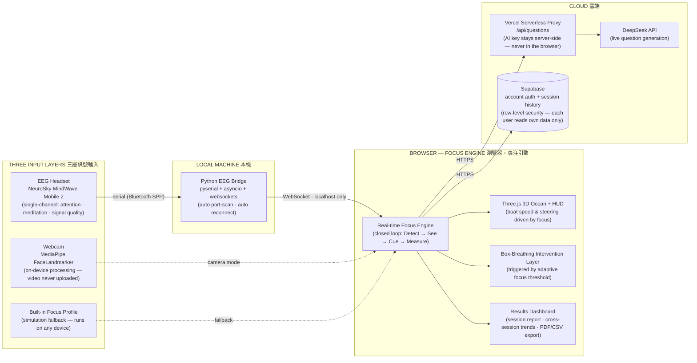
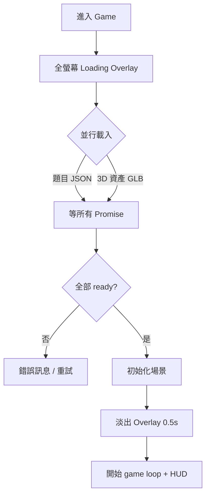

# NeuroFocus 展覽總手冊（EXHIBITION HANDBOOK）

> **現場唯一要開嘅文件。** 產品定位、技術架構、玩法邏輯、現場執行、講稿、評判 Q&A、Windows 部署，全部喺呢度。
> 👉 專案狀態同剩低待辦 → **[`docs/IEYI_PLAN_V2.md`](./IEYI_PLAN_V2.md)**
>
> 🔴 **Day 2 早上返到攤位，只需要睇 [Part 0](#part-0)。** 其他 Part 係後備資料。
>
> **最快搵到嘢**
> | 你想做咩 | 去邊 |
> |---|---|
> | **招呼街客（Day 1 出咗事，已重寫）** | **Part 0** ← 60 秒 loop＋收尾句＋訪客分流 |
> | 上台講嘢（英文 ≤3:00） | **Part 6**（時間分配／講稿 A–E／90–120 秒 core version） |
> | 被評判問嘢 | **Part 7**（中英對照：L1 必背 → L2 → L3 → **L4 弱點題**） |
> | 開機／EEG 出問題 | **Part 8**（含「配對到冇數據」「玩完一場 bridge 死咗」修復記錄） |
> | 攤位規格／賽程／要帶咩 | **Part 11** |
> | 想拎盡分 | **Part 9.1** — 40-30-30 逐格拆解＋每格 money line |
> | Pilot 實驗（✅ 07-27 已完成） | **Part 12**（執行紀錄，留返答辯引用） |

---

## 目錄

0. [**攤位急救卡（Day 2 最重要）**](#part-0)
1. [產品是什麼](#part-1)
2. [網站所有模式：目的與原理](#part-2)
3. [技術架構（最新）](#part-3)
4. [遊戲運行邏輯 + UI 機制](#part-4)
5. [現場執行（答辯線 vs 攤位線）](#part-5)
6. [正式答辯包（講稿＋影片＋海報記錄）](#part-6)
7. [評判 Q&A（中英對照・L1→L4 四層）](#part-7)
8. [Windows 部署 SOP + 裝置分工 + FPS 已知問題](#part-8)
9. [競爭力分析＋40-30-30 拎分地圖](#part-9)
10. [現場檢查清單](#part-10)
11. [IEYI 攤位規格 + 賽程 + 展板計劃](#part-11)
12. [Pilot 實驗執行指引＋紀錄](#part-12)

---
<a name="part-0"></a>
## Part 0 — 攤位急救卡（Day 1 檢討後重寫・Day 2 早上照呢個做）

### 0.1 Day 1 出咗咩事

隊員回饋三件事：**街客有啲一頭霧水／有啲覺得「呢個只係一個 idea」／每個客花太多時間，做到有時要特登避開街客。**

三樣嘢其實係**同一個病因**：攤位用緊台上答辯嘅次序 —— 先講問題、再解釋、最後先示範。

- 台上，評判**坐定咗聽你講 3 分鐘**，所以「問題 → 方案 → 示範」啱。
- 攤位，街客**只肯畀你 10 秒**去證明值得停低。你講問題嗰 30 秒，佢腦入面得一句：「講緊嘢咋喎」→ 就係「只係一個 idea」嘅來源。
- 而因為冇一句**收尾句**，一開口就甩唔到身 → 每個客 10 分鐘 → 見到人埋嚟就驚 → 避開。

**解法只有一句：攤位要倒轉次序 —— 先郁，後講；先俾佢試，後解釋。**

### 0.2 訪客分流（唔係個個都要 60 秒）

| 訪客 | 點認 | 你做咩 | 時間 |
|---|---|---|---|
| **路過** | 行過望一眼，冇停低 | **唔好埋身。** 講一句 hook，手指住個 mon。佢停就升級，唔停就算 | **10 秒** |
| **有興趣** | 停低咗、望住個 mon、開口問「呢個係咩」 | **0.3 嘅 60 秒 loop** | **60 秒** |
| **評判／老師／同行參賽者** | 掛住證、追問技術細節 | 完整版（Part 5.6 評判版＋Part 7 Q&A） | **3 分鐘** |

> 一日落嚟，八成訪客係「路過」。**你唔係要服務所有人，你係要令啱嘅人停低。**

### 0.3 60 秒攤位 loop（背熟呢四格）

| 秒數 | 做咩 | 講咩 |
|---|---|---|
| **0–10s**<br>**先郁後講** | 手指住個 mon（畫面一定要行緊，見 0.6） | **EN**: *"Watch the boat — it slows down the moment you lose focus. Want to try?"*<br>**中**：「睇住隻船——你一走神佢就會慢低。試唔試？」 |
| **10–30s**<br>**交俾佢自己做** | 戴頭帶／叫佢坐低望鏡頭，然後叫佢**「望開你部電話三秒」** | **EN**: *"Now look at your phone for three seconds."* → 隻船慢低、呼吸提示彈出 → *"That's you. The system caught it."*<br>**中**：「而家望開你部電話三秒。」→「呢個係你自己，系統捉到咗。」 |
| **30–45s**<br>**一句解釋＋開報告** | 撳去 Results 頁 | **EN**: *"Every session measures it: how steady you were, and how long each distraction cost you."*<br>**中**：「每一節都會量返：你有幾穩定、每次走神用咗幾耐先返到嚟。」 |
| **45–60s**<br>**收尾＋QR** | **後退半步**、手伸向 QR code | 見 0.5 收尾句 |

🔴 **全場最強嘅三秒，就係佢自己望開電話、隻船慢低嗰刻。** 唔好用你嘅嘴代替呢三秒。

### 0.4 開場第一句 —— 唔好再用問題數據

| | 句子 | 點解 |
|---|---|---|
| ❌ | 「Attention span 得返 47 秒⋯⋯」 | 台上啱，攤位＝開講座。街客未知你係做咩，聽住數字只覺得悶 |
| ❌ | 「我哋係 NeuroFocus，我哋做咗一個專注訓練平台」 | 自我介紹＝零資訊，佢唔識你 |
| ✅ | **"Watch the boat — it slows down when you lose focus. Want to try?"** | 十個字內俾咗：睇邊度、會發生咩、關你咩事 |

**問題數據唔係唔講，係唔喺第一句講。** 等佢自己試完、有反應、開口問「點解會咁」嗰陣先講——嗰時佢先聽得入耳。

### 0.5 收尾句（解決「甩唔到身」）

> **EN**: *"That's the whole loop. Scan this and you can try it on your own laptop — thanks for coming by!"*
> **中**：「成個 loop 就係咁。掃個碼你自己部機都試到，多謝你！」

**動作比句子重要**：講嘅同時**後退半步**、身體側開、手伸向 QR code。九成人會自動接住個訊號走。

仲想繼續傾嘅：
> **EN**: *"There are a few people waiting to try — scan the code and take your time. We're here until 12."*
> **中**：「仲有幾位等緊試，你掃咗碼慢慢玩，我哋喺度到 12 點。」

> ⚠️ **唔好再避開街客。** 你哋避人係因為冇 exit line，唔係因為人多。有咗呢句，每個客 60 秒收得返尾，就唔使避。

### 0.6 攤位待機：畫面一定要係郁緊

**唔好停喺選單或者 Setup 頁。** 開住訓練模式行緊、隻船喺度航、HUD 數字跳緊。

郁緊嘅畫面自己會吸引人埋嚟；靜止嘅選單等於一塊死海報。冇客嗰陣就自己戴住頭帶行 loop，人自然會停。

### 0.7 「呢個只係一個 idea 啫」點破解

呢句嘅真正意思係：**佢冇見過證據。** 順住呢三步答，唔好跳：

1. **即刻俾佢自己試**（0.3 嘅 10–30 秒）——隻船因為**佢自己**走神而慢低。呢刻佢由觀眾變成當事人，「idea」呢個字自然消失。
2. **開 Results 頁**——真數字、恢復時間、跨場趨勢，一撳可以匯出 CSV／PDF。**唔係 mockup，係佢自己頭先嗰節嘅數據。**
3. **講 pilot**：
   > **EN**: *"We ran a controlled comparison with four students — same notes, same quiz, paper versus our platform. n = 4 is small, so we treat it as preliminary, not proof."*
   > **中**：「我哋做咗一個四人對照測試，同一份筆記、同一份卷，紙本對平台。n=4 好細，所以我哋只當佢係初步數據，唔係定論。」

> **誠實嗰句反而係最有殺傷力嗰句。** 敢講「n=4 太細」嘅隊，會令人相信你其他嘢冇作假。

### 0.8 攤位三人企位（Day 2 改呢個）

| 角色 | 企邊 | 做咩 |
|---|---|---|
| **講解** | 個 mon 側邊 | 行 0.3 個 loop，一次只服務**一個**訪客 |
| **硬件** | 電腦後面 | 頭帶消毒、重開 session、bridge 出事即切相機模式 |
| **招手** | 攤位外沿 | 望住有邊個慢咗腳步 → 用 0.4 第一句截住佢；同時擋住排隊 |

**唔好三個人圍住同一個訪客** —— 對方會有壓迫感，而且冇人睇住新客。

### 0.9 Day 2 開場前 5 分鐘 checklist

- [ ] 網站已 `Ctrl+Shift+R` 硬重新整理（唔係會食舊 cache）
- [ ] 畫面**行緊訓練模式**，唔係停喺選單
- [ ] QR code 擺喺手到拿到嘅位（收尾句要用）
- [ ] 頭帶消毒濕紙巾喺枱面
- [ ] 三個人講得出 0.4 第一句同 0.5 收尾句**逐隻字**
- [ ] Results 頁已經有一節真數據喺度（隨時撳到俾人睇）

---
<a name="part-1"></a>
## Part 1 — 產品是什麼

**一句定位**：NeuroFocus 係一個**神經回饋專注訓練平台原型**。

**唔係**：單純遊戲、單純 EEG 讀數器、醫療器材。
**係**：把「專注狀態」變成**可視化、可訓練、可量化**嘅互動系統。

| | 內容 |
|---|---|
| **主問題** | 短片、通知、社交媒體令年輕人長期處於「睇落清醒、其實注意力好碎」嘅狀態。 |
| **主解法** | 用 EEG / 外界偵測**即時觀察**專注狀態，再用**遊戲回饋 + 呼吸介入**幫用戶重新回到穩定專注。 |
| **主價值** | 唔再係叫用戶「你專心啲」，而係令佢**即時見到自己狀態、學識點拉返自己入狀態**。 |
| **產品定位** | 教育 / 訓練 / 展示用嘅 neurofeedback prototype；專注訓練平台概念驗證；可延伸成商業產品嘅互動原型。 |

**核心閉環**（比單純顯示腦波數字更似產品）：
`偵測 → 視覺化 → 遊戲回饋 → 呼吸介入 → 量化報告`

---
<a name="part-2"></a>
## Part 2 — 網站所有模式：目的與原理

系統有**兩層模式**：先揀「練咩」，再揀「用咩訊號」。

### 第一層：任務模式（練咩）
> 訓練/挑戰兩個模式**都喺同一個海洋場景、玩法一致**，分別只在於挑戰模式會加入題目壓力。（2026-07 已把訓練模式一度試過嘅「書房場景」移除，統一用海洋。）第三個「學習模式」建置中（見下）。

- **訓練模式**：專注航行，**不出題**，主打穩定維持專注。沿一條**無限彎曲航道**航行：專注先揸得住個舵（分心船會漂離航道）、穩住專注 25 秒摘一粒**心流星**、每 500m 經過一個**航標**、天氣即時反映腦狀態（分心起霧、復原放晴）。最適合台上展示（流程最清、最穩、旁觀者一眼睇明）。
- **挑戰模式**：加入 **Stroop 題 + 邏輯題**，主打「一邊做任務、一邊維持專注」，貼近真實生活。最適合台下俾評判親身感受「做 task 時大腦容易亂」。
- **學習模式 Study Mode（✅ 2026-07-16 全部完成，正式站已解鎖）**：第三個選項，對應一個**紙本 vs 平台對照實驗**——揀學科（生物已上線，「基礎/進階」兩級深度；化學/物理/歷史 🔒 Coming Soon，比賽前唔會解鎖）→ **閱讀階段**（教材放喺**螢幕右邊圓角磨砂閱讀器**〔闊約 60vw、跟深淺色變白/黑、唔重疊左邊 HUD〕，內文**筆記式排版**〔標題/列表/名詞解釋/重點框〕、計時器內嵌、左邊 focus HUD 照留；**每頁最少讀 15 秒先可揭頁、最多 3 分鐘自動揭頁**；背景同一片天空海景但**收起船／航道／浮標**；天氣共感/呼吸介入/三路訊號輸入照用）→ **答題階段**（**船隻＋題目 HUD 返場**，航行回饋同挑戰模式一樣，題目用該材料嘅**固定測驗卷**）→ **Study Results**（📖 溫習＋✍️ 答題兩階段數據斬開＋**CSV 匯出**，學生用編號 S01/S02/S03 唔收真名）。**教材**：由隊員編寫嘅生物「細胞膜與物質運輸」單元（基礎/進階、雙語筆記、各 10 條 MC），存 `pages/game/studyMaterials.js`，隊員可整份換走。詳見 plan §5 D3。**比賽 demo 唔倚賴佢**：訓練/挑戰模式一行 code 都冇郁。**實驗操作**：Setup 右上角齒輪 ⚙ 有「重設所有數據」（清進度/歷史/結果、保留登入＋語言/主題）同「刪除帳戶」，方便每位 pilot 學生（S01→S02→S03）之間清底重嚟；Study Results 匯出 PDF 頁首而家會印埋登入 email 做識別。

### 第二層：訊號來源模式（用咩訊號）
- **Real EEG**：MindWave 頭帶讀 EEG → 本地 `eeg_bridge.py` → WebSocket → 前端。**wow factor 最高、最吸引評判**；風險最高（藍牙 / COM port / 權限）。
- **Simulation**：即使無頭帶 / 頭帶失靈都可完整展示。**唔係假裝 EEG，而係展示神經回饋系統嘅完整運作邏輯。** 內部再分兩條：
  - `camera-ready`：相機開到，用 **MediaPipe 臉部追蹤**（望開、眨眼、臉部居中程度）估算 0–100 專注分。屬「外界偵測專注力」。
  - `simulation-fallback`：連相機都唔得，用內建 focus profile 產生自然起伏嘅專注曲線，驅動船速同呼吸介入。屬「保底模式」，確保任何裝置都 demo 到。

### 介入層：Box Breathing
- **定位**：唔係獨立模式，而係**橫跨整個系統嘅統一介入層**。
- **觸發**：無論用緊 Real EEG / camera / fallback，只要系統判定用戶**長時間偏離穩定專注**（低於自適應門檻持續一段時間），就觸發。
- **流程**：遊戲暫停、計時停止、專注顯示歸零 → 引導呼吸（吸 4 秒 / 憋 4 秒 / 呼 4 秒）→ 完成後短暫 focus boost，令用戶明顯感受「成功回復專注」。
- **意義**：由「只量度專注」推進到「主動改善專注」。

### 難度（挑戰模式用）
- **Easy**：降低門檻，讓新手感受系統如何回應專注變化。
- **Medium**：較真實嘅認知負荷。
- **Hard**：高認知負荷 + Stroop 衝突題，講「現實世界唔係靜坐，而係高壓下仍要保持清晰」。

---
<a name="part-3"></a>
## Part 3 — 技術架構（最新，已反映 2026-07 sprint）

### 資料流 System Architecture & Data Flow（全英文版・poster 直接用）


> **Poster 用法**：呢個 mermaid 圖 GitHub 會自動 render，crop 得；但**建議直接用 Claude 出嗰張高清 PNG**（同一內容、poster 米白色系、300dpi）——見對話記錄。三個要點記得喺 poster 度保留：① 三層輸入（EEG／webcam／simulation）任缺一都行到；② privacy 標明 on-device、video never uploaded；③ AI key server-side。

### 技術清單
- **前端基礎**：HTML5 單頁 + **Vanilla JS ES Modules**（非 React/Vue，輕量、易 Vercel 靜態部署）+ **Import Maps**（直接指 `three`、`@mediapipe/tasks-vision`、`@supabase/supabase-js`）+ **Hash Router**。
- **UI / 視覺**：Tailwind CDN（首頁高密度排版）+ Custom CSS（Liquid Glass / Clay 質感、dark mode、game HUD）+ Google Fonts / Material Symbols。字體統一：Orbitron 只喺遊戲 HUD，其餘用 EB Garamond + Inter。
- **3D 互動**：Three.js（場景、光影、材質、粒子、船隻）+ GLTF/HDR 資產（`EGGShip2.glb`、HDR sky、water normal map）+ Web Audio（BGM / 音效）。
- **專注輸入**：MindWave Mobile 2 單通道 EEG（`attention` / `meditation` / `signal_quality`）+ WebSocket + MediaPipe FaceLandmarker + getUserMedia。
- **本地橋接**：Python `asyncio` + `pyserial` + `websockets` + `serial.tools.list_ports` + `threading`。
- **後端（sprint 後新增）**：
  - **Supabase**：真實帳戶 auth（錯密碼真係入唔到；離線時先 fallback 本地 session）+ `session_history` 表（跨 session 歷史）。config 見 `docs/supabase_schema.sql`、`services/supabaseClient.js`。
  - **Vercel Serverless `/api/questions`**：DeepSeek key 收埋喺 `process.env.DEEPSEEK_API_KEY`，**永遠唔會出現喺瀏覽器**。有 GET 健康檢查（開網址睇 `hasKey`）。
- **持久化**：localStorage（語言 / 主題 / user / 歷史 mirror）。
- **部署**：Vercel 靜態前端 + 本地 Python bridge（EEG 唔上雲）+ Windows batch 啟動腳本。

### 主要檔案負責乜（更新版）
| 檔案 | 負責 |
|---|---|
| `index.html` | 載入入口、import map、全域 DOM 容器（countdown / breathing / loader） |
| `app/main.js` | Bootstrap：讀 localStorage 語言/主題/session，啟動 router |
| `app/router.js` | 單頁 hash router，管 home/auth/setup/game/results 嘅 lazy import + mount |
| `app/state.js` | 全域狀態（`testMode`、`trainingDurationSec`、`inputMode`、`difficulty`、`focusSource`…） |
| `app/i18n.js` | 中英文文案（`hk` / `en` 兩個 block，key 要對齊） |
| `api/questions.js` | **Vercel proxy**：server-side 叫 DeepSeek、隱藏 key、健康檢查、fallback reason |
| `services/authService.js` | **真 Supabase 登入/註冊**（離線 fallback） |
| `services/supabaseClient.js` | Supabase client（動態 import，離線唔會 crash） |
| `services/storageService.js` | localStorage + **跨 session 歷史讀寫** |
| `services/runtimeLoader.js` | 版本號 query string + 動態 import runtime（降快取干擾） |
| `services/focusInputService.js` | 相機專注偵測（MediaPipe FaceLandmarker） |
| `pages/game/runtime.js` | **全專案核心引擎**（接近 7000 行）：Three.js 場景、航行物理（航向+慣性）、心流充能摘星、天氣共感、黃金時刻、題目、focus 更新、呼吸介入、simulation profile、bridge reconnect、results、audio、performance profile、**自適應門檻**、**FPS meter**、**學習模式閱讀引擎（D3）** |
| `pages/game/voyage.js` | **航程系統**：無限不規則彎曲航道（發光虛線）、航標浮塔 checkpoint（浮沉+燈頭脈動+海鷗）、航海圖數據；`setVoyageVisible()` 畀學習模式收起船隻航道 |
| `pages/game/studyMaterials.js` | **學習模式教材（D3）**：per 學科 per 深度嘅分頁課文＋MC——隊員編寫嘅生物「細胞膜與物質運輸」（基礎/進階，雙語）已入庫，可直接整份換走 |
| `eeg_bridge.py` | 本地硬體橋：掃 COM port、揀 MindWave、解析 attention/meditation/signal、WebSocket 廣播 |
| `styles/**` | UI 外觀、Liquid Glass、dark mode、各頁樣式 |
| `*.bat` / `requirements-eeg-bridge.txt` | Windows 一鍵啟動（見 Part 8） |

---
<a name="part-4"></a>
## Part 4 — 遊戲運行邏輯 + UI 機制

### 基本流程
`輸入名稱 → Setup（揀任務模式 →〔學習模式先揀學科＋深度〕→ 揀訊號來源 →（挑戰揀難度 / 訓練揀時長 / 學習直接入）→（Simulation 問相機授權））→ Game → Results`

### 核心邏輯（2026-07 gameplay 重新設計後）
- **專注度驅動船速 + 舵**：`focusLevel` 係核心輸入——越高船越快；同時專注 = 舵嘅控制力：專注時船貼住彎曲航道行，分心時船會隨機漂離航道，重新專注先拉得返（真實航向物理：慣性加速、入彎側傾）。
- **心流充能摘星（訓練模式嘅「贏」）**：企穩喺個人穩定線以上，能量環≈25 秒充滿一圈 = 1 粒星（分心只暫停充能，唔倒扣）；摘星有短暫滑行加速 + 金色橫額。
- **航標 checkpoint**：每 500m 一個紅白航標浮塔座喺航道上，經過有鐘聲 + 橫額；右下航海圖卡實時顯示航道彎位、船嘅偏航同下一個航標距離；跨 session 有「航海日誌」累積總航程。
- **天氣共感**：分心持續 → 起霧、水濁、天暗（旁觀者唔使識睇 HUD 都知狀態）；復原 → 放晴。呼吸介入時霧鎖畫面，**跟住呼氣一格格撥開**，完成陽光爆返。
- **黃金時刻（Real EEG 專屬）**：專注 + 放鬆雙軸同時達標 4 秒 → 成個場景轉入暖金黃昏——雙軸神經回饋嘅高光位，Simulation 冇（冇 meditation 訊號，唔造假）。
- **題目系統**（挑戰模式）：先試 AI 生成 → 失敗 / 太慢 / 格式錯就自動轉**本地 fallback 題庫**。題目偏生活化 + 生物/化學/邏輯推理。有嚴格本地 validation（唯一正解、拒絕重複選項 / 「以上皆是」/ 缺解釋），無效 AI 題自動換成本地驗證過嘅題。
- **雙軸心流（Real EEG 專屬）**：EEG 模式下，心流條件係「**專注 AND 放鬆**」（attention 高 + meditation 達標）；Simulation / camera 模式無 meditation 訊號，用單軸規則。
- **Box Breathing 觸發**：`focusLevel` 低於**自適應門檻**（用歷史調整，唔再死 45/55）並持續一段時間 → 底部專注提示（**連提示音**，2026-07-18 加：提示彈出嗰刻響一次，6 秒冷卻防重複，跟遊戲內音效音量滑桿）→ 觸發呼吸 UI → 完成後短暫 focus boost。
- **自適應門檻**：系統跟住玩家歷史表現收緊 recovery / trigger 門檻——係真「訓練」而唔淨係「量度」。

### Results 量化（2026-07-10 D1 重新設計：航海報告版面）
> 設計語言用 v0 設計稿，Claude 以 vanilla JS + inline SVG 落地（唔加框架），Training / Challenge 兩版共用一套 teal + 金色系，深淺色 + 雙語齊全。由上到下：
- **Hero 判語**：一句大字 + 模式/難度/訊號來源 chips + 專注率或正確率——做到「3 秒睇明今次點」。
- **4 格指標**：專注穩定度（高亮）、平均恢復、呼吸救返；第 4 格挑戰係「距離 + 航標」、訓練係「訓練時長」。
- **成就（訓練）**：心流星、航標、**黃金時刻（真 EEG 專屬，模擬顯示鎖住唔造假）**、航海日誌累積；**答題回顧（挑戰）**：答對數 + 可展開答錯卡（你的答案／正解／解釋）。
- **專注曲線 SVG**（area fill + 穩定線）+ **session 內前後對比 badge**（頭半 vs 尾半）。
- **跨 session trend**（recovery / 穩定度趨勢 + 「分心恢復 vs 你最近平均」誠實 headline）——直接回應評判「點證明有進步」。
- **下一個目標卡**：一個具體目標 + 一句現實意義（例如「恢復快 = 溫書分咗心都追得返」）——見到進步之餘知道下一步。
- **耐刷新**：中途 refresh Results 頁唔會歸零（快照存 localStorage，還原最新一局；重複刷新唔會重複入歷史）。

### UI 機制（值得同評判講嘅工程細節）
**1. Loading 狀態機**（避免黑屏 / 感知崩潰）

用 `Promise.all` 確保資產**全部 ready** 先開場，避免 3D「pop-in」。

**1a2. 題目載入分流＋啟動看門狗（2026-07-11 修復「無法進入遊戲」）**：
- **Simulation／相機模式**：載入**唔等 AI 題**——本地題庫即秒seed入場，AI 題 4 秒後喺背景補上（成功就自動換用，失敗照玩本地題）。效果：模擬模式幾秒內必入場，唔會因為 AI 慢而卡 Loading。
- **EEG 模式**：保留「AI 優先、最多等 8 秒、可中斷」——真頭帶 demo 值得等一陣攞 AI 題。
- **啟動看門狗**：入場 25 秒仲未 boot 完（例如某個資產請求 hang 死）→ 自動放棄、雙語提示「載入超時」、帶返 Setup 頁重試；boot 成功一刻即解除，唔會誤殺慢機嘅開場倒數。**唔會再出現「無限 Loading」**。

**1b. 入場零穿崩 + 現代 Loading（2026-07-10）**：入 game 一刻 loader 會**同步不透明覆蓋**（頁面初始已帶隱藏態），唔會再見到一兩幀原始 HUD/背景；Loading 頁重新設計（小艇浮喺波浪線 + 品牌字 + 進度 shimmer，純 transform/背景動畫，弱機都平）。

**1b2. 遊戲內設定面板（2026-07-11 完成版）**：右上 ⚙ 掣開設定——畫質（自動 / 高L0 / 中L1 / 低L2 / 最低L3）、鏡頭距離（近/標準/遠）、**背景音樂/音效音量滑桿**、**全螢幕切換**；全部設定會記住。**開住設定面板時遊戲會經正規 pause 管線暫停**（計時/距離/呼吸計時全部凍結），閂返即繼續。自動畫質模式下 FPS 跌會自動降級、回穩升返；DEMO_MODE 嘅 FPS meter 顯示現行等級（評判想睇技術深度可以指住佢講）。

**1c. 遊戲提示一律喺螢幕底（2026-07-10）**：摘星/航標/開場提示/加速/呼吸前置提示全部改為由**底部中央**升起（分四層堆疊唔會互疊），唔遮玩家視線中央；呼吸引導 overlay 維持原樣。

**2. 固定寬度數字 HUD**：`updateDigitDisplay` 把每個數字放入固定闊度 `.digit-box`（`tabular-nums`），令 speed 由「1.1」跳到「10.0」時 **HUD 唔會抖動**。

**3. Windows 效能保護**：偵測到 Windows 就掛 `html[data-platform="windows"]` flag，關掉首頁重 blur / glow / 浮動動畫（見 Part 8）。另有隱藏 **FPS meter**（`DEMO_MODE` 後面）可即時睇幀數。

---
<a name="part-5"></a>
## Part 5 — 現場執行（答辯線 vs 攤位線）

> **一句總綱**：**答辯靠 PPT＋預錄影片（Part 6），零現場操作風險；攤位靠真平台試玩，畀評判同觀眾親手體驗。**兩條線互為備份——答辯入面任何嘢評判想睇真版，攤位（或手提機）即場開。

### 5.1 兩條線分工
| 線 | 場合 | 用咩 | 風險 |
|---|---|---|---|
| **答辯線** | 台上 **≤3 分鐘（英文）**＋Q&A | PPT＋數據 dashboard＋預錄對比影片＋Results 截圖（全部離線檔案） | 極低 |
| **攤位線** | 評判巡攤／觀眾試玩 | 真平台：iPad／手機行 Simulation 保底；Windows＋EEG 頭帶做加分位 | 可控（雙軌＋備援） |

### 5.2 攤位雙軌制＋成功標準
| 軌 | 裝置 | 角色 |
|---|---|---|
| **A. EEG 深度軌** | Windows Laptop + EEG 頭帶 | 完整功能＋技術深度，畀評判睇「真腦波輸入」 |
| **B. 穩定體驗軌** | iPad + 參觀者手機 | 流暢、多人參與，Simulation 保底 |

**核心原則**：唔好將成敗押喺 EEG 即時取數——「網站可玩、Simulation 穩定、EEG 作加分」。
**三層成功標準**：最低＝觀眾用 iPad/手機玩到 Simulation；標準＝完整展示 EEG 連接流程；加分＝真 EEG 成功驅動船速。

### 5.3 風險分級＋救場
- **低風險**：公開網站、Simulation、題目互動、呼吸介入、結果頁。
- **中風險**：AI 出題速度、會場網絡、平板／手機效能。
- **高風險**：EEG 當日藍牙／serial、Windows 權限／驅動、bridge 數據唔穩。

**救場台詞**：
> 「會場藍牙干擾比較大，Real EEG 正在重連。不過我哋個系統有 Simulation 路線，可以即刻展示完整訓練邏輯。」

**鐵律**：觀眾面前**唔好花多過 1–2 分鐘**搞硬件；唔穩即刻切 Simulation。

### 5.4 三人分工（＝官方三角色，一人一個）
> ⚠️ **IEYI 每隊只准 3 人上場**，所以現場係三個人，一人食一個官方角色，冇後備人手。
> 官方 delegation PDF 嘅三角色：**主講（Lead Presenter）／示範＋技術（Demonstrator + Technical Responder）／攤位長＋後備主講（Booth Captain + Backup）**。

1. **主講（Lead Presenter）**：講完整版／core version、控制時間；答產品定位、「點解 EEG/camera/simulation」（彈藥 Part 7）。
2. **示範＋技術（Demonstrator + Technical Responder）**：EEG 頭帶連接、bridge 啟動、佩戴示範；答技術追問。**兼**手機入口／QR。
3. **攤位長＋後備主講（Booth Captain + Backup）**：管攤位、iPad 引導參觀者行 5.6 導覽、處理人流同排隊；主講唔到就頂上。

**三人版要特別留意**
- 攤位**唔可以三個人同時黐住一個訪客**——一個講解、一個顧硬件、一個睇住有冇新訪客埋嚟。
- 有人要走開（去洗手間／攞嘢），**剩返嘅人默認切 Simulation**，唔好一個人同時搞頭帶又講解。
- 講稿 6.4 A–E 五段分落三個人（例如 主講 A＋B＋E、示範 C、攤位長 D），排練時要夾定邊個接邊句。

> **海報／PPT 上如果有第四個名**：作品的確係四個人做，但只有三個人**上場**。有人問就照直講：「作品由四位隊員完成，比賽規定每隊三人出席，所以今日到場係我哋三個。」出發前同老師確認清楚**官方報名名單**上邊三位，唔好臨場答錯。

### 5.5 帶咩物品
- **核心**：Windows Laptop ×1、EEG ×2 套、iPad ×1（連充電線／頭）、Laptop 充電器、EEG 電池配件、延長線、拖板。
- **網絡備援**：手機熱點 ≥1、已部署網址、QR code、本機 IP 局域網入口說明。
- **操作／清潔**：酒精濕紙巾、紙巾、小鏡／髮夾（戴 EEG）、膠紙／魔術貼。
- **講解物料**：項目名牌、一頁式介紹、A0 海報、評審問答速記卡（Part 7 精華）。
- **數碼備援**：USB（簡報＋預錄影片＋四頁截圖：Setup／閱讀／測驗／Results）、多一部手機錄影。

### 5.6 攤位導覽

> 🔴 **一般街客版已經搬去 [Part 0](#part-0) 並且完全重寫**（Day 1 之後）。
> 舊嗰個「先解釋模式 → 再逐個模式示範」嘅六步流程**唔好再用**——就係佢令街客覺得「淨係一個 idea」同埋每個客拖到十分鐘。街客一律行 **Part 0.3 嘅 60 秒 loop**。

**評判／老師／同行參賽者版（3–5 分鐘）**——呢啲人肯企耐啲，先值得用長版：
1. 由 Part 0.3 個 loop 開始（畀佢自己試，一樣要先郁後講）
2. 三種模式概念（訓練／挑戰／學習）
3. 學習模式完整行一次（攤位冇時限，15 秒閱讀鎖照行）
4. EEG 頭帶示範（如當日穩定）
5. Results：恢復時間＋跨場趨勢＋一撳匯出
6. Pilot 對照測試（Part 0.7 第 3 點嗰句，連「n=4 太細」一齊講）

**EEG 唔穩時**：先認（「現場藍牙受限」）→ 即切相機模式行完整閉環 → 強調輸入接口已存在、換訊號源唔使改系統。

---
<a name="part-6"></a>
## Part 6 — 正式答辯包（**英文・≤3 分鐘官方硬限**・PPT＋預錄影片・零現場操作）

> **官方規則（delegation PDF）**：**用英文 present、official version 3 分鐘以內**；評判每隊**可能只停 2 分鐘**，所以另備 **90–120 秒 core version**（見 6.1）。評分 40-30-30（見 Part 9）。
> **策略（07-17 老師方向＋Steven 修訂版）**：台上**完全唔現場操作平台**——問題用**真實研究數據 dashboard** 講；demo 用**賽前預錄嘅「專心 vs 分心」對比影片**；Results 用截圖。PPT 行**多文字路線**，deck 已喺 Canva 完成（見 6.3）。真平台留返俾 Q&A／攤位（Part 5）。
> 點解唔現場行：學習模式每頁 15 秒閱讀鎖 ×5 頁＋10 條 MC，完整流程機械下限 2.5–3 分鐘，台上行唔晒；預錄影片仲可以**同屏對比兩種狀態**，現場行反而做唔到。

### 6.1 核心訊息＋時間分配

**一個核心訊息（成隊人講同一句）**
> **中**：NeuroFocus 將「專注力」由一個睇唔到、齋靠意志力頂嘅嘢，變成**睇得到、練得到、量得到**嘅技能——一隻**會因為你分心而飄走嘅船**即時話你知你幾時走神，**呼吸提示**幫你拉返，**進度儀表板**話你知有冇進步。
> **EN**: NeuroFocus turns focus — normally invisible and willpower-dependent — into a skill you can **see, train and measure**: a boat that **drifts when your attention wanders** shows the exact moment you lose focus, breathing cues pull you back, and a progress dashboard tells you whether you are improving.

**A. 完整版時間分配（9 頁・目標 ≤3:00，總和 180s）**
| 段 | Slides | 內容 | 時間 |
|---|---|---|---|
| A | S1–S2 | 開場＋問題數據 dashboard | 45s |
| B | S3–S4 | 舊方法缺口＋一個閉環 | 30s |
| C | S5–S7 | 三種模式 → 對比影片 → Results 儀表板 | 65s（S5 壓到 ~12s） |
| D | S8 | 點樣量度＋實驗設計＋誠實成效 | 25s |
| E | S9 | 市場＋願景＋收結 | 15s |
> 總和 **180 秒＝3:00**，留 buffer 就講快啲。**練嗰陣要計時**，跌唔到 3 分鐘就再砍 S5／S9。

**B. Core version（90–120 秒・評判只停 2 分鐘時用）**
> 五句到位：① S2 問題（淨講 **47 秒＋23 分鐘**兩個數）→ ② S4 **一個閉環**（Detect→See→Cue→Measure）→ ③ S6 **對比影片**（專心 vs 分心，畫面自己講）→ ④ S7 **Results**（溫習/答題分開量＋恢復時間＋跨場趨勢）→ ⑤ S9 收結一句（see, train, measure）。技術全部留 Q&A。
> 練法：完整版練熟後，砍走 S1／S3／S5／S8 嘅口白，只保留每段一句 headline，就係 core version。

### 6.2 語言（官方要求英文 present）
**官方規定用英文 present，所以講稿以英文為準（6.4 EN 段）。** Slide 內文亦已全英文（同 poster 一致）。中文對照（6.4 中段）留俾**排練溫稿**同**萬一評判想用中文追問 Q&A** 時接得上，唔上 slide。標題可雙語（英文為主視覺），但講嘅時候一律英文。

### 6.3 PPT（9 頁）— ✅ 已喺 Canva 完成

> **逐頁大綱＋Canva prompt 已移除**（2026-07-20）：PPT 已經砌起，呢個 building outline 唔再需要維護，以**實際 deck 為準**。
> 各頁內容口徑仲有需要就去：**講稿 6.4**（A–E 對應 S1–S9，present 用）／**海報 6.6**（同一套故事嘅英文落版）／**Q&A Part 7**／**Pros & Cons Part 9**。S2 四個數字嘅來源見 **6.6 References**。
> deck 頁序（俾 6.1／6.4 對照）：S1 封面 · S2 問題數據 · S3 舊方法缺口 · S4 一個閉環 · S5 三種模式 · S6 對比影片 · S7 Results · S8 實驗與誠實 · S9 市場願景。

### 6.4 講稿（Part A–E・中英對照・對應 S1–S9）

> 邊個讀邊段你哋自己分；`[SLIDE]`＝轉頁位，`[VIDEO]`＝影片播放中講。

**A — 開場＋數據問題（S1→S2，50s）**
> **【中】** 各位評判好，我哋係 NeuroFocus。`[SLIDE S2]` 想先畀四個數字大家睇。**47 秒**——人喺一個螢幕上嘅平均持續專注時間，廿年前係兩分半鐘，而家得返 47 秒。**23 分鐘**——每次分心之後，平均要 23 分鐘先完全返到原本任務。**2 倍**——高頻用數碼媒體嘅青少年，兩年內出現 ADHD 症狀嘅風險係其他人兩倍。**6 至 7 個鐘**——香港青少年每日嘅螢幕時間，接近成人兩倍。唔係後生仔唔想專心，係環境令佢哋愈嚟愈難，而且**冇人教過佢哋點樣拉返**。
>
> **【EN】** Good afternoon judges, we are NeuroFocus. `[SLIDE S2]` Four numbers first. **47 seconds** — the average time we now sustain attention on one screen, down from 2.5 minutes two decades ago. **23 minutes** — the average time to fully return to a task after one distraction. **2×** — teens with heavy digital media use face roughly double the risk of developing ADHD symptoms within two years. **6–7 hours** — Hong Kong teenagers' daily screen time, nearly double that of adults. It's not that young people don't want to focus — the environment makes it ever harder, and **no one ever taught them how to pull themselves back**.

**B — 缺口＋一個閉環（S3→S4，40s）**
> **【中】** `[SLIDE S3]` 而家啲方法點解唔夠？叫你「專心啲」，唔會話你知你**幾時**走咗神；番茄鐘只計時間，唔量狀態；而一次分心要 23 分鐘先返嚟——所以介入一定要**即時**。`[SLIDE S4]` 我哋嘅答案係**一個閉環**：即時**偵測**專注 → 用隻船畀你**睇到** → 分心太耐**呼吸提示**拉你返 → 完場**量化**進步。訊號可以嚟自 EEG 腦電、相機或者模擬——閉環唔變。
>
> **【EN】** `[SLIDE S3]` Why do current fixes fall short? "Just focus" never tells you *when* you drifted; a timer counts minutes, not state; and one distraction costs 23 minutes — so intervention must be **immediate**. `[SLIDE S4]` Our answer is **one loop**: detect focus in real time → make it **visible** through a boat → a **breathing cue** pulls you back when you drift too long → and every session **measures** your progress. The signal can come from EEG, a camera, or simulation — the loop stays the same.

**C — 三種模式＋影片＋儀表板（S5→S6→S7，85s）**
> **【中】** `[SLIDE S5]` 呢個閉環有三個入口：**訓練模式**冇題目，純練穩定專注嘅基本功；**挑戰模式**加題目壓力，練「一邊做嘢一邊唔散」；**學習模式**係真溫習——讀我哋自製教材、考固定測驗卷，全程量埋你嘅專注。學習模式一個模式行晒成個閉環，所以我哋用佢示範。
>
> `[SLIDE S6，開影片]` **【中・影片旁述】** 呢段係賽前真實錄製：同一段生物筆記，兩種狀態。專心嗰陣——focus 指標平穩。而家分心——大家睇住個指標跌，系統即刻彈**呼吸提示**，跟住呼吸，狀態拉返。測驗階段——專心時隻船順航；一分心，隻船即刻失速。呢個就係「睇得到嘅專注」。
>
> `[SLIDE S7]` **【中】** 完場之後係咁樣嘅報告：**溫習同答題分開量**——知你係讀嗰陣散定答嗰陣散；**每次分心幾快拉返**——呢個先係訓練緊嘅證據；仲有**同之前場次嘅進步趨勢**，一鍵匯出 PDF／CSV 畀老師。
>
> **【EN】** `[SLIDE S5]` The loop has three entries: **Training** — no questions, pure stability practice; **Challenge** — questions add pressure, staying focused while working; **Study** — real revision: read our own study material, take a fixed quiz, with focus measured throughout. Study mode runs the whole loop in one mode, so that's our demo. `[SLIDE S6, play video]` **(over video)** This was recorded before the competition: the same biology notes, two states. Focused — the meter stays steady. Now distracted — watch it drop, the **breathing cue** appears, follow it, and the state recovers. In the quiz, the boat sails smoothly while focused and stalls the moment attention breaks. This is focus made visible. `[SLIDE S7]` And here is the report: **revision and quiz measured separately**, **recovery time after each distraction** — the real evidence of training — plus a **cross-session trend**, exportable to PDF/CSV in one click.

**D — 實驗＋誠實（S8，35s）**
> **【中】** 點樣證明有用？我哋設計咗一個對照實驗：**同一份教材、同一份固定測驗卷**，紙本組同平台組比較測驗成績＋溫習過程嘅專注數據。機制方面有文獻根據——即時回饋建立自我覺察、規律呼吸降低過高喚醒、重複練習訓練恢復力。但要誠實講：而家係 n 得 2 至 3 個學生嘅 pilot，長期成效要更大樣本先證實——我哋分得好清「已做到」同「仲要證實」。
>
> **【EN】** How do we prove it helps? We designed a controlled comparison: **same material, same fixed quiz**, paper group versus platform group, comparing test scores plus the focus data recorded during revision. The mechanisms are grounded in literature — real-time feedback builds self-awareness, paced breathing lowers excess arousal, repetition trains recovery. But honestly: this is a pilot of two to three students; long-term efficacy needs a larger study — we keep a clear line between "done" and "to be proven".

**E — 市場＋願景＋收結（S9，20s）**
> **【中】** 因為有 webcam 就用到，任何學生都試得——學校、補習、家長市場都打得開；跨場數據支持訂閱同報表模式。下一步：接返真 EEG 閉環、加眼動／心率等 sensor、同學校做大樣本研究。一句收結：NeuroFocus，將專注力變成**睇得到、練得到、量得到**嘅技能。技術細節歡迎 Q&A，多謝各位！
>
> **【EN】** Since a webcam is enough, any student can try it — opening the school, tutoring and parent markets, with cross-session data supporting subscriptions and reports. Next: the full EEG loop, extra sensors like eye-tracking and HRV, and a larger study with schools. To close: NeuroFocus turns focus into a skill you can **see, train and measure**. We welcome all technical questions in Q&A — thank you!

### 6.5 S6 對比影片拍攝清單（出發日・機場拍）

> **實況安排**：出發日喺機場用手提電腦拍，落機前／酒店剪好。**用 Simulation 嘅相機模式，唔用 EEG**（機場冇得慢慢調頭帶）。

🔴 **一個唔可以錯嘅位：一定要用「相機模式」，唔可以用「內建模擬曲線」。**
PPT S6 同海報都寫住 *"Real recording, not a simulation. All data comes from user webcam input."* ——相機模式嘅專注值係由你真實嘅面部朝向算出嚟，講得出口；內建模擬曲線係程式生成嘅，用佢拍完再講「睇住個指標跌」就係**講大話**，評判一問就穿。
> 揀法：Setup → 揀模式 → **Simulation** → 相機授權**要㩒「允許」**。左上 HUD 應該顯示**「相機」**（唔係「模擬」）先開始拍。

**內容（~40 秒，一條片）**
| 秒數 | 畫面 | 重點 |
|---|---|---|
| 0–5 | 標題卡「同一份筆記，兩種狀態 Same notes, two states」 | 定調 |
| 6–20 | **閱讀階段對比**：專心（指標平穩）vs 分心（望開／碌手機→指標跌→**呼吸提示彈出**→跟住呼吸拉返） | 即時覺察＋介入 |
| 21–35 | **測驗階段對比**：專心（船順航、答題順）vs 分心（船失速） | 船＝專注嘅視覺化 |
| 36–40 | 收尾卡：一句核心訊息 | 扣返主題 |

**拍法**
- 螢幕錄影（Windows 用 Xbox Game Bar `Win+G`／Mac 用 QuickTime），1080p 或以上。
- **HUD 嘅 focus 指標全程要入鏡**（評判要睇到個數字郁）。
- 分心段最有說服力嘅做法：**真係攞部手機出嚟碌**，鏡頭影到手機更貼題。
- 加大字幕標明「專心中／分心中／呼吸介入」——會場嘈，唔靠聲。
- 對比方式：左右分割同屏最好；趕時間就先後兩段（先專心後分心）。
- 出 MP4 嵌入 PPT；**USB 另存一份**；埋位前試播一次（聲量／解像度）。

**機場拍攝現實提示**
- 揀背景乾淨、光線夠嘅位（相機模式靠面部追蹤，太暗會偵測唔到）。
- 拍之前開一次 `localhost` 版本確認相機正常，唔好靠會場 Wi-Fi。
- 拍 2–3 個 take 就夠，剪片留返上機／酒店做。

### 6.5b 剪好之後：確認影片同 S6 講稿夾得上（15 分鐘做得完）

> **要解決嘅問題**：影片已經剪好，但唔知條片嘅節奏同 S6 口白啱唔啱。夾唔上嘅兩種死法——**口白講完片仲未播完**（成場靜晒望住個 mon）或者**片播完口白未講完**（對住黑畫面繼續講）。

**第一步：度返兩個數（各 2 分鐘）**
1. **片長**：睇播放器嘅總時間，寫低（例：0:47）。
2. **口白長度**：將 6.4 段 C 入面 `[VIDEO]` 嗰段英文**大聲讀 3 次計時**，取**最長**嗰次。
   - 冇時間計時就估：英文答辯語速約 **2.5–2.8 字／秒**，`字數 ÷ 2.6 ≈ 秒數`。

**第二步：對號入座**
| 情況 | 點做 |
|---|---|
| 片長 ≈ 口白（差 ≤3 秒） | ✅ 得，跳去第三步 |
| **片長 > 口白** | 剪短片：先斬開場標題卡、再斬「專心」嗰半（專心嗰段觀眾一眼睇明，分心＋呼吸介入先係重點） |
| **片長 < 口白** | 唔好加長片——**斬口白**。技術細節全部推去 Q&A，只留「而家分心 → 指標跌 → 呼吸提示 → 拉返」 |

**第三步：標拍子（最重要）**
喺講稿條片嗰段，逐句寫低**邊句對住邊個畫面**，例如：
```
0:00 標題卡      →「Same notes, two states.」
0:08 專心閱讀    →「Focused: the indicator holds steady.」
0:18 分心        →「Now he looks away — watch the indicator fall.」
0:26 呼吸提示彈出 →「The system cues a breathing exercise.」
0:34 測驗／船失速 →「In the quiz, the boat stalls the moment attention drops.」
0:44 收尾卡      → 唔講嘢，畀畫面收
```
排練時**開住條片同時讀**，睇下有冇甩拍。片入面每個轉場都應該有**字幕卡**，主講靠字幕就知講到邊。

**🛟 最穩陣嘅做法（強烈建議・尤其係 3:00 硬限）**
> **畀條片自己講。** 片入面加齊字幕（「Focused／Distracted／Breathing cue／Quiz」），主講只講**入片一句＋出片一句**：
> - 入片：*"Same notes, two states — watch the focus indicator."*
> - 出片：*"That drop, that cue, that recovery — all measured."*
>
> 咁樣**節奏永遠夾得上**（因為根本唔使夾），會場嘈都唔怕聽唔到，而且慳返嘅秒數可以補去 S7 Results。壞處係少咗一段講嘢——但 3 分鐘硬限之下，呢個係換得過嘅。

### 6.6 A0 海報（✅ 已於 07-20 交校方統一打印）

> **製作階段已完結**，落版稿唔再喺呢度維護。呢節只留**海報上有咩**，等答辯／Q&A 口徑對得返。

**版面（六格＋頁首＋References）**
| 格 | 標題 | 內容重點 |
|---|---|---|
| 頁首 | NeuroFocus | 一句定位（turns focus into a skill you can see, train and measure）＋四位作者＋學校＋網站 QR（海報已印，四個名；上場得三人，口徑見 5.4） |
| ① | **The Problems** | 47 秒／23 分 15 秒兩個大數字＋2004→2024 落跌線；金句：叫人「專心啲」唔會話你幾時走神 |
| ② | **Our Solution** | 圓環圖 Detect → See → Cue → Measure；訊號可以係 EEG／webcam／模擬，閉環不變 |
| ③ | **Three Session Goals** | 訓練／挑戰／學習三張卡；學習模式行晒成個閉環，所以係主示範 |
| ④ | **Technical** | 三層輸入架構圖；on-device 相機處理、AI key 唔落瀏覽器、Supabase RLS |
| ⑤ | **Study Mode: The Full Loop** | 閱讀器 → 測驗（船返場）→ Study Results 三張截圖＋晴天/起霧孖圖 |
| ⑥ | **Evidence & Future** | 對照 pilot 設計、機制文獻根據、**誠實框（n≈2–3，長期成效待證）**、未來三點 |
| 底部 | References | 8 條學術／數據來源＋技術 attribution＋"study material prepared by our team" |

⚠️ **⑥ 格嗰張 Paper vs Platform 圖係標明「ILLUSTRATIVE DESIGN MOCK-UP」嘅示意圖**，唔係實驗結果。評判追問一定要照直講——答法見 Part 7「L4-1」。

**References（海報底部實際內容，Q&A 引用用）**
```
DATA
· Sustained attention ~47 s; ~23 min 15 s to fully refocus — Mark et al., UC Irvine
· ~2× risk of ADHD symptoms with heavy digital-media use — Ra et al., JAMA 2018
· 6–7 h average daily screen time, HK teens — HK Youth Survey 2024/25
EVIDENCE
· Computerized cognitive training in ADHD — meta-analysis of RCTs (PMC10208955)
· EEG neurofeedback & QEEG biomarkers (PMC12321976)
· Structured breathing lowers physiological arousal — Balban et al., 2023 (PMC9873947)
· Gamification improves cognitive-training adherence (PMC7445616)
· Pre/post RCT design template — BMJ Open 2024 (e079917)
TECH: NeuroSky MindWave · MediaPipe · Three.js · Supabase · Vercel
AUDIO: Universfield (Pixabay) · Study material prepared by our team
```

### 6.7 版本進化對照表（最舊 → 目前・答辯/Q&A 素材）

由 **2026-06-23 第一個 commit「EEG 2026 - Focus Game」** 到 **2026-07 嘅「NeuroFocus」平台**，三個幾星期、約 95 個 commit。核心 gameplay 檔 `runtime.js` 由 **3961 行** 長到 **7615 行**。以下逐項對照——重點唔淨係「加咗嘢」，而係**每一項點樣擴闊市場 + 加強專注訓練嘅說服力**：

| 面向 Dimension | 最舊版本 Oldest（06-23「EEG Focus Game」） | 目前版本 Now（07「NeuroFocus」平台） | 對「市場潛力／改善專注」嘅意義 |
|---|---|---|---|
| **定位 Identity** | 一個靠頭帶玩嘅 EEG 專注**遊戲** | 多模式**神經回饋專注訓練平台**原型 | 由「玩具／demo」升做「平台」，先有得延伸商業化 |
| **訊號來源 Signal** | EEG ＋ 模擬曲線 fallback（**冇相機**） | EEG ＋ **相機臉部偵測（MediaPipe）** ＋ 模擬 fallback | 冇 EEG 硬件都用得 → 受眾由「有頭帶嘅人」擴到「**任何有 webcam 嘅學生**」，TAM 大幅擴闊 |
| **任務模式 Task modes** | **單一遊戲**，冇分層 | **訓練／挑戰／學習** 三模式（任務層）＋ EEG／Simulation（訊號層）兩層架構 | 覆蓋更多場景：純練穩定、抗干擾、溫習學習——一個平台多種用途 |
| **專注介入 Intervention** | **冇**（淨係量度） | **Box Breathing 呼吸介入**，接喺所有偵測後面嘅統一層 | 由「淨係量度你分咗心」→「量度**＋主動幫你調節返**」＝真正嘅訓練價值，唔止 monitor |
| **數據／進度 Data** | 淨係**單次 session** 結果 | 單次 ＋ **跨 session 趨勢／恢復分析**（雲端 Supabase ＋ 本地）＋ PDF/CSV 匯出 | 用戶睇到自己進步 → 黏性／回訪／訂閱潛力；對評判＝「唔止畀你睇一次」 |
| **教育應用 Education** | **冇** | **學習模式**：紙本 vs 平台對照實驗、固定測驗卷、兩階段專注數據、自製教材 | 打開**教育市場**（學校／老師／家長）＋ 提供「**可量度學習過程**」嘅證據角度 |
| **語言 Language** | 中英雙語（一開始已有） | 中英雙語**更完整**（連教材、結果、匯出都雙語） | 面向本地學生 ＋ 國際評判，兩邊都 present 到 |
| **規模 Scale** | `runtime.js` 3961 行、README 淨係講 EEG 駁機 | `runtime.js` 7615 行、完整手冊＋計劃書＋教材＋實驗 | 3.5 週由「一隻遊戲」演進成「一個系統」 |

**分析一：市場潛力有冇因為改良而增加？→ 有，而且係關鍵性擴闊。**
最舊版本嘅致命限制係「**要有 MindWave 頭帶先玩到**」——市場等於「擁有／肯買消費級 EEG 嘅人」，非常窄。加咗**相機偵測 fallback** 之後，任何一部有鏡頭嘅手機／電腦都可以完整體驗，受眾由「頭帶用家」擴到「**普通學生**」。再加**學習模式**，等於由「個人玩具」跨入「**教育工具**」呢個更大、更肯付費嘅市場（學校／補習／家長）。而**跨 session 進度追蹤**提供咗回訪同訂閱嘅商業鈎。所以改良方向唔係「加花巧」，而係**一步步拆走增長天花板**。

**分析二：係咪真係可以改善專注？→ 要誠實分兩面講。**
- **機制上站得住腳**：(1) **即時神經回饋**幫用戶建立「而家掂唔掂」嘅**自我覺察**——呢個係行為改變嘅第一步；(2) **Box Breathing** 用規律呼吸降低過高喚醒，係有文獻支持嘅情緒／喚醒調節手法；(3) **重複練習 + 恢復數據**訓練嘅係「**分心之後點拉返自己**」呢個技能，唔係一次性表演。呢三樣都係朝住「真正改善」嘅方向設計，而且平台**已經量度到**專注穩定度同恢復時間。
- **但要 honest**：我哋**未有嚴謹嘅長期實證**——pilot 得 n≈2–3，冇正式對照組／前後測／長期追蹤，用嘅又係消費級單通道 EEG。所以正確講法係：「**機制對齊科學、平台已經量度到學習過程，但長期成效仲未證實**」。定位係**訓練平台原型**，唔係已完成臨床驗證嘅醫療產品；下一步先做更大樣本嘅對照研究。**呢個誠實框架本身就係加分位**——評判最鍾意見到參賽者分得清「已做到」同「仲要證實」。

---
<a name="part-7"></a>
## Part 7 — 評判 Q&A（中英對照・由淺入深・對應官方評分）

> **點用**：由 **L1 答起**，評判追問先落 L2／L3。多數評判唔係技術專家——佢哋想聽「解決咩問題、邊個會用、demo 得唔得」。**L1 七題要背到滾瓜爛熟**；L2/L3 係彈藥，唔使主動出；**L4 係我哋最弱嘅位**，要預先夾定口徑。
> **語言**：官方要求英文 present，所以**英文版係主答案**，中文版留俾溫稿同萬一評判用中文追問。
> **黃金句式**：一句答案 → 一個具體例子 →（對方仲想聽先）技術細節。**唔好一開口就講 WebSocket。**
> **評分標記**：🎨 創意 40%／💰 市場 30%／🛠️ 實用 30% —— 答嘅時候有意識咁踩返嗰格（每格點拎分見 **Part 9.1**）。

---

### 🟢 L1 — 人人都會問（非技術評判・必背）

**Q1. 你哋個作品係咩嚟？ / What is your project?** 🎨
> **【中】** 一個**專注力訓練平台**。你嘅專注度會即時操控一隻帆船：專心，船就穩定向前；一分心，船就會偏離航道。系統見到你分心，會即刻彈呼吸引導叫你拉返；每次做完，會話你知你分咗幾多次心、每次用幾耐先拉得返。
> **【EN】** A **focus-training platform**. Your attention steers a sailboat in real time: focus and it holds its course, drift and the boat wanders off. When the system sees you drift, it immediately offers a breathing cue to pull you back — and at the end it tells you how often you drifted and how long each recovery took.

**Q2. 解決緊咩問題？ / What problem does it solve?** 🎨💰
> **【中】** 而家人喺一個螢幕上平均只維持 **47 秒**專注，二十年前係兩分半鐘。一次分心之後，平均要 **23 分鐘**先完全返到原本件事。問題係——**你分咗心自己唔知**，等你發現已經太遲。我哋令佢**即時睇得見**。
> **【EN】** People now sustain attention on a single screen for about **47 seconds**, down from two and a half minutes twenty years ago. After one interruption it takes on average **23 minutes** to fully return to the task. The real problem is that **you don't notice you've drifted** — by the time you do, it's too late. We make it visible the moment it happens.

**Q3. 同「叫人專心啲」／番茄鐘有咩分別？ / How is this different from just telling someone to focus, or a Pomodoro timer?** 🎨
> **【中】** 番茄鐘只計**時間**，唔量**狀態**——25 分鐘倒數完，唔代表你真係專注咗 25 分鐘。我哋量嘅係狀態本身，而且**當場**介入。一句講：**由「提醒」變成「回饋」**。
> **【EN】** A timer counts **minutes**, not **state** — finishing a 25-minute block doesn't mean you were focused for 25 minutes. We measure the state itself and intervene **in the moment**. In one line: we turn a reminder into feedback.

**Q4. 邊個會用？ / Who is this for?** 💰
> **【中】** 學生、學校、補習社、家長。**有一個 webcam 就用到**，唔使買任何硬件——所以任何一間學校今日就部署得到。EEG 頭帶係加分體驗，唔係入場券。
> **【EN】** Students, schools, tutoring centres and parents. **A webcam is enough** — no hardware purchase — so a school could deploy it today. The EEG headset is a premium experience, not an entry requirement.

**Q5. 你哋點知佢真係有效？ / How do you know it works?** 🛠️💰
> **【中】** 分兩層答。**已做到嘅**：平台已經量到專注穩定度、分心次數、每次恢復時間，仲有跨場次趨勢。**未做到嘅**：我哋只做咗細樣本 pilot，長期成效要更大研究先講得。我哋分得好清「已經做到」同「仲要證實」。
> **【EN】** Two layers. **What we have done**: the platform already measures focus stability, how often attention drops, recovery time after each drop, and the trend across sessions. **What we have not**: this is a small-sample pilot; long-term efficacy needs a larger study. We keep a clear line between "done" and "to be proven".

**Q6. 可以畀我試吓嗎？ / Can I try it?** 🛠️
> **【中】** 當然可以。（→ 攤位即場開 Simulation／相機模式，1 分鐘體驗；EEG 頭帶當日穩定就戴。）
> **【EN】** Of course — please do. *(Open Simulation/camera mode at the booth: a one-minute try. Offer the EEG headset if it's behaving that day.)*

**Q7. 你哋自己做咗幾多？ / How much of this did you build yourselves?** 🎨
> **【中】** 全部。五個星期由零開始：3D 遊戲引擎、EEG 硬件橋接、相機視覺、雲端後端、雙語介面、教材同測驗卷，全部係我哋隊四個人做，今日上場三個。
> **【EN】** All of it. Five weeks from nothing: the 3D engine, the EEG hardware bridge, the camera vision pipeline, the cloud backend, the bilingual interface, and the study material and quiz — built by the four of us; three of us are here today, as the rules allow three per team.

---

### 🟡 L2 — 中度追問（評判想睇深入啲）

**Q8. 「專注度」實際上係點量出嚟？ / How is focus actually measured?** 🎨🛠️
> **【中】** 三條可以互換嘅輸入線：① **EEG 頭帶**——NeuroSky 單通道，讀 attention／meditation；② **Webcam**——MediaPipe 追蹤面部朝向同眼部狀態，**全程喺你部機計算，影像永不上傳**；③ **內建模擬曲線**——保證任何裝置都示範到。三條線出嚟都係同一個 0–100 專注值，**閉環完全唔使改**。
> **【EN】** Three interchangeable inputs: ① an **EEG headset** — single-channel NeuroSky, giving attention and meditation; ② a **webcam** — MediaPipe face tracking, **processed entirely on-device; video is never uploaded**; ③ a **built-in simulation profile** so any device can demonstrate the system. All three produce the same 0–100 focus value, and the loop behind them never changes.

**Q9. 點解要有三個模式？ / Why three modes?** 🎨
> **【中】** 核心其實係**一個閉環**：偵測 → 睇到 → 提示 → 量化。三個模式只係三個入口——**訓練**練基本功、**挑戰**加題目壓力、**學習**係真溫習場景。學習模式一個模式就行晒成個閉環，所以用佢做主示範。
> **【EN】** The core is really **one loop** — detect, see, cue, measure. The modes are just three entry points: **Training** builds the basics, **Challenge** adds task pressure, **Study** is a real revision session. Study Mode runs the entire loop in one session, which is why it's our main demo.

**Q10. 呢個係咪醫療產品？可以治 ADHD 嗎？ / Is this a medical device? Can it treat ADHD?** 🛠️
> **【中】** **唔係，我哋唔會咁講。** 定位係教育／訓練用嘅神經回饋原型，目標係幫用戶建立**自我覺察**同**自我調節**能力。冇臨床試驗就唔可以講治療——呢條線我哋守得好緊。
> **【EN】** **No, and we don't claim it is.** It's an educational neurofeedback prototype for building self-awareness and self-regulation. Without clinical trials we will not use the word treatment — that's a line we hold firmly.

**Q11. 呼吸引導點解有用？ / Why does the breathing exercise help?** 🎨
> **【中】** 用規律呼吸（吸 4 秒／停 4 秒／呼 4 秒）短時間降低過高嘅生理喚醒，係有文獻支持嘅調節手法（Balban et al., 2023）。重點係**時機**：一次分心要 23 分鐘先返到嚟，所以介入一定要喺當下。
> **【EN】** Paced breathing — four seconds in, four hold, four out — lowers excess physiological arousal, which is supported in the literature (Balban et al., 2023). The key is **timing**: since one distraction costs 23 minutes, the intervention has to arrive in the moment, not afterwards.

**Q12. 數據存喺邊？私隱點處理？ / Where is the data stored? What about privacy?** 🛠️💰
> **【中】** 帳戶同場次歷史存喺 Supabase，行 row-level security，**每個用戶只讀到自己嘅數據**；本機有離線鏡像。**相機影像全程本地處理、永不上傳。** 做實驗嗰陣學生用編號 S01／S02，唔收真名。
> **【EN】** Accounts and session history live in Supabase with row-level security, so **each user can only read their own data**; there's a local mirror for offline use. **Camera frames are processed on-device and never uploaded.** In our pilot, participants are identified by code — S01, S02 — never by name.

**Q13. 商業模式係點？ / What's the business model?** 💰
> **【中】** 短期：學校體驗工作坊、STEAM 教材。中期：軟件訂閱＋畀老師／家長睇嘅進度報表（跨場次數據就係呢個鈎）。長期：多 sensor 版本、個人化難度。因為零硬件門檻，邊際成本好低。
> **【EN】** Near term: school workshops and STEAM teaching material. Mid term: a software subscription plus progress reports for teachers and parents — that's what the cross-session data unlocks. Long term: a multi-sensor version with personalised difficulty. With no hardware requirement, our marginal cost stays low.

**Q14. 點解台上播片唔現場玩？ / Why show a video instead of a live demo?** 🛠️
> **【中】** 兩個原因。第一，產品**刻意**設計每頁最少讀 15 秒防止跳讀，加埋十條題，完整流程要 2–3 分鐘，台上時間唔夠。第二，預錄可以**同屏對比「專心 vs 分心」兩種狀態**，現場玩一次反而示範唔到對比。片係真實錄製、冇加工；**真平台就喺攤位，歡迎即場試**。
> **【EN】** Two reasons. First, the product **deliberately** enforces a 15-second minimum per page to stop skim-reading; with ten quiz questions the full flow takes two to three minutes — longer than our slot. Second, a recording lets us show **focused and distracted side by side**, which a single live run cannot. The footage is real and unedited, and the live platform is at our booth for anyone who wants to try it.

---

### 🔴 L3 — 技術深入（工程／科學背景評判）

**Q15. EEG 由頭帶到畫面，條技術鏈點行？ / Walk me through the EEG pipeline.** 🎨
> **【中】** MindWave 經藍牙 SPP 出 ThinkGear 協議 → 本機 Python bridge 解析封包（同步位元組、checksum 校驗、eSense 解碼）→ WebSocket 推去瀏覽器 → 專注值驅動 Three.js／WebGL 嘅 3D 海洋。**EEG 數據唔上雲**，全部喺本機。
> **【EN】** The MindWave streams the ThinkGear protocol over Bluetooth SPP; a local Python bridge parses the packets — sync bytes, checksum validation, eSense decoding — and pushes them over a WebSocket to the browser, where the focus value drives a Three.js/WebGL ocean. **The EEG data never leaves the machine.**

**Q16. 單通道消費級 EEG，準唔準？ / Single-channel consumer EEG — is it accurate?** 🛠️
> **【中】** 我哋用佢做**訓練輸入同展示**，唔會講成研究級腦狀態診斷——呢個係誠實嘅設計取捨。單通道拎到嘅係 NeuroSky 嘅 eSense 指標，官方定義 40–60 為中性、60 以上為提升。**我哋嘅門檻直接跟返呢個分級**，唔係自己老作數字。要更準就加多通道或者多 sensor 交叉驗證。
> **【EN】** We use it as a **training input and a demonstration**, not as research-grade brain-state measurement — that's a deliberate, honest trade-off. What a single channel gives is NeuroSky's eSense scale, where 40–60 is defined as neutral and above 60 as elevated. **Our thresholds follow that published scale** rather than numbers we invented. Greater accuracy would need more channels or sensor fusion.

**Q17. 訊號差／頭帶跌咗會點？數據會唔會污糟？ / What if the signal is poor or the headset slips — does that corrupt your data?** 🛠️
> **【中】** 呢個位我哋特別處理過。頭帶滑咗一樣會繼續送封包，只不過訊號質素同 attention 都係 0——**如果照計，嗰段時間會被錯誤記錄成「用戶分心」**。所以我哋要「訊號質素足夠 **而且** attention 唔係 0」先計時；唔夠就暫停計時同提示調整。另外 eSense 規格入面 **0 係「算唔到」嘅特殊值，唔係零分**，我哋亦按呢點處理。
> **【EN】** We handled this explicitly. A slipped headset keeps streaming packets, just with zero signal quality and zero attention — **if we counted that, the whole stretch would be recorded as the user being distracted.** So the clock only advances when signal quality is sufficient **and** attention is non-zero; otherwise it pauses and prompts the wearer to adjust. We also treat eSense 0 as its documented "cannot be calculated" sentinel rather than a real score of zero.

**Q18. 「專注門檻」係固定定自適應？ / Are your focus thresholds fixed or adaptive?** 🎨
> **【中】** 自適應。系統會睇你過往場次嘅平均表現去收緊恢復門檻同觸發時間——即係**你進步咗，個標準會跟住升**，所以係真訓練而唔止量度。同時 EEG 同模擬用兩套唔同基準，因為兩者嘅數值分佈根本唔同。
> **【EN】** Adaptive. The system tightens the recovery threshold and trigger timing based on your own recent sessions — **as you improve, the bar rises with you**, which is what makes it training rather than just measurement. EEG and simulation also use separate baselines, because their value distributions are genuinely different.

**Q19. 會場冇網／網絡差會點？ / What happens if the venue network is down?** 🛠️
> **【中】** 唔會死。three.js、MediaPipe 模型、字型全部**自存喺我哋自己 server**，唔靠任何外部 CDN；題目有本地題庫；雲端連唔到就自動轉本地 session。我哋實測過**封鎖晒所有外部連線**，成個流程照行。攤位主機仲係行本機版本。
> **【EN】** It still runs. Three.js, the MediaPipe model and the fonts are **served from our own origin**, not a third-party CDN; questions fall back to a local bank; and if the cloud is unreachable the app switches to a local session. We tested it with **every external connection blocked** and the full flow still worked — and the booth machine runs locally anyway.

**Q20. AI 出題點運作？點防止出錯題？ / How does the AI question generation work, and how do you stop bad questions?** 🎨🛠️
> **【中】** 挑戰模式會叫 DeepSeek 即場出題，但 **API key 只存喺伺服器端，永遠唔會落到瀏覽器**。收到題之後有本地驗證：唯一正解、拒絕重複選項、拒絕「以上皆是」、必須有解釋——唔合格就自動換返本地驗證過嘅題庫。**做實驗嗰陣就完全唔用 AI**，用鎖死嘅固定卷確保公平。
> **【EN】** Challenge Mode calls DeepSeek to generate questions, but the **API key stays server-side and never reaches the browser**. Every returned item is validated locally — exactly one correct answer, no duplicate options, no "all of the above", explanation required — and anything that fails is swapped for a vetted local question. **The experiment uses no AI at all**: it runs a fixed paper so the comparison stays fair.

**Q21. 實驗設計具體係點？ / What exactly is your experimental design?** 🛠️💰
> **【中】** 同一份教材、同一份固定測驗卷，比較「紙本溫習」同「平台溫習」兩組嘅測驗成績；每位參加者**兩種條件都做**，次序同教材對調平衡。要講清楚一點：**紙本組冇 sensor，所以量唔到佢嘅專注數據**——分數比較係睇有冇幫到學習，專注數據係睇機制有冇運作，兩者答唔同問題。樣本細，所以只報描述性數據。
> **【EN】** Same material, same fixed quiz, comparing paper revision against platform revision; **each participant does both conditions**, with order and material counterbalanced. One thing to be clear about: **the paper group has no sensor, so we cannot measure their focus** — the score comparison asks whether it helped learning, while the focus data shows whether the mechanism works. They answer different questions. With a small sample we report descriptive results only.

**Q22. 下一步會做咩？ / What's next?** 💰🎨
> **【中】** 三件事：完整 EEG 閉環做旗艦體驗、加多 sensor（眼動／心率變異）做交叉驗證、同學校合作跑大樣本前後測研究。
> **【EN】** Three things: the full EEG closed loop as our flagship experience, sensor fusion with eye-tracking and heart-rate variability for cross-validation, and a larger pre/post study with schools.

---

### ⚫ L4 — 聽完 present／睇完海報之後最可能問（**我哋目前最弱嘅位**）

> 呢一節由**觀眾角度倒推**：評判聽完三分鐘、望完海報六格之後，腦入面會剩低咩疑問？
> 每題有：⚠️ 點解係弱點 → ✅ 最佳誠實答法（中英）。**唔可以靠 hea 答**——承認限制＋講清楚我哋點分「已做到 vs 未做到」，反而係拎信任分嘅位。

**L4-1. 海報幅 Paper vs Platform 圖係「示意圖」，即係你哋根本未做過實驗？ / Your poster chart is labelled illustrative — so you haven't actually run the study?** 🛠️
> ⚠️ **最大弱點。** 海報自己標住 ILLUSTRATIVE，睇得仔細嘅評判一定捉。
> **【中】** 「係，嗰張係**設計示意圖**，我哋特登標明咗，因為當時實驗未跑——我哋唔想用假數據扮有結果。實驗喺 ___ 已經跑咗（n＝___），呢度係真實 CSV／截圖。數據太細唔足以下結論，但流程同量度方法已經驗證得到。」
> **【EN】** "Yes — that chart is a **design mock-up**, and we labelled it as such because the study hadn't run yet. We didn't want to present invented data as results. We ran it on ___ with ___ participants; here is the actual export. The sample is far too small to conclude anything, but it does show the protocol and the measurements work."
> 💡 **跑完 pilot 一定要將真數據帶埋落攤位**（印一張 A4／留喺手提機），呢題就由弱點變加分位。

**L4-2. 你哋話「23 分鐘先返到專注」，但 Results 寫住恢復時間得 2.6 秒——邊個先啱？ / Your poster says 23 minutes to refocus but your dashboard shows 2.6 seconds. Which is it?** 🎨🛠️
> ⚠️ **內部矛盾，好易被捉**——同一個英文詞（recovery）用咗喺兩個唔同構念。
> **【中】** 「兩個係唔同嘅量度。**23 分鐘**係文獻講嘅『被打斷之後完全返到原本任務』，包括切換情境、搵返做到邊。我哋量嘅係**訊號層面嘅微觀恢復**：專注值跌穿門檻之後幾快升返。前者係任務層面、後者係狀態層面，數量級唔同好正常。我哋唔會用 2.6 秒去挑戰 23 分鐘嗰個發現。」
> **【EN】** "They measure different things. The **23 minutes** is the published figure for fully returning to the original task after an interruption — it includes context switching and finding your place again. What we log is a **signal-level micro-recovery**: how quickly the focus value climbs back above threshold after it dips. One is task-level, the other is state-level, so the difference in magnitude is expected. We are not claiming our 2.6 seconds contradicts that finding."

**L4-3. 用 webcam 睇住我塊面，其實你只係知我望唔望住螢幕，唔係知我專唔專心。 / A webcam only tells you whether I'm looking at the screen, not whether I'm concentrating.** 🎨🛠️
> ⚠️ **最尖銳嘅技術批評，而且佢係啱嘅。**
> **【中】** 「你講得啱。相機量嘅係**注意力朝向嘅代理指標**——面部朝向、視線離開、臉部居中程度——唔係腦活動。所以我哋將佢定位成**無門檻嘅入門線**，而 **EEG 先係真正量緊生理訊號嗰條線**。兩條線餵同一個閉環，但我哋唔會講相機等於量到腦。」
> **【EN】** "You're right, and we say so. The camera measures a **proxy for attentional orientation** — head pose, gaze leaving the screen, how centred the face is — not brain activity. That's why we position it as the **zero-barrier entry path**, while the **EEG is the line that actually measures a physiological signal**. Both feed the same loop, but we never claim the camera reads your brain."

**L4-4. 咁我對住螢幕發吽哣，你個系統咪照畀高分？ / So if I stare blankly at the screen, your system still scores me as focused?** 🛠️
> ⚠️ 承接上題，係實際可以「呃」到系統嘅情況。
> **【中】** 「相機模式的確有呢個限制——望住螢幕發呆會被當成專注。有兩點紓緩：一係**挑戰同學習模式有題目**，發吽哣答唔到題，分數會反映；二係戴 EEG 就避開晒呢個問題，因為量嘅係腦電。長遠加眼動追蹤可以再收窄。」
> **【EN】** "In camera mode, yes — that's a real limitation. Two things mitigate it: **Challenge and Study Mode include questions**, so a blank stare shows up in the score; and the EEG path avoids the problem entirely because it reads electrical activity. Eye-tracking would narrow the gap further."

**L4-5. 學習模式要溫書，但你畀隻船同海睇——本身咪好分心？ / Study Mode is for revision, but you show a boat and an ocean — isn't that distracting?** 🎨
> ⚠️ 好合理嘅 UX 質疑，而且我哋**真係為咗呢個改過設計**——答得好會變加分位。
> **【中】** 「我哋一開始都擔心，所以**閱讀階段係收起隻船同航道嘅**，淨返海景同左邊一個細 HUD。船只會喺**測驗階段**返場。連『閱讀時角落加隻細船』呢個提案我哋都否決咗，就係怕分散注意力。」
> **【EN】** "We worried about exactly that, so during the **reading phase the boat and the route are hidden** — only the calm seascape and a small HUD remain. The boat returns for the **quiz phase**. We even rejected a proposal to keep a small boat in the corner while reading, for that reason."

**L4-6. 份教材同測驗卷邊個寫？點知條卷測得準？ / Who wrote your material and quiz? How do you know the quiz is valid?** 🛠️💰
> ⚠️ 教材同卷都係隊員自己寫，冇經專業審核。
> **【中】** 「教材同十條題都係我哋隊員按課程內容自己編寫，**冇經第三方驗證**——所以我哋唔會用佢嚟聲稱『學習成效』。佢喺實驗入面嘅角色只係**一把固定嘅尺**：兩組用完全一樣嘅材料同卷，咁比較先公平。要做正式研究就一定要用標準化評估工具。」
> **【EN】** "Our team wrote both, based on the syllabus, and **they have not been externally validated** — which is precisely why we don't use them to claim learning gains. In the study their only job is to be a **constant ruler**: both conditions get identical material and identical questions, so the comparison is fair. A formal study would need standardised instruments."

**L4-7. 三個模式，但你淨係 demo 一個——另外兩個係咪未做完？ / You demo one mode out of three — are the other two finished?** 🛠️
> **【中】** 「三個都完成咗，可以即場試（→ 攤位開）。台上揀學習模式係因為佢**一個模式就行晒成個閉環**——讀、分心、介入、測驗、報告。三分鐘要示範完整故事，佢最有效率。」
> **【EN】** "All three are complete — you can try any of them right now at our booth. We demo Study Mode on stage because it **runs the entire loop in one session**: reading, drifting, intervention, quiz, report. With three minutes, it tells the whole story most efficiently."

**L4-8. 你哋收幾錢？學校點解要買你哋而唔係封鎖手機？ / What would you charge? Why buy this instead of just banning phones?** 💰
> ⚠️ **市場格佔 30%，但 present 同海報都冇講價錢同競品對比。**
> **【中】** 「定位係**學校 site licence ＋ 家長訂閱**兩條線；零硬件門檻，邊際成本主要係雲端，所以定價可以做得低。同封鎖手機嘅分別係：封鎖係**限制**，我哋係**訓練**——學生離開咗管制環境之後，得到嘅係一個自己用得著嘅技能。同 Forest 嗰類 App 嘅分別係佢哋計時間，我哋量狀態同即時介入。」
> **【EN】** "A school site licence plus a parent subscription. With no hardware requirement our marginal cost is essentially cloud, so the price point can stay low. The difference from banning phones is that a ban is a **restriction** while this is **training** — the student keeps the skill once they leave the controlled environment. And unlike apps such as Forest, which count time, we measure state and intervene in the moment."

**L4-9. 你哋喺同學身上做測試，有冇同意程序？ / Did you obtain consent for testing on students?** 🛠️
> **【中】** 「有。參加者係自願、事前解釋清楚做咩、隨時可以停；**唔收真名，用編號 S01/S02**；數據只存喺本機同我哋自己嘅帳戶。我哋亦清楚講明呢個係 pilot 而唔係正式研究，所以冇宣稱任何醫療或學習成效。」
> **【EN】** "Yes. Participation was voluntary, we explained the procedure beforehand, and anyone could stop at any time. **We record a code — S01, S02 — never a name**, and the data stays on the local machine and our own account. We also state plainly that this is a pilot, not a formal study, so we make no medical or educational efficacy claims."

**L4-10. 比賽完之後仲會唔會繼續？ / Will this continue after the competition?** 💰
> **【中】** 「會。下一步好具體：① 同學校合作跑大樣本前後測；② 加多 sensor（眼動／心率變異）做交叉驗證；③ 完整 EEG 閉環做旗艦體驗。平台本身已經上線可以用，唔係比賽完就收檔。」
> **【EN】** "Yes. Our next steps are concrete: a larger pre/post study with schools, sensor fusion with eye-tracking and HRV, and the full EEG closed loop as the flagship experience. The platform is already live and usable — it doesn't stop when the competition does."

---

**🔎 三個我哋自己知、但唔好主動講嘅位**（畀人問到就照上面答，唔問就唔提）
1. 相機模式量嘅唔係腦活動（L4-3/4）。
2. 海報嗰張證據圖係示意圖（L4-1）——**除非 pilot 已跑完，就主動亮真數據**。
3. 三種輸入源嘅專注數值**唔可以直接互相比較**（門檻同分佈唔同）——所以實驗全程用同一種輸入源。有人問就照講，係嚴謹嘅表現。

### 🆘 尷尬情況應對

| 情況 | 點答 |
|---|---|
| **EEG 當場連唔到** | 「會場藍牙干擾比較大，我哋有 Simulation 路線，可以即刻示範完整訓練邏輯。」→ 立即切，唔好喺觀眾面前搞硬件超過 1–2 分鐘 |
| **問「Simulation 係咪假？」** | 「唔係假 EEG，係**另一條真實輸入線**——相機真係喺度分析你嘅狀態。佢嘅角色係保證任何裝置都示範到完整系統邏輯。」 |
| **問到我哋唔識答** | 「呢個位我哋未做過，我唔想亂講。我哋而家做到嘅係 ___，你講嗰個方向我覺得值得試。」**誠實承認遠勝過老作**——評判最鍾意呢種 |
| **質疑 n 太細** | 「完全同意，所以我哋叫佢 pilot 而唔係研究。呢個階段目標係驗證流程行得通，唔係證明成效。」 |


<a name="part-8"></a>
## Part 8 — Windows 部署 SOP + 裝置分工 + FPS 已知問題

### 目標
Windows laptop 做現場 demo 機：本地 Python EEG bridge + 本地站 `http://localhost:8000/#home`，真 EEG 為主、Simulation 備援。

### 要 copy 去 Windows 嘅檔
`index.html`、`app/`、`pages/`、`services/`、`styles/`、`components/`、`assets/`、`bgm/`、`server.js`、`eeg_bridge.py`、`requirements-eeg-bridge.txt`、`install_eeg_bridge_windows.bat`、`start_eeg_bridge_windows.bat`、`start_local_site_windows.bat`、`start_2a_demo_windows.bat`。

### 一次性準備
1. 裝 Python 3　2. Windows 藍牙配對 `MindWave Mobile 2`　3. 雙擊 `install_eeg_bridge_windows.bat`。
> **Node.js 唔再係必需（2026-07-25）**：`start_local_site_windows.bat` 見到冇 Node 會自動改用 **`serve_local.py`**（同一批檔案、同一個 `http://localhost:8000`，MIME 已釘死避免 Windows 登錄檔把 `.js` 當 `text/plain` 令 ES module 起唔到）。有 Node 就照用 `server.js`，行為一樣。

### 🔌 兩種 EEG 接法（都係 bridge 行喺本機，唔存在「bridge 上雲」）
> EEG bridge 一定要喺**插住頭帶嗰部機**行（佢讀 COM port）。可以變嘅只係**網頁由邊度嚟**：

| 接法 | 點行 | 需要 Node？ | 需要網絡？ | 幾時用 |
|---|---|:---:|:---:|---|
| **A. 線上站＋本機 bridge** | 開 `start_eeg_bridge_windows.bat`，瀏覽器入已部署網址 | ❌ | ✅ | 冇裝 Node、想最快試通 |
| **B. 本機站＋本機 bridge**（攤位建議） | 雙擊 `start_2a_demo_windows.bat`（bridge＋Python 站一齊起） | ❌ | ❌ | 攤位正式 demo：網絡死都行到 |

- 兩種接法**瀏覽器都係連 `ws://127.0.0.1:8765`**（bridge 亦會試 8766）。HTTPS 頁連 `ws://127.0.0.1` 屬 loopback 例外，**Chrome 允許**——所以接法 A 行得通；但 Safari／部分 Firefox 版本會攔，**攤位一律用 Chrome**。
- 連唔到可以手動指定：網址加 `?bridgeUrl=ws://127.0.0.1:8765`（會記入 localStorage），或 `?bridgeHost=192.168.x.x` 指去另一部機。
- **接法 B 係攤位建議做法**：三個外部依賴（three.js／MediaPipe／字型）已經自存喺 `/vendor`，實測封鎖晒外網仍然 8/8 通過。

> **Mac 定位（2026-07-11 修訂）：做網站/備援機得，做 EEG 主機唔得。** Code 層面 bridge 支援 macOS 序列埠（/dev/cu.* 掃描＋權限提示），但 **MindWave Mobile 2（藍牙 Classic SPP 老協議）喺近年 macOS 上實測經常配對到但攞唔到數據**——Steven 過往經驗一致，NeuroSky 對 macOS 嘅支援亦早已停更。結論：**真 EEG demo 一律用 Windows 機**；MacBook 用 `start_demo_mac.command` 做本地網站/備援/hotfix 機。

### 開場步驟
1. 插電　2. Windows 電源模式設 `Best performance`　3. 開瀏覽器硬件加速　4. 關 Teams / OneDrive 同步 / Discord / 多餘分頁　5. 開頭帶　6. 雙擊 `start_2a_demo_windows.bat`　7. 等兩個視窗（EEG Bridge + Local Site）　8. **Chrome** 開 `http://localhost:8000/#home?demo=1`（`?demo=1` 開返攤位用嘅 FPS meter＋debug 掣）　9. Setup 測 `EEG Device`，唔得就即切 `Simulation`。

> **`?demo=1` 係咩（2026-07-25 起）**：DEMO_MODE 預設**閂咗**（公開網址唔想俾人喺 console 撳出星星）。攤位機喺網址加一次 `?demo=1` 就會開返 FPS/畫質等級 meter 同 `EEG_APP.debug.*`，**選擇會記住**（要閂返用 `?demo=0`）。

### 快速驗證
- **本地站**：`http://localhost:8000/#home` 首頁順、Setup/Auth 唔卡。
- **EEG bridge**：視窗唔會即刻閃退;顯示 COM port + connected 就入 EEG 模式;連唔到就即用 Simulation。
- **離線實測**：拔咗網線／熄 Wi-Fi，本機站仍然要入到遊戲（three.js／MediaPipe／字型已自存 `/vendor`）。首頁排版亦有本地 Tailwind 墊底。

### 裝置分工
- **Windows Laptop**：主技術 demo 機 + 本地站 + Python bridge + 真 EEG 嘗試;EEG 失敗仍作本地備援機。
- **iPad 1**：主公開互動機，開公開站跑 Simulation，畀順滑體驗。
- **iPad 2**：後備公開機（評判睇 / 多一位參觀者 / iPad 1 需要 refresh 時）。
- **MacBook**：緊急維修 / 備援控制機 + 專案檔案備份 + hotfix 文字/CSS/部署 + 播截圖/影片。

### ⚠️ Windows FPS 已知問題（已修，但要知）
- **症狀**（2026-06-23 記錄）：Windows 首頁得 ~20–31 FPS，iPad 遊戲頁 ~45 FPS。
- **根因**：Windows 整合 GPU 對**層疊 glassmorphism blur、大陰影卡片、image filter、loop 浮動/雷達動畫**特別食力（`devicePixelRatio` 只 0.9375，唔係 DPR 問題;亦確認首頁冇提早 import 遊戲 runtime）。
- **已套用修法**：加 `html[data-platform="windows"]` flag，Windows 首頁**關掉** blur filter、hover 放大、重 image filter、連續浮動/雷達動畫;遊戲有 performance profile（降 DPR / 陰影 / 後製 / 粒子）。
- **已完成（P1，2026-07-11）**：動態畫質 scaling 已上線——FPS 跌自動逐級降質（L0→L3）、回穩再升；遊戲內 ⚙ 設定面板可以手動鎖級／較音量／全螢幕。FPS meter（`DEMO_MODE` 後面）會顯示現行等級。弱機到攤位直接較「低/最低」仲順便慳電（Part 11 電量策略）。

### 🔴 「配對到但攞唔到數據」——已修（2026-07-25）
- **根因**：Windows 配對 MindWave 會開**兩個 COM port**（outgoing／incoming），只有一個會出數據。舊 bridge 一開得到 port 就當成功、**永遠等落去**，仲彈「Check power and sensor contact」，令人以為係電池／額頭接觸問題——其實只係揀錯 port，而且佢**永遠唔會試另一個**。
- **修法**：一個 port 開咗但 **12 秒內冇有效封包**，就當佢係錯 port，自動跳去下一個；「檢查電池／接觸」呢句而家只會喺**已經收過真數據之後**先出現，唔會再誤導。
- **仍然唔通嘅逃生門**：開 bridge 前指定 port（裝置管理員 → 連接埠 睇「Outgoing」嗰個）：
  ```bat
  set NEUROFOCUS_EEG_PORT=COM5
  start_eeg_bridge_windows.bat
  ```
- **睇 bridge 視窗嘅字判斷**：`MindWave serial connected: COMx` → 之後見到 `No EEG data … trying the next port.` ＝ 正常換 port 中；見到持續有數據就係搞掂。

### 🧠 真 EEG 行為（2026-07-25 首次實機跑通後修正）
- **訊號 chip 而家準確**：bridge 送出嘅 `signal_quality` 係 **100 = 接觸完美、0 = 冇接觸**，但 HUD 之前讀反咗，所以頭帶放喺枱面（0%）都會寫「訊號良好」。已修，chip 而家顯示 `📶 訊號良好 92%` 咁樣連數字一齊出：**≥70 良好／30–69 弱／<30 冇接觸**。
- **訊號唔夠就自動暫停計時**：頭帶滑咗一樣會繼續送封包（attention 0、signal 0），舊 code 只檢查「有冇封包」，所以計時照行、嗰段被當成「分心」入數。而家要**有可用訊號**先計時，否則暫停並提示調整感測器。
- **門檻已按 NeuroSky 官方 eSense 分級調整**：eSense 40–60 = 中性、20–40 = 下降、60+ = 提升。舊門檻（穩定 50／低 45）係跟模擬曲線調嘅，用真頭帶時**中性專注都被判為分心**，呼吸提示不停彈。EEG 模式而家用 **穩定 40／低 30／恢復 45**，另加輕度平滑（eSense 每秒一個值、抖動大）。
- **攤位免重複確認**：真 EEG 一旦連通，呢部機會記住（`nf_eeg_station`），之後 refresh／返主頁再入都唔會再彈「確認頭帶」對話框。撳「斷開」就會取消記住。

### 🔁 玩完一場之後（攤位循環）
- **唔使重開 bridge**：一場完返主頁，bridge socket 會**保持連住待機**，下一位入 Setup 撳 EEG 即刻接返，唔會再彈確認對話框。只有親手撳「斷開」先會真正斷。
- **bridge 視窗玩完一場就死咗＝已修（07-25）**：舊 code 一邊 `await ws.send()` 一邊迭代 client 集合，瀏覽器喺嗰一刻離開就掟 `RuntimeError: Set changed size during iteration`，發送迴圈直接死——bridge 仲開住但唔再送數據，睇落就似「玩完一次就自動完成」。而家迭代快照＋逐幀容錯，client 離線只會印一行「Client disconnected」。
- **開場前唔使夾時間**：EEG 模式讀秒會等到頭帶出到可用讀數先開波（最多 30 秒），期間畫面會提示「請戴好頭帶」定「等待穩定訊號」。

### 緊急清單
新 AAA 電池、清潔額頭 sensor 接觸、重開 `start_2a_demo_windows.bat`、bridge 失敗即用 Simulation。

---
<a name="part-9"></a>
## Part 9 — 競爭力分析（創科比賽 / STEAM 展覽・發明品類別）

### 9.1 官方評分準則 40-30-30 — 逐格拆解（**呢節係拎分地圖**）

> 官方 delegation PDF 定咗三格：**創意 40%／市場 30%／實用 30%（presentation 佔實用入面 10 分）**。
> 下面每格有四樣嘢：**官方要求解讀 → 評判實際會睇／會問 → 我哋嘅得分彈藥（可以照講）→ 我哋嘅失分風險**。
> 每格尾有一句 **💬 Money line**（中英），係嗰格最抵讚嘅一句，答問時搵位講出嚟。

---

#### 🎨 創意 Creativity — 40%（最大一格）

**官方要求**：*Explain the novel mechanism and the precise difference from existing solutions.*
→ 重點唔係「你個 idea 幾新奇」，而係 **①個新機制係點運作 ②同已經有嘅嘢精準分別喺邊**。淨係講「我哋好創新」係攞唔到分嘅。

**評判實際會睇／會問**
- 你解唔解釋到個機制本身（唔止結果）？
- 市面已經有 neurofeedback 產品、有專注 App——你哋究竟新喺邊？
- 呢個係「拼湊現有技術」定「有自己嘅設計判斷」？

**我哋嘅得分彈藥**
| # | 講咩 | 點解拎到分 |
|---|---|---|
| 1 | **一個閉環，唔係三件功能**：Detect → See → Cue → Measure 首尾相連，每一步自動觸發下一步 | 講到「機制」而唔止「功能清單」 |
| 2 | **專注＝舵**：唔係加分減分，係**你分心，船就真係揸唔到**——狀態直接變成物理後果 | 呢個係設計上嘅原創隱喻，唔識字都睇得明 |
| 3 | **三層可互換輸入**（EEG／webcam／模擬）餵同一個閉環，換訊號源唔使改系統 | 架構層面嘅創新，唔係表面功夫 |
| 4 | **精準差異**：市面 neurofeedback 產品要買頭帶（US$200+）；專注 App（Forest 類）只計時間唔量狀態。**我哋將入場券降到一個 webcam，同時做到即時介入** | 直接回應「同現有方案嘅精準分別」 |
| 5 | **設計取捨講得出**：閱讀階段特登收起隻船、eSense 0 當「算唔到」唔當零分、實驗鎖死固定卷唔用 AI | 顯示有真判斷，唔係堆功能 |

**失分風險**
- ❌ 講成「我哋做咗個 EEG 遊戲」——聽落似 side project。
- ❌ 用「AI」「大數據」呢類空詞當創新點。
- ⚠️ 評判可能知市面已有同類產品 → **一定要用第 4 點主動劃清界線**，唔好等佢問。

> 💬 **Money line**
> **【中】** 我哋唔係做多一個提醒 App——我哋將「專注」變成一個**即時、可見、有後果**嘅閉環：你一分心，隻船即刻揸唔到，系統即刻介入，完場即刻量到。
> **【EN】** We didn't build another reminder app — we turned attention into a **closed loop that is immediate, visible and consequential**: the moment you drift the boat stops steering, the system intervenes, and the session measures it.

---

#### 💰 市場 Marketability — 30%

**官方要求**：*Identify who needs it, why they need it, and how it could realistically be implemented.*
→ 三條問題要答齊：**邊個要／點解要／點樣真係落到地**。第三條最多隊伍答唔到。

**評判實際會睇／會問**
- 目標用戶講唔講得具體（唔係「所有人」）？
- 有冇成本／價錢概念？
- 落地障礙諗過未（學校點部署？家長點睇？）？

**我哋嘅得分彈藥**
| # | 講咩 | 點解拎到分 |
|---|---|---|
| 1 | **用戶好具體**：中學生為主；付錢嘅係**學校（site licence）同家長（訂閱）** | 分清「用家」同「買家」＝有商業思維 |
| 2 | **痛點有數據**：47 秒、23 分鐘、香港青少年每日 6–7 小時螢幕時間 | 唔使解釋評判都明個需求真 |
| 3 | **零硬件門檻＝可以真落地**：有 webcam 就用到，學校今日部署得到；EEG 係升級選項唔係前提 | 直接答「how could it realistically be implemented」 |
| 4 | **有回訪鈎**：跨場次趨勢＋畀老師／家長嘅報表 → 撐得起訂閱制 | 唔係一次性玩具 |
| 5 | **教育場景已經落到地**：學習模式＋固定測驗卷＋對照實驗框架，唔係概念圖 | 已經有可運作嘅教育工具 |

**失分風險**
- ❌ 答「所有需要專注嘅人」——等於冇答。
- ❌ 完全冇價錢概念（**present 同海報都冇講過價**，被問到要即刻答得出 → 見 **L4-8**）。
- ⚠️ 內地評判可能問「喺內地點部署」→ 答：換國內 CDN／自 host，架構本身唔綁定任何一家雲。

> 💬 **Money line**
> **【中】** 因為只需要一個 webcam，任何一間學校今日就部署得到——我哋唔係喺賣硬件，係喺賣一個學生離開課室之後仍然帶得走嘅技能。
> **【EN】** Because a webcam is all it takes, any school could deploy this today — we're not selling hardware, we're selling a skill the student keeps after they leave the classroom.

---

#### 🛠️ 實用 Usability — 30%（**內含 presentation 10 分**）

**官方要求**：*Deliver a stable, reproducible demonstration with concise explanation and direct answers.*
→ 呢格考嘅**唔係產品有幾多功能，係你哋現場表現**：示範穩唔穩、講得簡潔唔簡潔、答問直唔直接。**係三格入面最容易靠準備拎分嗰格。**

**評判實際會睇／會問**
- Demo 有冇死機／有冇等好耐？
- 三分鐘講唔講得完？超時會扣印象分。
- 問一條問題，係咪一句答到？定係遊花園？

**我哋嘅得分彈藥**
| # | 講咩／做咩 | 點解拎到分 |
|---|---|---|
| 1 | **零現場操作答辯**：PPT＋預錄影片，台上冇嘢會死機 | 直接對應「stable, reproducible」 |
| 2 | **三層 fallback**：EEG 死 → 相機；相機死 → 模擬；網絡死 → 本機版本（實測封鎖晒外網仍然行到） | 講得出＝工程成熟度 |
| 3 | **攤位真機可即場試** | 「reproducible」嘅最強證明 |
| 4 | **計時練過**：≤3:00 完整版 ＋ 90–120 秒 core version（評判可能只停 2 分鐘） | presentation 嗰 10 分 |
| 5 | **答問直接**：先一句答案，再例子，最後先技術（見 Part 7 黃金句式） | 「direct answers」係明文要求 |
| 6 | **產品本身嘅穩定設計**：訊號唔夠會暫停計時唔會污糟數據、開場等到訊號 OK 先自動開波 | 顯示我哋為咗「可重複」落過功夫 |

**失分風險**
- ❌ **超時**——官方硬限 3 分鐘，超咗即刻蝕。
- ❌ 攤位機出事又冇即刻切 fallback（鐵律：搞硬件唔可以超過 1–2 分鐘）。
- ❌ 答問答到遊花園、三個人搶答。
- ⚠️ 學習模式完整流程要 2–3 分鐘，**現場示範畀評判睇要用最短路徑**（讀第一頁＋示範分心介入就夠，唔好由頭行到尾）。

> 💬 **Money line**
> **【中】** 台上你見到嘅每一樣嘢，攤位都可以即場再做一次——而且冇網、冇頭帶、冇雲端都照做得到。
> **【EN】** Everything you saw on stage can be reproduced at our booth right now — and it still runs with no internet, no headset and no cloud.

---

#### 📋 上台前自檢（照呢三格 tick 一次）

| 格 | 我哋準備好未？ |
|---|---|
| 🎨 創意 40% | [ ] 三個人都講得出「一個閉環」＋「同現有方案嘅精準分別」（第 4 點） |
| 💰 市場 30% | [ ] 有人答得出價錢模式（L4-8）＋「邊個買單」 |
| 🛠️ 實用 30% | [ ] 計時 ≤3:00 行過 ×2；core version 練過；影片離線播到；攤位 fallback 順序人人識 |

### 優勢（Pros，demo + 答辯主打・2026-07-17 重新分析）
1. **題目貼身，老師認證**：老師 07-17 明言「**題目非常貼近當代年輕人的需要，非常值得發展下去**」——問題定義清楚，社會需求唔使解釋評判都明。
2. **完整閉環，唔止監測**：`偵測 → 睇到（船）→ 介入（呼吸）→ 量化（儀表板）`，一句講得明；**學習模式一個模式已經串晒成個閉環**，所以 3 分鐘答辯都示範得完整。
3. **無硬件門檻**：唔一定要 EEG 頭帶——**有 webcam 就用到**（相機面部偵測），任何學生即場試到；Real EEG 係加分位，唔係入場券。市場同 demo 兩邊都受惠。
4. **量度到「過程」，唔止「結果」**：溫習 vs 答題**兩階段分開**嘅專注數據、分心恢復時間、跨 session 進步趨勢，仲有 PDF／CSV 一鍵匯出——「點證明有效」呢條必問題有實物答。
5. **教育場景已落地**：學習模式＋固定測驗卷＋紙本 vs 平台對照實驗框架＋自製教材——唔係概念圖，係已經行得嘅實驗工具。
6. **互動感強**：評判即刻感受「我專心→船快／我分心→介入彈出」，展覽體驗直接，唔使靠想像。
7. **技術跨域深（Q&A 彈藥）**：前端＋3D＋EEG Python bridge＋相機視覺＋AI 出題＋雲端（Supabase）全部真接通——新策略下技術唔喺正文講，但評判一追問就有貨，深度反而更突出。
8. **產品成熟度＋誠實框架**：真帳戶登入、跨裝置歷史、數據重設／刪除帳戶（私隱尊重）、全站雙語；對外始終分清「已做到 vs 待證實」——呢種誠實本身就係評判信任嘅加分位。

### 劣勢（Cons・2026-07-17 重整）

> 已處理／已搬走嘅項唔再列（訊息唔清＋綜合感 → Part 6 新策略已解決；長期實證 → pilot 框架已建成，餘下工作見下面「點樣真正證明有效」；Simulation 誤會＋醫療定位 → 屬**風險應對**，收喺 Part 7 Q&A）。**細船決定（07-17 Steven 拍板）：閱讀階段唔加船**——保持閱讀時收船嘅原設計，避免分散閱讀注意力；「綜合感」由敘事（一個閉環）同測驗階段船返場去補。

1. **真 EEG 路徑脆弱**：硬件／藍牙／serial／bridge／權限／瀏覽器任一環都可能出錯。
2. **單通道 EEG 語義限制**：消費級 attention/meditation 指標，唔係研究級多通道。
3. **科學敘事要精準**：Alpha/Beta 唔可以講到太絕對。
4. **介入手段仍偏單一**：主要得 Box Breathing 一種。

**建議（點樣收窄每一項）**
- **對 1（EEG 脆弱）**：答辯**根本唔倚賴 EEG**（Part 6 策略：Simulation demo＋預完成場次）；攤位就 rehearsal ×5＋斷線急救卡＋「30 秒切 Simulation」台詞人人識背；賽後 E1 收尾（斷線凍結→fallback＋Results 標注）。
- **對 2（單通道限制）**：口徑鎖死「**訓練輸入＋展示**，唔係腦狀態診斷」；如評判追問，補充未來可加多通道／多 sensor（eye-tracking、HRV）做交叉驗證。
- **對 3（科學敘事）**：一律用「設計框架」語氣；背熟下面「科學基礎＋誠實講法」嘅可主張／不可主張清單，唔好即興發揮。
- **對 4（介入單一）**：定位「可擴展嘅介入層」——Box Breathing 只係第一種，roadmap 講明可加微休息提示、視線遠望提示、節奏聲效等短介入，架構已預留（介入層接喺所有偵測後面）。

### 市場可行性
- **教育**：家長/學校關注學生專注、情緒調節、自主學習，比紙筆訓練更吸引。
- **家庭**：未來若不靠貴 EEG，單靠 camera + 軟件訂閱已有潛力。
- **訓練中心 / 治療輔助**：作專注訓練輔助（非取代治療）。
- **商業模式**：短期（學校展示、STEAM 教材、體驗工作坊）→ 中期（軟件訂閱、課程包、雲端進度）→ 長期（多 sensor 版、個人化 AI 難度、報表系統）。

### 科學基礎 + 誠實講法
**可合理主張**：
- 即時回饋比抽象提醒更易建立自我覺察。
- 循序漸進（訓練→挑戰）比一次過高壓更適合訓練。
- 節律呼吸有助短時間降低過高喚醒（與 parasympathetic / vagal modulation 有關）。
- 檢測 + 介入比純檢測更接近真正訓練。
- 重複練習 + 即時獎勵（船速）有助形成穩定自我調節策略。
- 認知負荷訓練（挑戰模式）貼近真實情境。

**不可過度主張**：
- 唔可以話已證明可治療 ADHD（無臨床試驗 / 對照組）。
- 唔可以話 Alpha+Beta 穩定就必然 = Flow。
- 唔可以話已證明長期療效（未有 longitudinal dataset）。

**嚴謹講法**：本產品建基於 neurofeedback、即時回饋、呼吸調節、循序漸進注意力訓練;目標係幫用戶建立自我覺察與自我調節;理論上有助長期改善，但仍需更長期用戶研究驗證。

**外部證據方向**：
- Neurofeedback 對 ADHD 群體層面效果係**混合**嘅（2024 系統性回顧/meta-analysis 指標準 protocol 下可能有小幅改善）→ 正確講法：「有科學基礎、有潛力，但仍需高質量驗證」。
- 慢速呼吸 / paced breathing 對 vagal modulation 支持相對更一致 → Box Breathing 係較站得穩嘅一環。

### 點樣真正證明「有效果」（未來 roadmap）
1. 前測/後測（Stroop 正確率、反應時間、連續專注時間）。
2. 長期追蹤（每週 3 次 × 4–8 週，睇 focus stability / recovery time）。
3. 對照組（普通遊戲組 vs neurofeedback + breathing 組）。
4. 主觀量表（分心頻率、緊張程度、任務完成能力）。
5. 行為證據（是否更快從分心恢復）。

### 答辯文獻關鍵字
- ADHD / 專注訓練：`ADHD attention training review`、`sustained attention intervention children`
- Neurofeedback：`EEG neurofeedback ADHD systematic review`、`attention neurofeedback learning`
- 呼吸：`box breathing focus recovery`、`breathing exercise attention regulation`
- 遊戲化：`gamification attention training`、`serious games cognitive training review`
- 相機隱私（未來 P1）：`camera consent privacy browser interaction`、`local processing privacy HCI`
- 實驗設計：`attention training pre post study design`、`reaction time focus metric`

---
<a name="part-10"></a>
## Part 10 — 現場檢查清單

### 🚨 離港前（過咗就補唔到）
- [x] A0 poster PDF 已交校方統一打印（07-20）
- [ ] 裝飾開支 ≤HK$100、單據留底
- [ ] 🧪 **實驗紙本材料印晒**（北京酒店印唔到）——清單見 **Part 12.3**；⚠️ 測驗卷唔可以有答案
- [ ] **離線備份齊全**（USB＋雲）：PPT、S6 對比影片、Results／閱讀／測驗／Setup 截圖、流程圖——data card 慢／斷都 demo 到
- [ ] 裝置無運輸損壞、離港前試起本地站一次；作品 ≤10kg 且 ≤1m×1m
- [ ] 電量：PD 100W 尿袋 ×2、新 AAA 一盒、拖板（維修區 220V 充電用）

### 出發日 → 抵京當晚
- [ ] 📹 **機場拍 S6 對比影片**（**相機模式**，Part 6.5）→ 剪好 → 嵌入 PPT → **離線播到**、聲畫正常、USB 備份
- [ ] 🧪 **酒店跑 pilot 實驗**（Part 12）→ 收齊 CSV ＋ 截圖 ＋ 備份
- [ ] 🎤 **酒店夾 present**：英文計時 ≤3:00 ×2、90–120 秒 core version ×1、分工確認
- [ ] 裝置叉滿、AAA 換新、offline backup 播一次

### 上台前
- [x] PPT 9 頁完成（Canva）；上台前確認 S2 數據卡來源、S7 貼咗 Results 截圖
- [ ] 講稿分工講清楚：Part 6.4 A–E 邊個讀邊段，大家夾好；**全英文**連影片計時行過一次 **≤3:00**（官方硬限）；另練熟 **90–120 秒 core version**（評判可能只停 2 分鐘）
- [ ] 手提機開定真平台 standby（評判 Q&A 想睇即場開；答辯本身零現場操作）
- [ ] iPad 已開網址，停 `Home`（攤位用）
- [ ] Windows 電腦喺攤位，`eeg_bridge.py` 運行中
- [ ] EEG 頭帶喺電腦旁，方便即時佩戴（攤位試玩用；答辯唔靠佢）
- [ ] 備援共識：Real EEG 不穩即改 Simulation

### 最後檢查（必做）
- [ ] 公開網址可打開
- [ ] QR code 準備好
- [ ] iPad 可正常入網站 + 跑 Simulation
- [ ] Windows 可開本地版
- [ ] 所有裝置充滿電
- [ ] ≥1 條延長線 + 拖板
- [ ] demo 截圖 / 錄屏備援存在
- [ ] **devtools Network 確認：冇任何 DeepSeek key 外露**（只見自己 domain 嘅 `/api/questions`）

### 最後檢查（強烈建議）
- [ ] 今晚完整演練一次：參觀者流程 / 評判流程 / EEG 失敗備案
- [ ] 三人確認各自角色（Part 5.4，一人一個官方角色）
- [ ] 準備三種長度講稿：**90–120 秒 core version**（官方要求，評判只停 2 分鐘用）、**≤3:00 完整版**（官方硬限）、30 秒攤位 hook（Part 5.6）

---

> **結語**：現階段最合理嘅策略唔係追求所有功能完美上場，而係把「穩定可展示」（網站 + Simulation + 呼吸介入 + 結果頁）同「高技術亮點」（真 EEG）分開處理。只要分工清晰 + 備好網絡/QR/截圖/EEG 備案，就有機會喺評判面前呈現「**技術深度 + 體驗完成度 + 未來擴展性**」三者兼備嘅印象。

---
<a name="part-11"></a>
## Part 11 — IEYI 攤位規格 + 賽程 + 展板計劃（來源：2026 官方 delegation PDF，2026-07-20 對正）

> **比賽在北京、五日制（07-27 → 07-31）**——唔係本地兩日。所有嘢（poster PDF、裝置、離線備份、綵排）**離港前搞掂**。攤位有 **data card 上網**（每隊一張），但仍要離線備份。

### 🚨 07-20 三條死線（校方交收）
| 項 | 官方規定 |
|---|---|
| **Poster PDF** | **07-20（或之前）**將 final A0 PDF email 去 **`wzy@cyt.edu.hk`**——校方統一 A0 打印，隊伍**唔使自己印**（但要準時交檔） |
| **隊旗／彩印** | 要嘅話 **07-20 前**通知 **WANG Ziyuan 老師**；校方彩印支援上限 **30 張 A4** |
| **裝飾預算** | 每隊 **≤HK$100**，**保留所有單據** |
| **共用尿袋** | 校方 2 個 power bank 07-20 分配俾 2 隊「最需要」；**每隊仍要自備** |

### 📅 五日賽程（北京・官方 tentative，如變以現場老師／主辦為準）
| 日期 | 內容 |
|---|---|
| **07-27（一）抵京** | 到北京；tentative 酒店 check-in **15:00–18:00** |
| **07-28（二）攤位日** | 門開 **08:30**、開幕禮 **09:00–10:00**、**12:00 前攤位就緒**、**評審 14:00–17:00** |
| **07-29（三）攤位日** | **評審 09:00–12:00**、隊際交流 **14:00–16:00**、**撤展 16:00–17:00**（自行帶走所有嘢） |
| **07-30（四）** | 頒獎＋閉幕 **09:00–11:00** |
| **07-31（五）** | 離京 |
> **評審**：兩段（28 下晝＋29 上晝），攤位**至少一人留守**，評判逐檔巡、每隊可能**只停 2 分鐘**（見 Part 6 時間策略）。

### 🎬 文化參訪＋IG Reel 作業（北京期間・校方作業，非攤位）
- 參訪地點（每位同學負責一個）：**751 D·PARK／798 Art Zone／中國科學技術館**。
- 任務：以主題「**科技如何塑造當代人的生活**」製作 IG Reel（**最少 6 張圖＋加音效**，內容配合主題）。
- 投票：由同學＋老師「一人一票」選最佳／最受歡迎 Reel。

### 攤位＋參賽官方規格（要點）
| 項 | 官方規定 |
|---|---|
| 枱 | 1 張，**1.2m 長 × 0.6m 闊**（電子器材都要放呢度，唔會加枱） |
| 椅 | 最多 3 張 |
| 展板 | **1.8m 闊 × 1.8m 高**黑絨布面；提供 **10 個安全扣針** |
| **海報（必須）** | **至少一張，A0（1189×841mm）或以下**；訊息流 **problem → invention → core function → evidence/photos** |
| **固定方法** | ✅ 夾／安全扣針／磁石／雙面膠　❌ **禁漿糊**、禁易燃裝飾、禁尖銳裝飾 |
| **⚡ 電源** | **攤位冇任何電源**；只有「Model Repair Area」有 **220V 插座＋工作枱**（唔提供工具）可以充電 |
| **上網** | 每隊一張 **data card**（Google Drive／貼近香港 SAR 環境上網）；**仍要離線備份**（PPT／影片／流程圖／截圖），冇網都 demo 到 |
| 作品限制 | **≤10kg 且 ≤1m×1m**（過大要用縮模）；材料要耐用、安全、唔易爛 |
| **禁帶** | 爆炸品／腐蝕品／毒物／易燃物／危險或易腐物／活體生物 |
| 裝飾 | 可帶輕量隊旗／絲帶／氣球 |
| 小禮物 | 可派俾觀眾互動；唔計分、不得用於「疏通」評判（違者 DQ） |
| 收檔 | **07-29 16:00–17:00 撤展**，自行帶走所有嘢，留低嘅當棄置 |

### 🎒 校方 vs 隊伍 分工（官方 checklist）
- **校方提供**：A0 打印、**data card ×1／隊**、膠紙 ×1 卷／隊、共用 power bank ×2（分配俾最需要隊）。
- **老師隨身帶**：剪刀、𠝹刀、Bostik 膠水、遮蔽／打包膠紙、箱頭筆——即係**隊伍唔使自己帶呢啲切割／黏貼工具**。
- **每隊自備**：作品（＝三部裝置）、後備件、**power bank**、線材、顯示裝置、**離線備份**、專案工具。
- **現場行為**：全程**一人留守攤位**、清走垃圾、完場帶走所有嘢。

### ⚡ 冇電源 = 我哋最大現實約束（電量策略）
成個評審期（28 下晝＋29 上晝）所有裝置**食電池**：
1. **前一晚全部叉滿**：MacBook Pro、Windows Laptop、iPad、2 × MindWave（MindWave Mobile 2 食 **AAA 電**——帶一盒新 AAA，即場換）。
2. **帶大容量 PD 100W 行動電源 ×2**（叉到 laptop 嗰種）＋各裝置線材；細 power bank 留俾手機/熱點。
3. **輪流去維修區充電**：低峰時段（評判未到本檔前後）派一人拎一部機去叉；**帶自己拖板/延長線去維修區用**（攤位用唔着）。
4. **慳電設定**：遊戲內畫質設定較「低/最低」＋熄埋唔用嘅背光；Windows 選 Balanced（唔好 Best Performance 淨飲電）；demo 空檔較螢幕光度低啲、iPad 用低光。
5. **順序取捨**：如果電量告急——保 Windows（EEG demo）> iPad（公眾互動）> MacBook（純備援可以先熄）。

### 📋 A0 展板（海報）內容計劃
> **內容大綱＋每格附圖清單一律睇 Part 6.6**（2026-07-18 已對齊隊員 Canva template，唔好兩邊各自維護）。呢度只留規格同加分位：
- **製作規格**：A0 直向、300dpi、字要夠大（3 米外讀到標題為準）；顏色／字體由設計隊員決定；**帶磁石/長尾夾/雙面膠**（官方只俾 10 個扣針）。
- **加分位**：枱面放埋「一頁式 A4 傳單」俾評判帶走＋Results 頁 A4 打印版（評判追問證據時直接遞）。

### 🎒 攜帶裝置清單（隊伍自備・已扣除校方／老師會帶嘅嘢）
> 校方帶：A0 打印、data card、膠紙、共用尿袋；老師帶：剪刀／𠝹刀／Bostik／膠紙／筆。所以隊伍**唔使**再帶呢啲。
- **核心**：MacBook Pro、Windows Laptop、iPad（私人）、2 × EEG（MindWave Mobile 2）、全部對應充電器。
- **電量**：PD 100W 行動電源 ×2（叉到 laptop 嗰種）、新 AAA 電池一盒（MindWave 用）、拖板／延長線（維修區 220V 充電用）。
- **上網／備份**：手機熱點（data card 慢／斷嘅備援）、USB 手指（PPT＋對比影片＋Results/閱讀/測驗/Setup 截圖，**離線備份**）。
- **展示**：磁石＋長尾夾＋雙面膠（固定海報，官方只俾 10 扣針）、A4 傳單／Results A4 打印版（評判追問證據即遞）。
- **EEG 衛生／急救**：酒精濕紙巾、小鏡／髮夾、斷線急救卡（T2 產出）。
**裝置分工**：Windows＝EEG 主 demo 機（本地站＋bridge）；iPad＝公眾 Simulation 機；MacBook＝備援/hotfix/播錄屏（`start_demo_mac.command` 一鍵起本地站）。

### 時間軸（對齊北京五日官方日程）
- **離港前一晚**：所有裝置叉滿、AAA 換新、offline backup 播一次確認得、完整 rehearsal 一次；poster PDF 07-20 已交（校方印）。
- **07-27 抵京**：酒店 check-in（15:00–18:00），檢查裝置有冇運輸損壞、試起本地站。
- **07-28 攤位就緒（12:00 前）**：海報上板→裝置擺位→本地站起機→EEG 試連一次→照相留底；**評審 14:00–17:00**：輪更留守、輪流去維修區充電、EEG 唔穩即切 Simulation（Part 5 台詞）。
- **07-29 評審 09:00–12:00**：同上；**16:00–17:00 撤展**全檔清走。
- **07-30 頒獎（09:00–11:00）** → **07-31 離京**。

---
<a name="part-12"></a>
## Part 12 — Pilot 實驗執行指引＋紀錄（✅ 07-27 酒店已完成，n=4）

> **場景**：抵京當晚，酒店房，搵同行同學做。**目標唔係做研究，係做一次跑得通、講得出口嘅 pilot**，攞到真 CSV 上攤位。
> **總時長**：4 人約 **90 分鐘**；2 人約 **50 分鐘**。
> **一句原則**：寧願**少人但做得公平**，都好過多人但亂做——n 細唔係問題（我哋會誠實講），**不公平先係致命傷**。

### 12.1 為咗公平，四個唔可以妥協嘅設定

| # | 設定 | 點解 |
|---|---|---|
| 1 | **每個人兩種條件都做**（紙本 ×1 ＋ 平台 ×1） | n 得 2–4，如果一半做紙本一半做平台，每格得 1–2 人，完全冇比較意義。**同一個人自己同自己比**先係細樣本唯一站得住嘅做法 |
| 2 | **次序同教材要對調**（見 12.2 分配表） | 唔對調嘅話，分唔清「平台好啲」定「第二次做熟手咗」定「第二份教材淺啲」 |
| 3 | **兩種條件時間上限一樣** | 否則平台組多咗時間讀，贏得唔公道 |
| 4 | **全程用同一種訊號輸入（相機模式）** | 三種輸入源嘅專注數值分佈唔同、門檻都唔同，**混住用就冇得比**。用相機唔用 EEG：唔使調頭帶、每部機都有、唔會食掉半個鐘 |

### 12.2 分配表（照抄，唔好自己臨場改）

| 參加者 | 第 1 節 | 第 2 節 |
|---|---|---|
| **S01** | 📄 紙本 ＋ **基礎** | 💻 平台 ＋ **進階** |
| **S02** | 💻 平台 ＋ **基礎** | 📄 紙本 ＋ **進階** |
| **S03** | 📄 紙本 ＋ **進階** | 💻 平台 ＋ **基礎** |
| **S04** | 💻 平台 ＋ **進階** | 📄 紙本 ＋ **基礎** |

- 只得 **2 人** → 用 S01、S02（條件同次序已平衡）。
- 得 **3 人** → 用 S01、S02、S03。
- 呢個排法令「紙本／平台」、「基礎／進階」、「第一節／第二節」三樣嘢都攤分平均。

### 12.3 離港前一定要印（北京酒店印唔到）

由 `docs/STUDY_MATERIALS_PRINT.md` 印，**每位參加者一套**：

- [ ] **基礎筆記** 5 節（紙本組讀）
- [ ] **進階筆記** 6 節（紙本組讀）
- [ ] **基礎測驗卷 10 題** — ⚠️ **一定要遮走／刪走每題下面嘅「答案 / Answer」行同尾頁「答案速查」**
- [ ] **進階測驗卷 10 題** — 同上
- [ ] **答案紙 ×1**（改卷用，自己收好）
- [ ] **紀錄表**（12.6 格式，印 4 張）
- [ ] 原子筆 ×4、計時器（用手機就得）

### 12.4 開始之前（15 分鐘準備）

1. **一部機一個位**：兩部手提電腦可以兩個人同時做（大幅慳時間）。
2. 每部機開好本機站 `http://localhost:8000/#home`（唔靠酒店 Wi-Fi）。
3. 每位參加者**開一個帳戶，用戶名就係編號**（`S01`…），**唔好用真名**。
4. 上一位做完 → **Setup 右上 ⚙ → 重設所有數據**，先落下一位。
5. 房間安排：同一張枱、同樣光線（相機模式要夠光）、**所有人手機收埋**、參加者之間唔好傾偈。

### 12.5 逐節流程（每節約 15 分鐘）

**開場白（照讀，兩種條件一字不改）**
> 「你會讀一份生物筆記，之後做十條選擇題。盡你能力讀同答就得，唔使趕。過程中我哋唔會催你。你隨時可以話停。」

**A. 📄 紙本節**
1. 派筆記，開計時器，**上限 8 分鐘**（讀完可以提早話停，記低實際用時）。
2. 收走筆記 → 派**測驗卷**（紙本）→ 答題，上限 6 分鐘。
3. 收卷，記低起訖時間。

**B. 💻 平台節**
1. Setup → **學習模式** → 生物 → 揀深度（跟分配表）→ **Simulation → 允許相機**。
   - ⚠️ 確認左上 HUD 顯示**「相機」**唔係「模擬」。
2. 閱讀階段：每頁最少 15 秒，**叫佢照自己節奏讀，唔好狂撳跳頁**（跳頁會令數據冇意義）。
3. 讀完自動／手動入測驗 → 平台出題（該材料嘅固定卷）。
4. 完場 → Study Results → **㩒「匯出 CSV」** → 檔案存落一個 `pilot/` 資料夾，順便**截圖**。

**⏱️ 兩節之間畀 2 分鐘休息**（唔好連做，攰咗會影響第二節）。

### 12.6 紙本紀錄表（每人一張）

```
參加者編號：S___          日期：____________

第 1 節   條件：📄紙本 / 💻平台      教材：基礎 / 進階
  閱讀 開始 ____:____   結束 ____:____   實際用時 ____ 分 ____ 秒
  測驗 開始 ____:____   結束 ____:____   分數 ____ / 10
  備註（有冇被打擾、裝置有冇問題）：____________________

第 2 節   條件：📄紙本 / 💻平台      教材：基礎 / 進階
  閱讀 開始 ____:____   結束 ____:____   實際用時 ____ 分 ____ 秒
  測驗 開始 ____:____   結束 ____:____   分數 ____ / 10
  備註：____________________

平台節 CSV 檔名：____________________
```

> 平台節嘅專注數據（閱讀專注穩定度、分心次數、介入次數、平均恢復時間、每題用時）**CSV 自動有**，唔使人手抄。

### 12.7 時間表（4 位參加者・兩部機並行）

> **主持嘅係隊員（3 人），參加者係另外搵嘅同學。** 三位隊員分工：一個報時＋讀開場白，一個顧兩部機（開站、開帳戶、重設數據、匯出 CSV），一個改卷＋填紀錄表。


| 時間 | 做乜 |
|---|---|
| 0:00–0:15 | 佈置、開站、開帳戶、派材料、講開場白 |
| 0:15–0:30 | **第一批**（S01 紙本 ／ S02 平台）第 1 節 |
| 0:30–0:32 | 休息 |
| 0:32–0:47 | **第一批** 第 2 節（條件對調） |
| 0:47–1:02 | **第二批**（S03 紙本 ／ S04 平台）第 1 節 |
| 1:02–1:04 | 休息 |
| 1:04–1:19 | **第二批** 第 2 節（條件對調） |
| 1:19–1:30 | 改卷、收 CSV、截圖、**備份落 USB ＋ 雲端** |

> 2 人版：直接跑第一批兩節 ＋ 收尾，約 **50 分鐘**。

### 12.8 出咗結果之後點講（答辯口徑）

**可以講**
- 「我哋喺北京跑咗一個 n＝___ 嘅 pilot，同一份教材、同一份固定卷，每位參加者**紙本同平台都做過一次**，次序同教材已對調平衡。」
- 「平台節有埋過程數據：閱讀專注穩定度、分心次數、每次分心用幾耐拉返。」
- 「呢個係 feasibility pilot——證明流程行得通、量度做得到。」

**唔可以講**
- ❌ 「顯著」「證明咗」「平台令成績提升 X%」——n 太細，**唔准報 p 值**。
- ❌ 將平台組同紙本組嘅**專注數據**對比——⚠️ **紙本組根本冇 sensor，量唔到專注**。分數先係兩組可比嘅嘢；專注數據只係平台組內部嘅過程紀錄。

**如果結果係平台組分數輸咗**
> 照講。「呢個 pilot 入面平台組分數冇明顯優勢，樣本太細講唔到嘢。我哋而家可以肯定嘅係量度方法行得通——成效要更大樣本先答得到。」**誠實承認負面結果，喺評判眼中係加分唔係減分。**

### 12.9 出事點算

| 情況 | 點做 |
|---|---|
| 相機偵測唔到（太暗／逆光） | 換位、開燈；仲唔得就整節改用**內建模擬曲線**，**但要喺紀錄表寫低**，嗰節數據唔好同其他節混住比較 |
| 有人中途唔想做 | 立即停，該份數據作廢，唔好勉強 |
| 時間唔夠 | **砍人數唔好砍設計**：寧願得 2 個人做齊兩節，都唔好 4 個人各做一節 |
| 完全跑唔切 | 攤位照用「示意圖 + 誠實框」，Q&A 答 **L4-1** |

