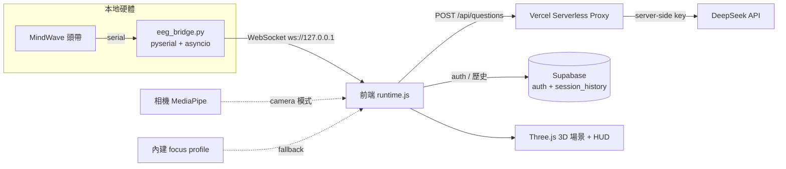
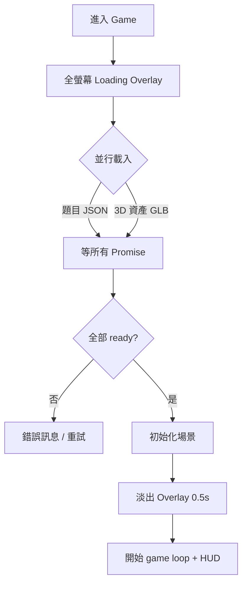

# NeuroFocus 展覽總手冊（EXHIBITION HANDBOOK）

> **一份文件睇晒**：產品是什麼、技術架構、玩法邏輯、現場執行、台上台詞、評判 Q&A、Windows 部署、競爭力與科學論述。
> 呢份係「**展覽 + 答辯**」用嘅參考大全，展覽當日直接開嚟用。
> 👉 至於「之後要寫咩 code / 待辦」——睇另一份 **[`docs/IEYI_PLAN_V2.md`](./IEYI_PLAN_V2.md)**。
> 👉 **正式答辯（3–4 分鐘、PPT 主導、老師 07-17 新方向）**——直接睇本手冊 **Part 6**（策略＋demo 時間分析＋PPT/Canva prompt＋講稿＋A0 海報）；Q&A 喺 **Part 7**；Pros & Cons 喺 **Part 9**。
>
> 本手冊由以下舊文件整合而成（已全部併入，並**更新到 2026-07 sprint 後嘅最新狀態**）：
> `PROJECT_ANALYSIS.md`、`README.md`、`EXHIBITION_EXECUTION_BRIEF`、`GAMEPLAY_UPGRADE_CONFIRMATION`、`UI_FLOWCHART`、`WINDOWS_2A_DEPLOYMENT_SOP`、`TRAE_HANDOFF_PROMPT_WINDOWS`、`debug-windows-home-fps`。
>
> 最後整合日期：**2026-07-16**

---

## 目錄

1. [產品是什麼](#part-1)
2. [網站所有模式：目的與原理](#part-2)
3. [技術架構（最新）](#part-3)
4. [遊戲運行邏輯 + UI 機制](#part-4)
5. [現場展示執行](#part-5)
6. [正式答辯包（3–4 分鐘・PPT/Canva＋講稿＋海報）](#part-6)
7. [評判 Q&A](#part-7)
8. [Windows 部署 SOP + 裝置分工 + FPS 已知問題](#part-8)
9. [競爭力分析（對比賽）](#part-9)
10. [現場檢查清單](#part-10)
11. [IEYI 攤位規格 + 展板計劃（跟 2026 官方 PDF）](#part-11)

---
<a name="part-1"></a>
## Part 1 — 產品是什麼

**一句定位**：NeuroFocus 係一個**神經回饋專注訓練平台原型**。

**唔係**：單純遊戲、單純 EEG 讀數器、醫療器材。
**係**：把「專注狀態」變成**可視化、可訓練、可量化**嘅互動系統。

| | 內容 |
|---|---|
| **主問題** | 短片、通知、社交媒體令年輕人長期處於「睇落清醒、其實注意力好碎」嘅狀態。 |
| **主解法** | 用 EEG / 外界偵測**即時觀察**專注狀態，再用**遊戲回饋 + 呼吸介入**幫用戶重新回到穩定專注。 |
| **主價值** | 唔再係叫用戶「你專心啲」，而係令佢**即時見到自己狀態、學識點拉返自己入狀態**。 |
| **產品定位** | 教育 / 訓練 / 展示用嘅 neurofeedback prototype；專注訓練平台概念驗證；可延伸成商業產品嘅互動原型。 |

**核心閉環**（比單純顯示腦波數字更似產品）：
`偵測 → 視覺化 → 遊戲回饋 → 呼吸介入 → 量化報告`

---
<a name="part-2"></a>
## Part 2 — 網站所有模式：目的與原理

系統有**兩層模式**：先揀「練咩」，再揀「用咩訊號」。

### 第一層：任務模式（練咩）
> 訓練/挑戰兩個模式**都喺同一個海洋場景、玩法一致**，分別只在於挑戰模式會加入題目壓力。（2026-07 已把訓練模式一度試過嘅「書房場景」移除，統一用海洋。）第三個「學習模式」建置中（見下）。

- **訓練模式**：專注航行，**不出題**，主打穩定維持專注。沿一條**無限彎曲航道**航行：專注先揸得住個舵（分心船會漂離航道）、穩住專注 25 秒摘一粒**心流星**、每 500m 經過一個**航標**、天氣即時反映腦狀態（分心起霧、復原放晴）。最適合台上展示（流程最清、最穩、旁觀者一眼睇明）。
- **挑戰模式**：加入 **Stroop 題 + 邏輯題**，主打「一邊做任務、一邊維持專注」，貼近真實生活。最適合台下俾評判親身感受「做 task 時大腦容易亂」。
- **學習模式 Study Mode（✅ 2026-07-16 全部完成，正式站已解鎖）**：第三個選項，對應負責老師嘅**紙本 vs 平台對照實驗**——揀學科（生物已上線，「基礎/進階」兩級深度；化學/物理/歷史 🔒 Coming Soon，比賽前唔會解鎖）→ **閱讀階段**（教材放喺**螢幕右邊圓角磨砂閱讀器**〔闊約 60vw、跟深淺色變白/黑、唔重疊左邊 HUD〕，內文**筆記式排版**〔標題/列表/名詞解釋/重點框〕、計時器內嵌、左邊 focus HUD 照留；**每頁最少讀 15 秒先可揭頁、最多 3 分鐘自動揭頁**；背景同一片天空海景但**收起船／航道／浮標**；天氣共感/呼吸介入/三路訊號輸入照用）→ **答題階段**（**船隻＋題目 HUD 返場**，航行回饋同挑戰模式一樣，題目用該材料嘅**固定審核卷**）→ **Study Results**（📖 溫習＋✍️ 答題兩階段數據斬開＋**CSV 匯出**，學生用編號 S01/S02/S03 唔收真名）。**教材**：老師提供嘅生物「細胞膜與物質運輸」單元已數碼化（基礎/進階、雙語筆記、各 10 條審核 MC），存 `pages/game/studyMaterials.js`，老師可審核/整份換走。詳見 plan §5 D3。**比賽 demo 唔倚賴佢**：訓練/挑戰模式一行 code 都冇郁。**實驗操作**：Setup 右上角齒輪 ⚙ 有「重設所有數據」（清進度/歷史/結果、保留登入＋語言/主題）同「刪除帳戶」，方便每位 pilot 學生（S01→S02→S03）之間清底重嚟；Study Results 匯出 PDF 頁首而家會印埋登入 email 做識別。

### 第二層：訊號來源模式（用咩訊號）
- **Real EEG**：MindWave 頭帶讀 EEG → 本地 `eeg_bridge.py` → WebSocket → 前端。**wow factor 最高、最吸引評判**；風險最高（藍牙 / COM port / 權限）。
- **Simulation**：即使無頭帶 / 頭帶失靈都可完整展示。**唔係假裝 EEG，而係展示神經回饋系統嘅完整運作邏輯。** 內部再分兩條：
  - `camera-ready`：相機開到，用 **MediaPipe 臉部追蹤**（望開、眨眼、臉部居中程度）估算 0–100 專注分。屬「外界偵測專注力」。
  - `simulation-fallback`：連相機都唔得，用內建 focus profile 產生自然起伏嘅專注曲線，驅動船速同呼吸介入。屬「保底模式」，確保任何裝置都 demo 到。

### 介入層：Box Breathing
- **定位**：唔係獨立模式，而係**橫跨整個系統嘅統一介入層**。
- **觸發**：無論用緊 Real EEG / camera / fallback，只要系統判定用戶**長時間偏離穩定專注**（低於自適應門檻持續一段時間），就觸發。
- **流程**：遊戲暫停、計時停止、專注顯示歸零 → 引導呼吸（吸 4 秒 / 憋 4 秒 / 呼 4 秒）→ 完成後短暫 focus boost，令用戶明顯感受「成功回復專注」。
- **意義**：由「只量度專注」推進到「主動改善專注」。

### 難度（挑戰模式用）
- **Easy**：降低門檻，讓新手感受系統如何回應專注變化。
- **Medium**：較真實嘅認知負荷。
- **Hard**：高認知負荷 + Stroop 衝突題，講「現實世界唔係靜坐，而係高壓下仍要保持清晰」。

---
<a name="part-3"></a>
## Part 3 — 技術架構（最新，已反映 2026-07 sprint）

### 資料流


### 技術清單
- **前端基礎**：HTML5 單頁 + **Vanilla JS ES Modules**（非 React/Vue，輕量、易 Vercel 靜態部署）+ **Import Maps**（直接指 `three`、`@mediapipe/tasks-vision`、`@supabase/supabase-js`）+ **Hash Router**。
- **UI / 視覺**：Tailwind CDN（首頁高密度排版）+ Custom CSS（Liquid Glass / Clay 質感、dark mode、game HUD）+ Google Fonts / Material Symbols。字體統一：Orbitron 只喺遊戲 HUD，其餘用 EB Garamond + Inter。
- **3D 互動**：Three.js（場景、光影、材質、粒子、船隻）+ GLTF/HDR 資產（`EGGShip2.glb`、HDR sky、water normal map）+ Web Audio（BGM / 音效）。
- **專注輸入**：MindWave Mobile 2 單通道 EEG（`attention` / `meditation` / `signal_quality`）+ WebSocket + MediaPipe FaceLandmarker + getUserMedia。
- **本地橋接**：Python `asyncio` + `pyserial` + `websockets` + `serial.tools.list_ports` + `threading`。
- **後端（sprint 後新增）**：
  - **Supabase**：真實帳戶 auth（錯密碼真係入唔到；離線時先 fallback 本地 session）+ `session_history` 表（跨 session 歷史）。config 見 `docs/supabase_schema.sql`、`services/supabaseClient.js`。
  - **Vercel Serverless `/api/questions`**：DeepSeek key 收埋喺 `process.env.DEEPSEEK_API_KEY`，**永遠唔會出現喺瀏覽器**。有 GET 健康檢查（開網址睇 `hasKey`）。
- **持久化**：localStorage（語言 / 主題 / user / 歷史 mirror）。
- **部署**：Vercel 靜態前端 + 本地 Python bridge（EEG 唔上雲）+ Windows batch 啟動腳本。

### 主要檔案負責乜（更新版）
| 檔案 | 負責 |
|---|---|
| `index.html` | 載入入口、import map、全域 DOM 容器（countdown / breathing / loader） |
| `app/main.js` | Bootstrap：讀 localStorage 語言/主題/session，啟動 router |
| `app/router.js` | 單頁 hash router，管 home/auth/setup/game/results 嘅 lazy import + mount |
| `app/state.js` | 全域狀態（`testMode`、`trainingDurationSec`、`inputMode`、`difficulty`、`focusSource`…） |
| `app/i18n.js` | 中英文文案（`hk` / `en` 兩個 block，key 要對齊） |
| `api/questions.js` | **Vercel proxy**：server-side 叫 DeepSeek、隱藏 key、健康檢查、fallback reason |
| `services/authService.js` | **真 Supabase 登入/註冊**（離線 fallback） |
| `services/supabaseClient.js` | Supabase client（動態 import，離線唔會 crash） |
| `services/storageService.js` | localStorage + **跨 session 歷史讀寫** |
| `services/runtimeLoader.js` | 版本號 query string + 動態 import runtime（降快取干擾） |
| `services/focusInputService.js` | 相機專注偵測（MediaPipe FaceLandmarker） |
| `pages/game/runtime.js` | **全專案核心引擎**（接近 7000 行）：Three.js 場景、航行物理（航向+慣性）、心流充能摘星、天氣共感、黃金時刻、題目、focus 更新、呼吸介入、simulation profile、bridge reconnect、results、audio、performance profile、**自適應門檻**、**FPS meter**、**學習模式閱讀引擎（D3）** |
| `pages/game/voyage.js` | **航程系統**：無限不規則彎曲航道（發光虛線）、航標浮塔 checkpoint（浮沉+燈頭脈動+海鷗）、航海圖數據；`setVoyageVisible()` 畀學習模式收起船隻航道 |
| `pages/game/studyMaterials.js` | **學習模式教材（D3）**：per 學科 per 深度嘅分頁課文；目前留白霸位，老師材料一到就填入 |
| `eeg_bridge.py` | 本地硬體橋：掃 COM port、揀 MindWave、解析 attention/meditation/signal、WebSocket 廣播 |
| `styles/**` | UI 外觀、Liquid Glass、dark mode、各頁樣式 |
| `*.bat` / `requirements-eeg-bridge.txt` | Windows 一鍵啟動（見 Part 8） |

---
<a name="part-4"></a>
## Part 4 — 遊戲運行邏輯 + UI 機制

### 基本流程
`輸入名稱 → Setup（揀任務模式 →〔學習模式先揀學科＋深度〕→ 揀訊號來源 →（挑戰揀難度 / 訓練揀時長 / 學習直接入）→（Simulation 問相機授權））→ Game → Results`

### 核心邏輯（2026-07 gameplay 重新設計後）
- **專注度驅動船速 + 舵**：`focusLevel` 係核心輸入——越高船越快；同時專注 = 舵嘅控制力：專注時船貼住彎曲航道行，分心時船會隨機漂離航道，重新專注先拉得返（真實航向物理：慣性加速、入彎側傾）。
- **心流充能摘星（訓練模式嘅「贏」）**：企穩喺個人穩定線以上，能量環≈25 秒充滿一圈 = 1 粒星（分心只暫停充能，唔倒扣）；摘星有短暫滑行加速 + 金色橫額。
- **航標 checkpoint**：每 500m 一個紅白航標浮塔座喺航道上，經過有鐘聲 + 橫額；右下航海圖卡實時顯示航道彎位、船嘅偏航同下一個航標距離；跨 session 有「航海日誌」累積總航程。
- **天氣共感**：分心持續 → 起霧、水濁、天暗（旁觀者唔使識睇 HUD 都知狀態）；復原 → 放晴。呼吸介入時霧鎖畫面，**跟住呼氣一格格撥開**，完成陽光爆返。
- **黃金時刻（Real EEG 專屬）**：專注 + 放鬆雙軸同時達標 4 秒 → 成個場景轉入暖金黃昏——雙軸神經回饋嘅高光位，Simulation 冇（冇 meditation 訊號，唔造假）。
- **題目系統**（挑戰模式）：先試 AI 生成 → 失敗 / 太慢 / 格式錯就自動轉**本地 fallback 題庫**。題目偏生活化 + 生物/化學/邏輯推理。有嚴格本地 validation（唯一正解、拒絕重複選項 / 「以上皆是」/ 缺解釋），無效 AI 題自動換成本地驗證過嘅題。
- **雙軸心流（Real EEG 專屬）**：EEG 模式下，心流條件係「**專注 AND 放鬆**」（attention 高 + meditation 達標）；Simulation / camera 模式無 meditation 訊號，用單軸規則。
- **Box Breathing 觸發**：`focusLevel` 低於**自適應門檻**（用歷史調整，唔再死 45/55）並持續一段時間 → 頂部提示 → 觸發呼吸 UI → 完成後短暫 focus boost。
- **自適應門檻**：系統跟住玩家歷史表現收緊 recovery / trigger 門檻——係真「訓練」而唔淨係「量度」。

### Results 量化（2026-07-10 D1 重新設計：航海報告版面）
> 設計語言用 v0 設計稿，Claude 以 vanilla JS + inline SVG 落地（唔加框架），Training / Challenge 兩版共用一套 teal + 金色系，深淺色 + 雙語齊全。由上到下：
- **Hero 判語**：一句大字 + 模式/難度/訊號來源 chips + 專注率或正確率——做到「3 秒睇明今次點」。
- **4 格指標**：專注穩定度（高亮）、平均恢復、呼吸救返；第 4 格挑戰係「距離 + 航標」、訓練係「訓練時長」。
- **成就（訓練）**：心流星、航標、**黃金時刻（真 EEG 專屬，模擬顯示鎖住唔造假）**、航海日誌累積；**答題回顧（挑戰）**：答對數 + 可展開答錯卡（你的答案／正解／解釋）。
- **專注曲線 SVG**（area fill + 穩定線）+ **session 內前後對比 badge**（頭半 vs 尾半）。
- **跨 session trend**（recovery / 穩定度趨勢 + 「分心恢復 vs 你最近平均」誠實 headline）——直接回應評判「點證明有進步」。
- **下一個目標卡**：一個具體目標 + 一句現實意義（例如「恢復快 = 溫書分咗心都追得返」）——見到進步之餘知道下一步。
- **耐刷新**：中途 refresh Results 頁唔會歸零（快照存 localStorage，還原最新一局；重複刷新唔會重複入歷史）。

### UI 機制（值得同評判講嘅工程細節）
**1. Loading 狀態機**（避免黑屏 / 感知崩潰）

用 `Promise.all` 確保資產**全部 ready** 先開場，避免 3D「pop-in」。

**1a2. 題目載入分流＋啟動看門狗（2026-07-11 修復「無法進入遊戲」）**：
- **Simulation／相機模式**：載入**唔等 AI 題**——本地題庫即秒seed入場，AI 題 4 秒後喺背景補上（成功就自動換用，失敗照玩本地題）。效果：模擬模式幾秒內必入場，唔會因為 AI 慢而卡 Loading。
- **EEG 模式**：保留「AI 優先、最多等 8 秒、可中斷」——真頭帶 demo 值得等一陣攞 AI 題。
- **啟動看門狗**：入場 25 秒仲未 boot 完（例如某個資產請求 hang 死）→ 自動放棄、雙語提示「載入超時」、帶返 Setup 頁重試；boot 成功一刻即解除，唔會誤殺慢機嘅開場倒數。**唔會再出現「無限 Loading」**。

**1b. 入場零穿崩 + 現代 Loading（2026-07-10）**：入 game 一刻 loader 會**同步不透明覆蓋**（頁面初始已帶隱藏態），唔會再見到一兩幀原始 HUD/背景；Loading 頁重新設計（小艇浮喺波浪線 + 品牌字 + 進度 shimmer，純 transform/背景動畫，弱機都平）。

**1b2. 遊戲內設定面板（2026-07-11 完成版）**：右上 ⚙ 掣開設定——畫質（自動 / 高L0 / 中L1 / 低L2 / 最低L3）、鏡頭距離（近/標準/遠）、**背景音樂/音效音量滑桿**、**全螢幕切換**；全部設定會記住。**開住設定面板時遊戲會經正規 pause 管線暫停**（計時/距離/呼吸計時全部凍結），閂返即繼續。自動畫質模式下 FPS 跌會自動降級、回穩升返；DEMO_MODE 嘅 FPS meter 顯示現行等級（評判想睇技術深度可以指住佢講）。

**1c. 遊戲提示一律喺螢幕底（2026-07-10）**：摘星/航標/開場提示/加速/呼吸前置提示全部改為由**底部中央**升起（分四層堆疊唔會互疊），唔遮玩家視線中央；呼吸引導 overlay 維持原樣。

**2. 固定寬度數字 HUD**：`updateDigitDisplay` 把每個數字放入固定闊度 `.digit-box`（`tabular-nums`），令 speed 由「1.1」跳到「10.0」時 **HUD 唔會抖動**。

**3. Windows 效能保護**：偵測到 Windows 就掛 `html[data-platform="windows"]` flag，關掉首頁重 blur / glow / 浮動動畫（見 Part 8）。另有隱藏 **FPS meter**（`DEMO_MODE` 後面）可即時睇幀數。

---
<a name="part-5"></a>
## Part 5 — 現場展示執行

### 雙軌制（最重要嘅策略）
| 軌 | 裝置 | 角色 |
|---|---|---|
| **A. EEG 深度軌** | Windows Laptop + EEG 頭帶 | 完整功能 + 技術深度，畀評判睇「真腦波輸入」 |
| **B. 穩定體驗軌** | iPad + 參觀者手機 | 流暢、多人參與，Simulation 保底 |

**核心原則**：唔好將全部成敗押喺 EEG 即時取數。策略 = 「**網站可玩、Simulation 穩定、EEG 作加分**」。

### 三層成功標準
- **最低成功**：參觀者用 iPad / 手機入到網站、玩到 Simulation。
- **標準成功**：Laptop 演示真 EEG 流程，或至少完整展示 EEG 連接介面。
- **額外加分**：至少一部 EEG 成功連線，展示專注度驅動船速。

### 風險分級
- **低**：公開網站、Simulation、題目互動、呼吸介入、結果頁。
- **中**：AI 出題速度、會場網絡、平板/手機效能波動。
- **高**：EEG 當日藍牙/serial、Windows 權限/驅動、bridge 收唔到穩定數據。

### 四人分工
1. **主講 + 評審應對**：講背景、產品目的、技術架構；答「點解用 EEG/camera/simulation」「專注度點量化」「呼吸點幫訓練」。
2. **EEG + Laptop**：管頭帶連接、bridge 啟動、佩戴；成功就示範真 EEG。
3. **iPad + 一般參觀者**：引導入 Simulation，示範遊戲 / 呼吸 / 結果頁。
4. **人流分流 + 手機入口**：引導掃 QR、解釋手機版、處理網絡/排隊/故障。

### 帶咩物品
- **核心**：Windows Laptop ×1、EEG ×2 套、iPad ×1（連充電線/頭）、Laptop 充電器、EEG 電池/充電配件、延長線 ×1–2、拖板 ×1。
- **網絡備援**：手機熱點 ≥1、已部署網址、QR code（首頁 + demo 入口）、本機 IP 局域網入口說明。
- **操作/清潔**：酒精濕紙巾、紙巾、小鏡/髮夾（戴 EEG）、膠紙/魔術貼（固線）。
- **講解物料**：項目名牌、一頁式介紹、功能流程圖、原理簡介、評審問答速記卡。
- **額外**：多一部手機錄影、USB 備份簡報/影片、本地錄好嘅 demo 影片、四頁截圖備援（Setup / 遊戲 / 呼吸 / 結果）。

### Demo 路線
**路線 A — 一般參觀者（1–2 分鐘）**：掃碼/iPad 開網站 → 輸入名 → 揀 Simulation → 入遊戲 → 示範專注↔速度 → 有機會示範呼吸介入 → 睇結果頁。

**路線 B — 評判（3–5 分鐘）**：介紹目標（幫助專注訓練）→ 說明輸入模式（EEG / Simulation / 未來 camera）→ 示範核心流程 → 示範呼吸介入 + 結果頁 → 若 EEG OK 再示範真裝置。

**路線 C — EEG 失敗備援**：先承認現場連線受限 → 說明已設計真 EEG 模式 + 本機 bridge → 改用 Simulation 示範完整閉環 → 強調「輸入接口已存在，現場示範改用穩定模式」。

### 救場台詞
> 「會場藍牙干擾比較大，Real EEG 正在重連。不過我哋個系統有 Simulation 路線，可以即刻展示完整訓練邏輯。」

**鐵律**：喺參觀者面前**唔好花多過 1–2 分鐘**搞硬件；不穩就即刻切 Simulation。

---
<a name="part-6"></a>
## Part 6 — 正式答辯包（3–4 分鐘・PPT 主導・2026-07-17 老師新方向）

> **點解重寫**：老師 07-17 回饋——技術已夠分，但（1）展示訊息唔夠清楚、（2）遊戲／溫習／腦電波未有「綜合感」、（3）太 technical 會冗長。策略改為：**問題行先、PPT 主導、3–4 分鐘、現場只 demo 學習模式嘅閱讀階段（詳見 6.2 時間分析）、technical 全部留 Q&A（Part 7）**。
> Pros & Cons 睇 **Part 9**；Roadmap/to-do 睇 **[`IEYI_PLAN_V2.md`](./IEYI_PLAN_V2.md)**。

### 6.1 策略定調＋核心訊息＋時間分配

**四條定調（每次 present 都要做到）**
- **問題行先**：頭 30 秒就要令評判 100% 清楚「解決緊咩問題、為邊個解決」。
- **一個核心訊息**（成隊人講同一句）：
  > **中**：NeuroFocus 將「專注力」由一個睇唔到、齋靠意志力頂嘅嘢，變成**睇得到、練得到、量得到**嘅技能——用一隻**會因為你分心而飄走嘅船**即時話你知你幾時走神，再用**呼吸提示**同**進度儀表板**幫你逐次把專注練返嚟。
  > **EN**: NeuroFocus turns focus — normally invisible and willpower-dependent — into a skill you can **see, train and measure**: a boat that **drifts when your attention wanders** shows the exact moment you lose focus, then breathing cues and a progress dashboard help you train it back, session by session.
- **綜合感**：唔好講成三件事，要講成**一個閉環**：`偵測 → 睇到（船）→ 提示（呼吸）→ 量化（儀表板）`。學習模式係呢個閉環嘅最完整示範。
- **Technical 留 Q&A**：EEG bridge、相機演算法、AI 出題、雲端——一句帶過，評判想深入先喺 Q&A 答（Part 7 已備好）。

**時間分配（目標 3.5 分鐘）**
| 段 | 內容 | 時間 |
|---|---|---|
| A | 問題（短片＋一句痛點） | 40s |
| B | 我哋嘅答案＝一個閉環（核心訊息） | 30s |
| C | **現場 demo：學習模式閱讀階段（1 頁）＋分心→呼吸提示**；測驗用截圖、儀表板切去預先完成場次 | 80s |
| D | 成效觀點（誠實）＋市場＋願景 | 40s |
| E | 收結一句 → 邀請 Q&A | 15s |

### 6.2 Demo 執行方案（⚠️ 重新分析：點解唔可以現場行晒成個流程）

**機械時間落地數（用 code 實數計）**：
- 閱讀階段：基礎材料 **5 頁**，每頁**最少鎖 15 秒**先解鎖「下一頁」（冇任何 bypass）→ 就算頁頁狂撳，都要 **≥75 秒**純撳頁。
- 測驗階段：**10 條 MC**，就算背晒答案，讀題＋撳掣＋轉場每題 ~6–10 秒 → **≥60–100 秒**。
- 合計：**成個流程機械下限 ≈ 2.5–3 分鐘**——3.5 分鐘 presentation 一定爆。呢個 15 秒鎖係**產品刻意設計**（防跳讀、保證溫習質量），唔應該為咗 demo 拆走。

**所以答辯咁做（三件套）**：
1. **現場只行「閱讀階段第 1 頁」（~40–50s）**：入到閱讀畫面，15 秒鎖啱啱好畀你講解讀器＋focus 指標；跟住**示範分心**（望開／扮碌手機）→ 等佢彈**呼吸提示**→ 跟住呼吸拉返。呢個就係 wow 位，時間啱啱好。
2. **測驗階段唔現場行**：PPT Slide 6 放 1–2 張測驗截圖（船返場＋題目 HUD），一句帶過；或者 10 秒快進錄屏。
3. **儀表板用「預先完成場次」**：**present 之前（當日朝早）用 demo 帳戶完整行一次 study session**，行到 Results 之後**開定第二個瀏覽器 tab 留喺 Results 頁**（有 snapshot，refresh 都返到嚟）。講到 Slide 7 就**切去嗰個 tab**，show 真數據（溫習卡＋答題卡＋恢復時間）。
4. **保險**：成個流程預先**錄屏一條片**擺喺 PPT 尾——demo 機一死就播片，流程照行。

**NAV 速查表（demo 機兩個 tab）**
| 時刻 | 去邊 | 動作 |
|---|---|---|
| Slide 5 開始 | Tab 1 | Setup → 學習模式 → 生物 → 基礎 → Simulation →（相機 skip）→ 入閱讀 |
| Slide 5 中段 | Tab 1 | 示範分心 → 呼吸提示彈出 → 跟住呼吸 |
| Slide 6 | PPT | 唔郁平台，講截圖 |
| Slide 7 | Tab 2 | 切去預先完成嘅 Results，指住恢復時間＋兩階段卡 |
| Slide 8 | PPT | 返 PPT 收結 |

### 6.3 PPT 每頁詳細大綱（8 頁）＋ Canva Prompt（2026-07-18 詳細版）

> 隊員用 Canva 砌；**6.3.4 個 prompt** 直接 copy 畀 Canva Magic Design／AI 都得，或者照住人手砌。截圖自己喺平台 cap（閱讀頁／測驗頁／Results 各一）——**cap 之前記得喺 homepage 把網站切去英文 UI**（slides 建議全英文，理由見 6.3.1）。

#### 6.3.1 語言拍板：建議 slides 全英文＋口頭按評判（分析）

| 方案 | 好處 | 壞處 | 判斷 |
|---|---|---|---|
| 全中文 | 本地評判即讀即明；隊員砌得快 | IEYI 係**國際**發明展，評判團國際化——非華語評判一個字都睇唔明；同英文 UI 截圖／海報唔一致 | ❌ |
| 中英並排（舊 prompt 做法） | 兩邊都照顧到 | **每頁字量 ×2**，直接違反「每頁一個重點、3 秒睇明」鐵律；簡報研究（Mayer 嘅 redundancy principle）一致發現螢幕字越多、觀眾越唔聽你講 | ❌ |
| **全英文** ✅ | 國際賽通用評審語言；標題短（≤8 個字）本地評判一樣秒懂；同 A0 海報、英文 UI 截圖、科學名詞（EEG／neurofeedback）全部一致；國際賽觀感專業 | 隊員寫英文要執一執（下面 prompt 已寫定晒每頁文字，照抄就得） | **✅ 採用** |

**配套（好重要）**：
- **口講唔使跟 slides 語言**——講稿 6.4 本身中英對照：評判係本地人就照講中文，英文 slides 完全唔阻（標題得幾個字）；評判國際化就全英。開場先用英文打招呼，再按評判反應調節。
- **保險**：如果領隊／官方文件確認評審全程用中文（例如中國賽區中文評判組），就出中文版——6.3.3 大綱表已備齊中文標題，Canva 逐頁換字 **<15 分鐘**。呢個決定**建議 07-20 前**問清楚拍板，免得隊員砌完要返工。

#### 6.3.2 文獻數據卡（slides 用得嘅真數字＋出處）

> 用法鐵律：**每頁最多一個數字**，數字特大金色、出處一行細字（作者＋年份就夠）。答辯正文唔使背晒，評判 Q&A 追問先展開（配合 Part 7／Part 9「可主張／不可主張」清單）。

| # | 數字／發現 | 出處 | 用邊頁 | ⚠️ 注意 |
|---|---|---|---|---|
| 1 | 螢幕工作平均單次專注時長：2004 年約 2.5 分鐘 → 近年 **47 秒** | Gloria Mark（UC Irvine），*Attention Span*（2023） | S2 | 唔好用「人類專注得 8 秒、輸畀金魚」——嗰個係冇根據嘅都市傳說，評判識笑 |
| 2 | 被打斷後平均要 **~25 分鐘**先完全返到原任務 | Mark et al.，*The Cost of Interrupted Work*（CHI 2008） | S2／S3 | 講「分咗心唔係『返嚟』咁簡單」 |
| 3 | 人清醒時間 **~47%** 喺 mind-wandering，而且多數唔自覺 | Killingsworth & Gilbert，*Science*（2010） | S3 | 正正支持「幾時走神自己唔知」呢句核心 |
| 4 | 學生開始溫書後 **~3–5 分鐘**就出現第一次分心（多數係手機／社交媒體） | Rosen et al.，*Computers in Human Behavior*（2013） | S2（可選） | 最貼學生場景 |
| 5 | 手機**淨係擺喺枱面**都會拖低工作記憶表現 | Ward et al.，「Brain Drain」（*JACR* 2017） | S2（可選） | 一個 icon 一句就夠 |
| 6 | 慢呼吸提升副交感／HRV、降低焦慮喚醒（系統性回顧） | Zaccaro et al.，*Front. Hum. Neurosci.*（2018） | S5／S8 | 支持呼吸介入呢環——係成個科學敘事入面最穩嗰塊 |
| 7 | 每日 **5 分鐘**呼吸練習（RCT）改善情緒、降低生理喚醒；box breathing 係其中一組 | Balban et al.，*Cell Reports Medicine*（2023） | S5／S8 | 唔好講成「醫治焦慮」 |
| 8 | 「讀完即測」（retrieval practice）比重讀更記得牢，meta 效應量 **g≈0.5–0.6** | Roediger & Karpicke（2006）；Adesope et al. meta（2017） | S6 | 支持「Read, then quiz」呢個產品設計 |
| 9 | Neurofeedback 對 ADHD：標準 protocol 有中小效應、follow-up 有持續性，但整體證據**混合** | Van Doren et al. meta（2019）；近年 reviews | S8／Q&A | 只可以講「有科學基礎、待大樣本驗證」——同 Part 9 誠實框架完全一致 |

#### 6.3.3 Slide 7 儀表板「顯示差異」設計（含示意數據規則）

儀表板頁要令評判 **3 秒睇到三個差異位**（喺真截圖上圈註，或 Canva 自製 mock）：

| 差異位 | 展示數字（示意） | 點解呢個範圍先合理（文獻對齊） |
|---|---|---|
| **兩階段差異** | Reading stability **74%** vs Quiz **68%** | 時間越長專注自然下滑（vigilance decrement）＋答題認知負荷更高——差 **4–8 個百分點**合理；整到差 30 點就假 |
| **跨場改善** | Avg recovery **22s（第 1 場）→ 14s（第 5 場）**，↓約 36% | 神經回饋類訓練文獻見到嘅係**漸進**學習曲線——改善幅度寫 **20–40%** 之內先可信；「快咗 80%」冇文獻撐 |
| **介入有效** | Breathing cues **3 · 全部 <20s 救返** | 呼吸一輪 12 秒（4-4-4），文獻支持 1–2 分鐘慢呼吸已見喚醒下降（Zaccaro 2018）——「介入後好快救返」係站得住嘅講法 |

**誠實鐵律（同 Part 6.6／Part 9 框架一致，唔可以違反）**：
- 用 Canva 自製 mock 嘅話，**左下角必須有細字 "Illustrative mock-up — live data shown on stage"**；用真截圖就唔使。
- 呢啲示意數字**唔可以**講成 pilot 實驗結果——口頭永遠指住 **Tab 2 真數據**講（6.2 三件套）。
- Pilot 一出咗真 CSV 就即換真數，示意即棄。
- 圈註統一用金色（#F5C542）幼框＋一個詞 label（"Recovery ↓"／"Reading vs Quiz"），唔好遮住圖。

#### 6.3.4 大綱速覽表（中文標題＝隊員對照＋中文版後備；slides 上淨用 EN）

| # | 標題（中/EN） | 版面重點 | 講邊段 | 郁唔郁平台 |
|---|---|---|---|---|
| 1 | NeuroFocus——睇得到的專注力訓練 / Focus you can see, train & measure | 海洋＋船 hero 圖、隊名/校/IEYI、QR | 核心訊息一句 | 否 |
| 2 | 注意力，正在碎片化 / Attention is being fragmented | **嵌入 20–30 秒短片**（掛住碌手機、溫唔到書）＋3 關鍵字 | A | 否（播片） |
| 3 | 叫人「專心啲」冇用 / "Just focus" doesn't work | 左：意志力/番茄鐘只計時間 ✗；右：「幾時走神？點拉返？」 | B 前半 | 否 |
| 4 | 一個閉環，唔係三件事 / One loop, not three features | **中央閉環圓環圖**：偵測→睇到(船)→提示(呼吸)→量化，箭咀轉圈 | B 後半 | 否 |
| 5 | 同一份書，喺 NeuroFocus 溫 / Same notes, revised here | 大字「LIVE DEMO」＋閱讀頁截圖做底 | C1 | ✅ Tab 1 閱讀＋示範分心 |
| 6 | 讀完即刻考，船同你一齊航 / Read, then quiz — with the boat | 測驗階段截圖 1–2 張（船＋題目 HUD）；註明「老師審核固定卷」 | C2 | 否（截圖） |
| 7 | 唔止分數，係你嘅專注歷史 / Not a score — your focus history | Results 截圖：兩階段卡＋恢復時間＋趨勢 | C3 | ✅ 切 Tab 2 真數據 |
| 8 | 由「叫你專心」到「畀你練專心」 / From "focus!" to "train your focus" | 三欄：誠實成效／市場／願景＋「Technical 歡迎 Q&A」＋備用錄屏 | D＋E | 否 |

#### 6.3.5 Canva Prompt 詳細版（copy 畀隊員／Canva AI 用）

> 一次過貼晒可能超出 Canva AI 輸入上限——超咗就**先貼【全局風格】＋第 1–4 頁**生成，再逐頁貼住改。人手砌就當佢係逐頁 spec 照做。

```
你係比賽簡報設計師。請整一副 16:9、8 頁嘅國際賽答辯 PPT，
主題：「NeuroFocus — an EEG neurofeedback focus-training platform」。
slides 上所有文字用英文（口頭報告另有雙語講稿，唔使喺 slide 加中文）。

【全局風格】
- 背景：深海藍垂直漸變 #0B1E3A（頂）→ #123B5C（底）；全副唔好出現白底頁。
- 色板：青色 #22D3EE（accent／箭咀／icon）、金色 #F5C542（數據高亮／圈註）、
  正文白 #FFFFFF、次要文字 #9FB6CC。
- 字體：標題 Montserrat ExtraBold；內文 Inter（或 Open Sans）；大數字 Montserrat Bold 特大。
- 每頁鐵律：一個大標題（≤8 個英文字）＋內文最多 25 個英文字＋一個視覺主角
 （大截圖／圖表／影片位）；留白 ≥30%；每頁最多一個統計數字；唔好 bullet 牆。
- 每頁右下角：細頁碼＋細字 "NeuroFocus · IEYI 2026"。
- 過場動畫一律 fade（0.3s）；唔好飛入／彈跳／旋轉。

【第 1 頁・封面】
- 版面：上 2/3 hero 插圖——深藍夜海、一隻發光小帆船、地平線微光（扁平插畫風，
  唔好卡通幼稚；Canva 素材可搜 "sailboat night ocean flat illustration"）；下 1/3 文字區。
- 大標題："NeuroFocus"（特大、白色、置中）
- 副題："Focus you can see, train and measure"（青色）
- 底部一行細字：隊名 · 學校 · IEYI 2026；右下角預留 3×3cm QR code 位（白底圓角）。

【第 2 頁・問題】
- 標題："Attention is being fragmented"
- 中央：16:9 影片位（佔頁 55%、圓角、幼青邊）——之後嵌入 20–30 秒短片（離線 mp4）。
- 影片位下方三個 icon＋關鍵詞（橫排、青 icon、白字）：
  "Endless short videos" · "Constant notifications" · "Fragmented focus"
- 數據 callout（金色特大數字，擺影片位右側）："47s"
  ＋細字 "average attention on a screen — Mark, UC Irvine (2023)"

【第 3 頁・舊方法唔 work】
- 標題："'Just focus' doesn't work"
- 左右兩張圓角磨砂對比卡：
  左卡（灰調、紅 ✗ icon）："Willpower & timers only count minutes"
    ＋細字 "They never tell you WHEN you drifted"
  右卡（青框、? icon）："When did I drift? How do I pull back?"
- 底部一行金色細字："We mind-wander ~47% of waking hours — often without
  noticing (Killingsworth & Gilbert, Science 2010)"

【第 4 頁・閉環】
- 標題："One loop, not three features"
- 中央大圓環圖（佔頁 60%）：四個節點順時針、青色箭咀首尾相連：
  1 "DETECT"（腦電波 icon）— EEG / webcam
  2 "SEE"（帆船 icon）— a boat that drifts when you do
  3 "CUE"（呼吸 icon）— breathing pulls you back
  4 "MEASURE"（圖表 icon）— dashboard tracks progress
- 節點用圓形磨砂卡＋青 icon；圓心細字 "real-time · closed loop"。

【第 5 頁・LIVE DEMO】
- 標題："Same notes, revised on NeuroFocus"
- 右上角斜貼大 badge（金底深藍字）："LIVE DEMO"
- 中央大截圖位（佔頁 70%、圓角＋陰影）：閱讀器畫面截圖（英文 UI）。
- 底部細字："Study Mode · reading phase · focus meter live on the left"

【第 6 頁・測驗】
- 標題："Read, then quiz — with the boat"
- 兩張橫截圖位並排（各佔 40%）：左＝測驗題目＋帆船 HUD；右＝帆船航行畫面。
- 截圖下細字："Teacher-vetted, locked question paper — fair for the experiment"
- 角落金色細字："Retrieval practice beats re-reading (Roediger & Karpicke, 2006)"

【第 7 頁・儀表板】
- 標題："Not a score — your focus history"
- 中央大截圖位（佔頁 65%）：Results 儀表板截圖（英文 UI）。
- 喺截圖上加三個金色（#F5C542）幼框圈註＋引線 label（細字，唔好遮圖）：
  "Reading 74% vs Quiz 68%" · "Recovery 22s → 14s" · "Every drift rescued"
- 如果暫時冇真截圖、用 Canva 自製 mock 代替：左下角必須細字
  "Illustrative mock-up — live data shown on stage"
- 右側直排三個小標籤卡："Focus stability" / "Recovery time" / "Cross-session trend"

【第 8 頁・收結】
- 標題："From 'focus!' to 'train your focus'"
- 三欄圓角磨砂小卡：
  1 "Honest evidence" — mechanisms grounded in science · small pilot (n=2–3) ·
    long-term efficacy needs larger trials
  2 "Ready market" — any student with a webcam · schools & revision scenarios
  3 "Next" — full EEG loop · larger controlled study
- 底部一行（青色）："EEG bridge · camera algorithm · AI questions · cloud —
  happy to go deep in Q&A"
- 右下角：細 QR code＋"Try it yourself"

【第 9 頁・隱藏備用】
- 全黑背景、細標題 "Backup — full flow recording"，嵌入成套學習流程錄屏（離線 mp4）。
- 正常唔會播；demo 機出事先跳呢頁（對應 6.2 保險）。
```

**砌完自查（隊員用）**：① 每頁企遠兩米仲讀唔讀到標題？② 邊頁多過一個數字？刪剩一個。③ 三張截圖係咪英文 UI？④ Slide 2／9 條片係咪已上載入 Canva（離線播得）？⑤ Slide 7 如果用 mock，有冇 "Illustrative mock-up" 細字？

### 6.4 講稿（分段落 Part A–E・中英對照・唔分邊個講）

> 邊個讀邊段你哋自己分。`[NAV]`＝撳邊度；`[DEMO]`＝現場動作。

**A — 問題（Slide 1→2，40s）**
> **【中】** 各位評判好，我哋係 NeuroFocus。（播片）大家見到呢個畫面——而家嘅年輕人喺短片同通知轟炸下，好容易「睇落清醒，但注意力好碎」：想溫書，五分鐘就摸手機，摸完又唔記得讀到邊。專注力唔係唔想，而係**佢哋根本唔察覺自己幾時走咗神**。
>
> **【EN】** Good afternoon judges, we are NeuroFocus. (play clip) This is today's reality: under a flood of short videos and notifications, young people look awake but their attention is fragmented. They sit down to study and reach for the phone within five minutes — without even noticing the moment they drifted. It's not that they don't want to focus; they simply **can't sense when they lost it**.

**B — 我哋嘅答案：一個閉環（Slide 3→4，30s）**
> **【中】** 叫人「專心啲」冇用，番茄鐘只計時間——兩樣都唔會話你知你**幾時**分咗心。所以我哋做嘅唔係三個獨立功能，而係**一個閉環**：即時**偵測**你嘅專注 → 用一隻**船**畀你即刻**睇到** → 分心太耐就彈**呼吸提示**拉你返嚟 → 完場再**量化**你嘅進步。而家我哋用**學習模式**示範，因為佢一個模式已經串起成個閉環。
>
> **【EN】** Telling someone to "focus" doesn't work, and a timer only counts minutes — neither tells you *when* you drifted. So we built **one loop**, not three features: detect your focus in real time → let you **see** it through a boat → if you drift too long, a breathing cue pulls you back → then every session **measures** your progress. We'll demo our **Study mode**, because one mode chains the whole loop.

**C1 — 現場 demo：閱讀＋分心介入（Slide 5，~45s）**
> `[NAV]` Tab 1：Setup → 學習模式 → 生物 → 基礎 → Simulation →（相機可 skip）→ 閱讀畫面。
>
> **【中】** 我而家真係用平台溫一頁生物筆記。右邊係閱讀器；左邊呢個指標，就係我**呢一秒**嘅專注度。順帶一提，每頁有 15 秒最短閱讀時間——係故意嘅，防止跳讀。`[DEMO 扮分心、望開]` 而家我扮走神——大家見到指標跌，跟住系統彈出**呼吸提示**，我跟住佢呼吸……個狀態就拉返嚟。呢個就係**即時覺察＋即時介入**，唔使等到溫完書先知自己浪費咗幾多時間。
>
> **【EN】** I'm now actually revising one page of biology notes on the platform. The reader is on the right; this meter on the left is my focus **at this very second**. By the way, each page has a 15-second minimum reading time — deliberately, to prevent skim-reading. `[DEMO: drift, look away]` Now I pretend to lose focus — you can see the meter drop, then the system pops a **breathing cue**; I follow it… and my state comes back. That's **real-time awareness plus real-time intervention** — no waiting until the end to find out how much time you wasted.

**C2 — 測驗（Slide 6，講截圖，~15s）**
> **【中】** 讀完即刻考。呢部分為咗尊重大家時間，直接睇圖：隻**船返場**——我狀態好，船就順；一分心，船就失速。題目用嘅係**老師審核鎖死嘅固定卷**，保證實驗公平。
>
> **【EN】** Right after reading comes the quiz. To respect your time, here's a snapshot: the **boat returns** — sail smooth when my state is good, stall when I drift. Questions come from a **teacher-vetted, locked paper**, keeping the experiment fair.

**C3 — 儀表板（Slide 7，切 Tab 2，~20s）**
> `[NAV]` 切去 Tab 2（今朝預先完成嗰場嘅 Results）。
>
> **【中】** 呢個係我哋今朝真係行咗一場嘅結果：唔止分數——有**溫習階段**同**答題階段**分開嘅專注數據、**分心之後幾快拉返**，同埋**同之前場次嘅進步趨勢**，有進步佢會鼓勵你。老師仲可以一鍵匯出 PDF／CSV。
>
> **【EN】** This is a real session we completed this morning: not just a score — focus data split between **revision** and **quiz** phases, **how fast I recover after each distraction**, and a **progress trend across sessions**, with encouragement when you improve. Teachers can export a PDF/CSV in one click.

**D — 成效・市場・願景（Slide 8，40s）**
> **【中】** 要誠實講：我哋嘅機制有科學根據——即時回饋建立自我覺察、規律呼吸調節喚醒、重複練習訓練「拉返專注」呢個技能——但**長期成效仲需要更大規模研究**；而家係 n 得 2–3 個學生嘅 pilot。市場方面，因為**唔一定要 EEG 頭帶，有鏡頭就用到**，任何學生都試到，可以直入學校同溫習場景。下一步：接返真 EEG 閉環、做大樣本對照研究。
>
> **【EN】** To be honest: our mechanisms are grounded in science — real-time feedback builds self-awareness, paced breathing regulates arousal, repeated practice trains recovery — but **long-term efficacy still needs a larger study**; today it's a pilot of 2–3 students. On market: since it **needs no EEG headband — a webcam is enough**, any student can try it, going straight into school and revision scenarios. Next: reconnect the full EEG loop and run a proper controlled study.

**E — 收結（Slide 8，15s）**
> **【中】** 一句講晒：NeuroFocus 將專注力由「叫你專心」變成「**畀你睇到、練到、量到**」。技術細節——EEG、相機演算法、AI 出題、雲端——我哋好樂意喺 Q&A 詳談。多謝各位。
>
> **【EN】** In one line: NeuroFocus turns focus from "just concentrate" into something you can **see, train and measure**. All the technical depth — EEG, camera algorithm, AI question generation, cloud — we'd love to cover in Q&A. Thank you.

### 6.5 A0 海報設計大綱（841×1189mm 直度）

> 目標：**3 米外睇到主訊息，1 米內睇到閉環同截圖**。字級：大題 ≥100pt、段題 ≥54pt、內文 ≥28pt。色跟 PPT（深海藍底、青 accent、白字）。

```
┌───────────────────────────────────────────────┐
│ 頁首：NeuroFocus ＋ 核心訊息(中/EN) ＋ 校/隊/QR │ ← 12%
├───────────────┬───────────────┬───────────────┤
│ ① 問題        │ ④ 閉環大圖     │ ⑥ 儀表板截圖   │
│ 痛點+短片QR   │ 偵測→睇→提示   │ 趨勢+恢復時間  │
│               │ →量化（圓環）  │ 圈住「進步」   │
├───────────────┼───────────────┼───────────────┤
│ ② 舊方法唔夠  │ ⑤ 學習模式3步  │ ⑦ 成效(誠實)   │
│ 只計時間✗     │ 閱讀→測驗→結果 │ +市場+願景     │
├───────────────┴───────────────┴───────────────┤
│ 頁尾：科學依據一行 ＋ 團隊 ＋ 試玩 QR           │
└───────────────────────────────────────────────┘
```
- **④ 閉環圖係海報主角**（放中欄最大）——直接答「綜合感」。
- **⑤ 用三張真截圖**（閱讀＋focus 指標／測驗＋船／Results）。
- **⑦ 誠實三行**：機制✓／pilot n≈2–3／長期待證＋「webcam 就用到」。
- 唔好塞滿字；每格一個重點；截圖加圓角陰影。

### 6.6 版本進化對照表（最舊 → 目前・答辯/Q&A 素材）


由 **2026-06-23 第一個 commit「EEG 2026 - Focus Game」** 到 **2026-07 嘅「NeuroFocus」平台**，三個幾星期、約 95 個 commit。核心 gameplay 檔 `runtime.js` 由 **3961 行** 長到 **7615 行**。以下逐項對照——重點唔淨係「加咗嘢」，而係**每一項點樣擴闊市場 + 加強專注訓練嘅說服力**：

| 面向 Dimension | 最舊版本 Oldest（06-23「EEG Focus Game」） | 目前版本 Now（07「NeuroFocus」平台） | 對「市場潛力／改善專注」嘅意義 |
|---|---|---|---|
| **定位 Identity** | 一個靠頭帶玩嘅 EEG 專注**遊戲** | 多模式**神經回饋專注訓練平台**原型 | 由「玩具／demo」升做「平台」，先有得延伸商業化 |
| **訊號來源 Signal** | EEG ＋ 模擬曲線 fallback（**冇相機**） | EEG ＋ **相機臉部偵測（MediaPipe）** ＋ 模擬 fallback | 冇 EEG 硬件都用得 → 受眾由「有頭帶嘅人」擴到「**任何有 webcam 嘅學生**」，TAM 大幅擴闊 |
| **任務模式 Task modes** | **單一遊戲**，冇分層 | **訓練／挑戰／學習** 三模式（任務層）＋ EEG／Simulation（訊號層）兩層架構 | 覆蓋更多場景：純練穩定、抗干擾、溫習學習——一個平台多種用途 |
| **專注介入 Intervention** | **冇**（淨係量度） | **Box Breathing 呼吸介入**，接喺所有偵測後面嘅統一層 | 由「淨係量度你分咗心」→「量度**＋主動幫你調節返**」＝真正嘅訓練價值，唔止 monitor |
| **數據／進度 Data** | 淨係**單次 session** 結果 | 單次 ＋ **跨 session 趨勢／恢復分析**（雲端 Supabase ＋ 本地）＋ PDF/CSV 匯出 | 用戶睇到自己進步 → 黏性／回訪／訂閱潛力；對評判＝「唔止畀你睇一次」 |
| **教育應用 Education** | **冇** | **學習模式**：紙本 vs 平台對照實驗、老師固定審核卷、兩階段專注數據、教材數碼化 | 打開**教育市場**（學校／老師／家長）＋ 提供「**可量度學習過程**」嘅證據角度 |
| **語言 Language** | 中英雙語（一開始已有） | 中英雙語**更完整**（連教材、結果、匯出都雙語） | 面向本地學生 ＋ 國際評判，兩邊都 present 到 |
| **規模 Scale** | `runtime.js` 3961 行、README 淨係講 EEG 駁機 | `runtime.js` 7615 行、完整手冊＋計劃書＋教材＋實驗 | 3.5 週由「一隻遊戲」演進成「一個系統」 |

**分析一：市場潛力有冇因為改良而增加？→ 有，而且係關鍵性擴闊。**
最舊版本嘅致命限制係「**要有 MindWave 頭帶先玩到**」——市場等於「擁有／肯買消費級 EEG 嘅人」，非常窄。加咗**相機偵測 fallback** 之後，任何一部有鏡頭嘅手機／電腦都可以完整體驗，受眾由「頭帶用家」擴到「**普通學生**」。再加**學習模式**，等於由「個人玩具」跨入「**教育工具**」呢個更大、更肯付費嘅市場（學校／補習／家長）。而**跨 session 進度追蹤**提供咗回訪同訂閱嘅商業鈎。所以改良方向唔係「加花巧」，而係**一步步拆走增長天花板**。

**分析二：係咪真係可以改善專注？→ 要誠實分兩面講。**
- **機制上站得住腳**：(1) **即時神經回饋**幫用戶建立「而家掂唔掂」嘅**自我覺察**——呢個係行為改變嘅第一步；(2) **Box Breathing** 用規律呼吸降低過高喚醒，係有文獻支持嘅情緒／喚醒調節手法；(3) **重複練習 + 恢復數據**訓練嘅係「**分心之後點拉返自己**」呢個技能，唔係一次性表演。呢三樣都係朝住「真正改善」嘅方向設計，而且平台**已經量度到**專注穩定度同恢復時間。
- **但要 honest**：我哋**未有嚴謹嘅長期實證**——pilot 得 n≈2–3，冇正式對照組／前後測／長期追蹤，用嘅又係消費級單通道 EEG。所以正確講法係：「**機制對齊科學、平台已經量度到學習過程，但長期成效仲未證實**」。定位係**訓練平台原型**，唔係已完成臨床驗證嘅醫療產品；下一步先做更大樣本嘅對照研究。**呢個誠實框架本身就係加分位**——評判最鍾意見到參賽者分得清「已做到」同「仲要證實」。


### 6.7 攤位互動 SOP（6 步・中英對照）Booth SOP (6 steps)
1. **Hook**
   > **【中】** 頭先台上講嗰套腦波訓練系統，我哋而家可以畀你親身試。
   > **【EN】** That brainwave-training system we just presented — you can try it yourself right now.
2. **先講模式 Explain the modes first**
   > **【中】** 先揀任務模式，再揀訊號來源。
   > **【EN】** First pick a task mode, then pick a signal source.
3. **先示範訓練模式 Demo Training first**（`Real EEG → 訓練`）
   > **【中】** 呢個唔出題，純粹訓練穩定專注。
   > **【EN】** This one has no questions — it's purely about training steady focus.
4. **再示範挑戰模式 Then Challenge**
   > **【中】** 基本功穩定後就加任務壓力，貼近現實。
   > **【EN】** Once the basics are steady, we add task pressure to mirror real life.
5. **最後 Results Finish on Results**
   > **【中】** 每次訓練都量化今次表現——穩定度、恢復速度、呼吸次數，仲有同你之前 session 嘅對比。
   > **【EN】** Every session quantifies your performance — stability, recovery speed, breathing count, plus a comparison with your previous sessions.
6. **未來發展點到即止 Touch on the future, lightly**
   > **【中】** 之後會加長期 progress tracking、個人化難度、更多外界偵測。
   > **【EN】** Next we'll add long-term progress tracking, personalised difficulty, and more external sensing.

---
<a name="part-7"></a>
## Part 7 — 評判 Q&A

> Technical 而家**全部落 Q&A**（答辯正文唔講）。答法原則：**先一句到位，評判想深入先展開**；誠實講限制係加分位。

- **Q：你哋到底解決緊咩問題？**
  A：年輕人喺短片同通知下注意力碎片化，溫書/做嘢**分咗心都唔自覺**。我哋令佢即時察覺、即時拉返、再量化進步——由「監測」升級到「訓練」。

- **Q：點解要咁多模式？**
  A：核心其實係**一個閉環**（偵測→睇到→提示→量化），模式只係唔同入口：訓練＝純練、挑戰＝加任務壓力、學習＝閉環最完整嘅示範。所以答辯只 demo 學習模式，其餘留畀攤位深入試。

- **Q：點解唔現場行晒成個學習流程？**
  A：因為產品**刻意**設計每頁最少 15 秒閱讀鎖（防跳讀、保證溫習質量），加埋 10 條審核題，完整流程要 2–3 分鐘——所以現場示範閱讀＋介入嘅核心體驗，測驗同儀表板用今朝真實完成嗰場。**係產品嚴謹，唔係 demo 唔到。**

- **Q：EEG 具體點運作？**
  A：NeuroSky 單通道頭帶讀腦電 → 本地 Python bridge → WebSocket → 網頁，轉成即時專注指標驅動隻船。今日用 Simulation demo；EEG 係另一條獨立輸入路線，接返去閉環一樣行。

- **Q：數據存喺邊？私隱點處理？**
  A：帳戶同跨場歷史喺 Supabase（RLS 保護，每人只讀到自己），本地有 mirror 離線都用到；相機影像**全程本地處理，唔上傳**。實驗學生用編號 S01/S02/S03，唔收真名。

- **Q：Simulation 係咪即係假？**
  A：唔係。Simulation 係展示同備援路線，保證任何裝置都能完整示範系統邏輯;真實 EEG 係另一條獨立輸入路線。

- **Q：Simulation 兩條路線有咩分別？**
  A：相機可用就用相機外界偵測;相機不可用就用 fallback profile 保證流程完整。

- **Q：點解 Box Breathing 有用？**
  A：用戶過度緊張/太散時，規律呼吸可短時間重置節奏，更易回到穩定專注。而且佢唔綁死某一輸入模式，係接喺所有偵測機制後面嘅統一介入層。

- **Q：你哋點證明真係有效？**（最常問，要答得好）
  A：現階段已做到**即時神經回饋 + 呼吸介入 + 單次 session 量化 + 跨 session 前後對比同恢復趨勢**——即係唔止畀你睇一次，仲畀你睇多次之間有冇進步。另外我哋喺老師指導下做緊一個**小型對照 pilot**：用新嘅「學習模式」，同一份材料、同一份老師審核嘅測驗卷，比較「紙本溫習」同「平台溫習」兩組嘅測驗成績＋介入後拉返專注嘅時間（如果賽前完成會展示 CSV 數據；n 只有 2–3 個學生，我哋會誠實講呢個係 pilot、唔係正式研究）。至於嚴謹長期成效，下一步會做**更大樣本前後測、對照組、持續追蹤**。現階段定位係**訓練平台原型**，唔係已完成臨床驗證嘅醫療產品。

- **Q：呢個係咪醫療產品？**
  A：目前唔係。定位係教育/訓練/神經回饋原型，幫用戶建立自我覺察同專注調節能力。

- **Q：你哋用單通道消費級 EEG，準唔準？**
  A：我哋用 MindWave 輸出嘅 attention/meditation 作**訓練輸入同展示**，唔會講成研究級多通道腦狀態診斷。呢個係設計上誠實嘅取捨——重點係閉環訓練體驗，唔係臨床量測。

- **Q：Alpha/Beta 同 Flow 係咪必然等於?**
  A：唔係。我哋用「以 Alpha/Beta 作為專注與放鬆平衡嘅**設計框架**」去理解，唔係當成臨床定律。

- **Q：你哋題目係咪一直都係 AI 即場生成？同 pilot 實驗用嘅係咪一樣？**
  A：兩套分開用，設計上刻意：**量化 pilot 實驗**用嘅係老師**審核鎖死嘅固定卷**（因為 AI 每次生成都唔同，唔鎖死就唔公平比較）；**而家喺攤位/答辯畀你哋睇**嘅係 AI **即場**由文章生成題目，每次都唔同，用嚟展示「即時出題」呢個技術能力。呢個做法同挑戰模式本身「AI 出題失敗就自動轉用審核過嘅本地題庫」嘅邏輯一致——**做實驗要嚴謹求公平，做展示要靈活求真實體驗**，兩者唔矛盾。

---
<a name="part-8"></a>
## Part 8 — Windows 部署 SOP + 裝置分工 + FPS 已知問題

### 目標
Windows laptop 做現場 demo 機：本地 Python EEG bridge + 本地站 `http://localhost:8000/#home`，真 EEG 為主、Simulation 備援。

### 要 copy 去 Windows 嘅檔
`index.html`、`app/`、`pages/`、`services/`、`styles/`、`components/`、`assets/`、`bgm/`、`server.js`、`eeg_bridge.py`、`requirements-eeg-bridge.txt`、`install_eeg_bridge_windows.bat`、`start_eeg_bridge_windows.bat`、`start_local_site_windows.bat`、`start_2a_demo_windows.bat`。

### 一次性準備
1. 裝 Python 3　2. 裝 Node.js　3. Windows 藍牙配對 `MindWave Mobile 2`　4. 雙擊 `install_eeg_bridge_windows.bat`。

> **Mac 定位（2026-07-11 修訂）：做網站/備援機得，做 EEG 主機唔得。** Code 層面 bridge 支援 macOS 序列埠（/dev/cu.* 掃描＋權限提示），但 **MindWave Mobile 2（藍牙 Classic SPP 老協議）喺近年 macOS 上實測經常配對到但攞唔到數據**——Steven 過往經驗一致，NeuroSky 對 macOS 嘅支援亦早已停更。結論：**真 EEG demo 一律用 Windows 機**；MacBook 用 `start_demo_mac.command` 做本地網站/備援/hotfix 機。

### 開場步驟
1. 插電　2. Windows 電源模式設 `Best performance`　3. 開瀏覽器硬件加速　4. 關 Teams / OneDrive 同步 / Discord / 多餘分頁　5. 開頭帶　6. 雙擊 `start_2a_demo_windows.bat`　7. 等兩個視窗（EEG Bridge + Local Site）　8. 瀏覽器開 `http://localhost:8000/#home`　9. Setup 測 `EEG Device`，唔得就即切 `Simulation`。

### 快速驗證
- **本地站**：`http://localhost:8000/#home` 首頁順、Setup/Auth 唔卡。
- **EEG bridge**：視窗唔會即刻閃退;顯示 COM port + connected 就入 EEG 模式;連唔到就即用 Simulation。

### 裝置分工
- **Windows Laptop**：主技術 demo 機 + 本地站 + Python bridge + 真 EEG 嘗試;EEG 失敗仍作本地備援機。
- **iPad 1**：主公開互動機，開公開站跑 Simulation，畀順滑體驗。
- **iPad 2**：後備公開機（評判睇 / 多一位參觀者 / iPad 1 需要 refresh 時）。
- **MacBook**：緊急維修 / 備援控制機 + 專案檔案備份 + hotfix 文字/CSS/部署 + 播截圖/影片。

### ⚠️ Windows FPS 已知問題（已修，但要知）
- **症狀**（2026-06-23 記錄）：Windows 首頁得 ~20–31 FPS，iPad 遊戲頁 ~45 FPS。
- **根因**：Windows 整合 GPU 對**層疊 glassmorphism blur、大陰影卡片、image filter、loop 浮動/雷達動畫**特別食力（`devicePixelRatio` 只 0.9375，唔係 DPR 問題;亦確認首頁冇提早 import 遊戲 runtime）。
- **已套用修法**：加 `html[data-platform="windows"]` flag，Windows 首頁**關掉** blur filter、hover 放大、重 image filter、連續浮動/雷達動畫;遊戲有 performance profile（降 DPR / 陰影 / 後製 / 粒子）。
- **已完成（P1，2026-07-11）**：動態畫質 scaling 已上線——FPS 跌自動逐級降質（L0→L3）、回穩再升；遊戲內 ⚙ 設定面板可以手動鎖級／較音量／全螢幕。FPS meter（`DEMO_MODE` 後面）會顯示現行等級。弱機到攤位直接較「低/最低」仲順便慳電（Part 11 電量策略）。

### 緊急清單
新 AAA 電池、清潔額頭 sensor 接觸、重開 `start_2a_demo_windows.bat`、bridge 失敗即用 Simulation。

---
<a name="part-9"></a>
## Part 9 — 競爭力分析（創科比賽 / STEAM 展覽・發明品類別）

### 優勢（Pros，demo + 答辯主打・2026-07-17 重新分析）
1. **題目貼身，老師認證**：老師 07-17 明言「**題目非常貼近當代年輕人的需要，非常值得發展下去**」——問題定義清楚，社會需求唔使解釋評判都明。
2. **完整閉環，唔止監測**：`偵測 → 睇到（船）→ 介入（呼吸）→ 量化（儀表板）`，一句講得明；**學習模式一個模式已經串晒成個閉環**，所以 3 分鐘答辯都示範得完整。
3. **無硬件門檻**：唔一定要 EEG 頭帶——**有 webcam 就用到**（相機面部偵測），任何學生即場試到；Real EEG 係加分位，唔係入場券。市場同 demo 兩邊都受惠。
4. **量度到「過程」，唔止「結果」**：溫習 vs 答題**兩階段分開**嘅專注數據、分心恢復時間、跨 session 進步趨勢，仲有 PDF／CSV 一鍵匯出——「點證明有效」呢條必問題有實物答。
5. **教育場景已落地**：學習模式＋老師審核固定卷＋紙本 vs 平台對照實驗框架＋教材數碼化——唔係概念圖，係已經行得、老師參與過嘅實驗工具。
6. **互動感強**：評判即刻感受「我專心→船快／我分心→介入彈出」，展覽體驗直接，唔使靠想像。
7. **技術跨域深（Q&A 彈藥）**：前端＋3D＋EEG Python bridge＋相機視覺＋AI 出題＋雲端（Supabase）全部真接通——新策略下技術唔喺正文講，但評判一追問就有貨，深度反而更突出。
8. **產品成熟度＋誠實框架**：真帳戶登入、跨裝置歷史、數據重設／刪除帳戶（私隱尊重）、全站雙語；對外始終分清「已做到 vs 待證實」——呢種誠實本身就係評判信任嘅加分位。

### 劣勢（Cons・2026-07-17 重整）

> 已處理／已搬走嘅項唔再列（訊息唔清＋綜合感 → Part 6 新策略已解決；長期實證 → pilot 框架已建成，餘下工作見下面「點樣真正證明有效」；Simulation 誤會＋醫療定位 → 屬**風險應對**，收喺 Part 7 Q&A）。**細船決定（07-17 Steven 拍板）：閱讀階段唔加船**——保持閱讀時收船嘅原設計，避免分散閱讀注意力；「綜合感」由敘事（一個閉環）同測驗階段船返場去補。

1. **真 EEG 路徑脆弱**：硬件／藍牙／serial／bridge／權限／瀏覽器任一環都可能出錯。
2. **單通道 EEG 語義限制**：消費級 attention/meditation 指標，唔係研究級多通道。
3. **科學敘事要精準**：Alpha/Beta 唔可以講到太絕對。
4. **介入手段仍偏單一**：主要得 Box Breathing 一種。

**建議（點樣收窄每一項）**
- **對 1（EEG 脆弱）**：答辯**根本唔倚賴 EEG**（Part 6 策略：Simulation demo＋預完成場次）；攤位就 rehearsal ×5＋斷線急救卡＋「30 秒切 Simulation」台詞人人識背；賽後 E1 收尾（斷線凍結→fallback＋Results 標注）。
- **對 2（單通道限制）**：口徑鎖死「**訓練輸入＋展示**，唔係腦狀態診斷」；如評判追問，補充未來可加多通道／多 sensor（eye-tracking、HRV）做交叉驗證。
- **對 3（科學敘事）**：一律用「設計框架」語氣；背熟下面「科學基礎＋誠實講法」嘅可主張／不可主張清單，唔好即興發揮。
- **對 4（介入單一）**：定位「可擴展嘅介入層」——Box Breathing 只係第一種，roadmap 講明可加微休息提示、視線遠望提示、節奏聲效等短介入，架構已預留（介入層接喺所有偵測後面）。

### 市場可行性
- **教育**：家長/學校關注學生專注、情緒調節、自主學習，比紙筆訓練更吸引。
- **家庭**：未來若不靠貴 EEG，單靠 camera + 軟件訂閱已有潛力。
- **訓練中心 / 治療輔助**：作專注訓練輔助（非取代治療）。
- **商業模式**：短期（學校展示、STEAM 教材、體驗工作坊）→ 中期（軟件訂閱、課程包、雲端進度）→ 長期（多 sensor 版、個人化 AI 難度、報表系統）。

### 科學基礎 + 誠實講法
**可合理主張**：
- 即時回饋比抽象提醒更易建立自我覺察。
- 循序漸進（訓練→挑戰）比一次過高壓更適合訓練。
- 節律呼吸有助短時間降低過高喚醒（與 parasympathetic / vagal modulation 有關）。
- 檢測 + 介入比純檢測更接近真正訓練。
- 重複練習 + 即時獎勵（船速）有助形成穩定自我調節策略。
- 認知負荷訓練（挑戰模式）貼近真實情境。

**不可過度主張**：
- 唔可以話已證明可治療 ADHD（無臨床試驗 / 對照組）。
- 唔可以話 Alpha+Beta 穩定就必然 = Flow。
- 唔可以話已證明長期療效（未有 longitudinal dataset）。

**嚴謹講法**：本產品建基於 neurofeedback、即時回饋、呼吸調節、循序漸進注意力訓練;目標係幫用戶建立自我覺察與自我調節;理論上有助長期改善，但仍需更長期用戶研究驗證。

**外部證據方向**：
- Neurofeedback 對 ADHD 群體層面效果係**混合**嘅（2024 系統性回顧/meta-analysis 指標準 protocol 下可能有小幅改善）→ 正確講法：「有科學基礎、有潛力，但仍需高質量驗證」。
- 慢速呼吸 / paced breathing 對 vagal modulation 支持相對更一致 → Box Breathing 係較站得穩嘅一環。

### 點樣真正證明「有效果」（未來 roadmap）
1. 前測/後測（Stroop 正確率、反應時間、連續專注時間）。
2. 長期追蹤（每週 3 次 × 4–8 週，睇 focus stability / recovery time）。
3. 對照組（普通遊戲組 vs neurofeedback + breathing 組）。
4. 主觀量表（分心頻率、緊張程度、任務完成能力）。
5. 行為證據（是否更快從分心恢復）。

### 答辯文獻關鍵字
- ADHD / 專注訓練：`ADHD attention training review`、`sustained attention intervention children`
- Neurofeedback：`EEG neurofeedback ADHD systematic review`、`attention neurofeedback learning`
- 呼吸：`box breathing focus recovery`、`breathing exercise attention regulation`
- 遊戲化：`gamification attention training`、`serious games cognitive training review`
- 相機隱私（未來 P1）：`camera consent privacy browser interaction`、`local processing privacy HCI`
- 實驗設計：`attention training pre post study design`、`reaction time focus metric`

---
<a name="part-10"></a>
## Part 10 — 現場檢查清單

### 上台前
- [ ] PPT 8 頁＋隱藏備用錄屏頁完成（Canva，照 Part 6.3；**全英文 slides、三張截圖用英文 UI**），Slide 2 條片可**離線**播
- [ ] Slide 7 如用 mock 數據：有 "Illustrative mock-up" 細字；pilot 真 CSV 一出即換真數（6.3.3 鐵律）
- [ ] 評審語言已同領隊／官方確認（建議 07-20 前）——如中文評審，照 6.3.4 中文標題 15 分鐘換字
- [ ] Demo 機 Tab 1 預先登入、去到 Setup；**Tab 2 開定今朝完成場次嘅 Results**
- [ ] 成個學習流程嘅**備用錄屏**擺喺 PPT 尾
- [ ] 講稿分工講清楚：Part 6.4 A–E 邊個讀邊段，大家夾好；計時 ≤3.5 分鐘行過一次
- [ ] iPad 已開網址，停 `Home`（攤位用）
- [ ] Windows 電腦喺攤位，`eeg_bridge.py` 運行中
- [ ] EEG 頭帶喺電腦旁，方便即時佩戴（攤位試玩用；答辯唔靠佢）
- [ ] 備援共識：Real EEG 不穩即改 Simulation

### 最後檢查（必做）
- [ ] 公開網址可打開
- [ ] QR code 準備好
- [ ] iPad 可正常入網站 + 跑 Simulation
- [ ] Windows 可開本地版
- [ ] 所有裝置充滿電
- [ ] ≥1 條延長線 + 拖板
- [ ] demo 截圖 / 錄屏備援存在
- [ ] **devtools Network 確認：冇任何 DeepSeek key 外露**（只見自己 domain 嘅 `/api/questions`）

### 最後檢查（強烈建議）
- [ ] 今晚完整演練一次：參觀者流程 / 評判流程 / EEG 失敗備案
- [ ] 四人確認各自角色
- [ ] 準備 30 秒、1 分鐘、3 分鐘三種講稿

---

> **結語**：現階段最合理嘅策略唔係追求所有功能完美上場，而係把「穩定可展示」（網站 + Simulation + 呼吸介入 + 結果頁）同「高技術亮點」（真 EEG）分開處理。只要分工清晰 + 備好網絡/QR/截圖/EEG 備案，就有機會喺評判面前呈現「**技術深度 + 體驗完成度 + 未來擴展性**」三者兼備嘅印象。

---
<a name="part-11"></a>
## Part 11 — IEYI 攤位規格 + 展板計劃（來源：2026 官方 Booth Setup PDF，2026-07-11 摘錄）

### 官方規格（要點）
| 項 | 官方規定 |
|---|---|
| **Setup 時間** | **2026-07-28（二）11:00–12:00**；開幕禮後至中午亦可補 setup |
| **評審時段** | **07-28 下晝 → 07-29 中午**；期間攤位**至少一人留守**，評判順序逐檔巡 |
| 枱 | 1 張，**1.2m 長 × 0.6m 闊**（電子器材都要放呢度，唔會加枱） |
| 椅 | 最多 3 張（按作者人數） |
| 展板 | **1.8m 闊 × 1.8m 高**黑絨布面（海報區約 1.8×1.2m，以現場為準）；提供 10 個安全扣針 |
| **海報（必須）** | **至少一張，A0（841×1189mm）或以下**；用夾/磁石/雙面膠固定，**禁止漿糊**（會傷絨布） |
| **⚡ 電源** | **攤位冇任何電源供應**；只有「Model Repair Area」有 220V 插座＋工作枱可以充電（唔提供維修工具） |
| 裝飾 | 可帶輕量裝飾（氣球/絲帶/隊旗）；禁易燃、尖銳物 |
| 小禮物 | 可以派俾觀眾互動；唔計分、不得用於「疏通」評判（違者取消資格） |
| 收檔 | 完場自行帶走所有嘢，留低嘅當棄置 |

### ⚡ 冇電源 = 我哋最大現實約束（電量策略）
成個評審期（28 下晝＋29 上晝）所有裝置**食電池**：
1. **前一晚全部叉滿**：MacBook Pro、Windows Laptop、iPad、2 × MindWave（MindWave Mobile 2 食 **AAA 電**——帶一盒新 AAA，即場換）。
2. **帶大容量 PD 100W 行動電源 ×2**（叉到 laptop 嗰種）＋各裝置線材；細 power bank 留俾手機/熱點。
3. **輪流去維修區充電**：低峰時段（評判未到本檔前後）派一人拎一部機去叉；**帶自己拖板/延長線去維修區用**（攤位用唔着）。
4. **慳電設定**：遊戲內畫質設定較「低/最低」＋熄埋唔用嘅背光；Windows 選 Balanced（唔好 Best Performance 淨飲電）；demo 空檔較螢幕光度低啲、iPad 用低光。
5. **順序取捨**：如果電量告急——保 Windows（EEG demo）> iPad（公眾互動）> MacBook（純備援可以先熄）。

### 📋 A0 展板（海報）內容計劃（官方建議：作品摘要＋亮點相＋核心功能）
> 建議直向 A0，分五區，由遠到近都讀到：

1. **頂部（遠讀區）**：項目名 NeuroFocus + 一句定位（「用腦電波揸帆船嘅專注力訓練平台」）＋ 團隊/學校名 ＋ **大 QR code（公開網址）**。
2. **問題與解法**（左上）：注意力碎片化痛點 → 「偵測→視覺化→遊戲回饋→呼吸介入→量化報告」閉環圖。
3. **核心功能亮點**（中，圖為主）：遊戲截圖（天氣共感前後對比）、黃金時刻暖金畫面、Results 航海報告截圖、心流星/航標圖示——每張一句 caption。
4. **技術架構**（右/下）：MindWave→Python bridge→WebSocket→Three.js→Vercel/Supabase 簡化架構圖 ＋「三層輸入：EEG / 相機 / 模擬」示意。
5. **證據與誠實邊界**（底部）：跨場趨勢圖截圖（「點證明有進步」）＋ 一行誠實聲明（訓練原型、非醫療器材）＋ 未來路線三點。
- **製作規格**：A0 直向、300dpi、大字（標題 ≥100pt、內文 ≥28pt）、深底金/藍青主色（跟 Results 色系）；**帶磁石/長尾夾/雙面膠**（官方只俾 10 個扣針）。
- **加分位**：枱面放埋「一頁式 A4 傳單」俾評判帶走＋Results 頁 A4 打印版（評判追問證據時直接遞）。

### 🎒 攜帶裝置清單（Steven 確認 + 按官方 checklist 補充）
**核心（Steven 已定）**：MacBook Pro、Windows Laptop、iPad（私人）、2 × EEG（MindWave Mobile 2）、全部對應充電器。
**必補**：PD 100W 行動電源 ×2、新 AAA 電池一盒（MindWave 用）、手機熱點（會場網絡備援）、A0 海報＋A4 傳單/截圖、磁石＋長尾夾＋雙面膠、拖板（維修區充電用）、酒精濕紙巾（頭帶衛生）、小鏡/髮夾（戴頭帶）、斷線急救卡（T2 產出）、USB 手指（簡報/錄屏備援）。
**裝置分工**：Windows＝EEG 主 demo 機（本地站＋bridge）；iPad＝公眾 Simulation 機；MacBook＝備援/hotfix/播錄屏（`start_demo_mac.command` 一鍵起本地站）。

### 時間軸（對齊官方日程）
- **07-27（一）晚**：所有裝置叉滿、AAA 換新、海報捲筒裝好、完整 rehearsal 一次。
- **07-28（二）11:00**：到場 setup（海報上板→裝置擺位→本地站起機→EEG 試連一次→照相留底）。
- **07-28 下晝 → 07-29 中午**：評審期，輪更留守＋輪流充電；EEG 唔穩即切 Simulation（30 秒台詞）。
- **07-29 完場**：全檔清走。
